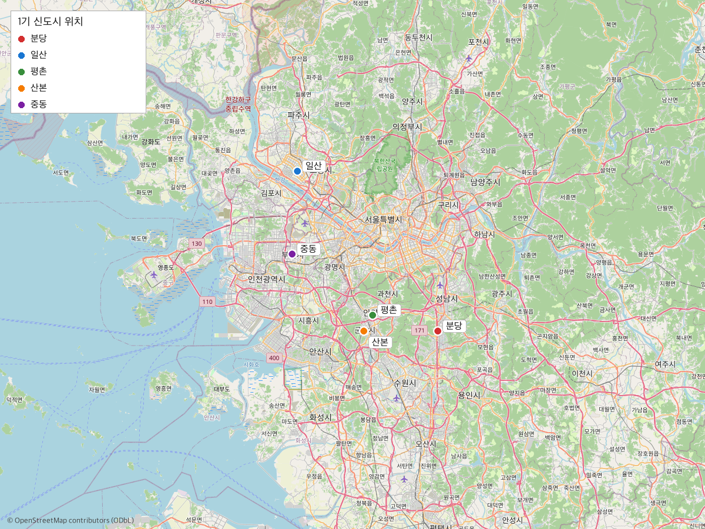

# Codex 작업 지시서: 1기 신도시 연구보고서 개선

## 0. 대상 파일 및 컨텍스트

작업 대상: `1기-신도시-연구보고서.md`  
참조 파일: `1기-신도시-보류-서술-메모.md`, `1기-신도시-자료-정리-메모.md`, `1기-2기-3기-신도시의-근본적-차이.md`

현재 보고서는 사실 서술의 엄밀성은 높지만, 다음 요소들이 빠져 있어 정보 밀도가 낮고 독자가 구체적인 규모감을 얻기 어렵다. 아래 태스크를 순서대로 실행한다.

---

## Task 1: 도시별 기본 스펙 표 추가 (§4)

**위치**: `## 4. 5개 신도시와 계획 주택공급` 내 기존 도시별 물량 서술 아래

**할 일**:  
국토교통부 정책자료(^1, ^2)를 기준으로, 아래 항목을 포함한 마크다운 표를 작성해 삽입한다.

| 도시 | 사업 면적 | 계획인구 | 계획 주택공급 | 첫 입주 |
|------|----------|---------|------------|--------|
| 분당 | ... | ... | 97,600호 | 1991.09 |
| 일산 | ... | ... | 69,000호 | 1992.08 |
| 평촌 | ... | ... | 42,000호 | 1992.03 |
| 산본 | ... | ... | 42,000호 | 1992.04 |
| 중동 | ... | ... | 41,400호 | 1993.02 |

- 사업 면적과 계획인구는 국토교통부 정책자료(^1, ^2) 또는 각 지자체 공개 자료에서 확인 가능한 수치만 사용한다.
- 확인이 안 되는 셀은 `확인 필요`로 표기하고 각주를 남긴다.
- 표 아래에 출처 각주를 명시한다.

---

## Task 2: 노후계획도시 특별법 절 신설 (§7)

**위치**: `## 7. 현재 시점의 구조적 쟁점` — 기존 노후화·재정비 서술 뒤에 새 소절 삽입

**할 일**:  
현재 §7은 "노후화와 재정비 압력이 커졌다"는 수준에서 끝난다. 2023년에 제정된 **노후계획도시 정비 및 지원에 관한 특별법**이 이 압력에 대한 법적 대응으로서 중요한 정책 변화인데 완전히 누락돼 있다.

아래 내용을 소절(`### 7.1 노후계획도시 특별법과 정비 추진` 등)로 추가한다:
- 특별법 제정 시점과 핵심 내용 (선도지구 지정, 용적률 완화, 통합심의 등)
- 1기 신도시 5곳이 이 법의 주요 적용 대상이라는 사실
- 현재까지 진행된 선도지구 지정 현황 (확인된 사실만)
- 출처: 국토교통부 보도자료, 법제처 법령 원문

**주의**: 재건축 결과나 시장 영향을 단정하는 문장은 넣지 않는다. 법 제정과 추진 현황 사실만 서술한다.

---

## Task 3: 주택공급 효과 수치 보강 (§3 또는 §8)

**위치**: `## 3. 정책 배경과 사업 범위` 또는 `## 8. 결론`

**할 일**:  
`1기-신도시-보류-서술-메모.md` §3에서 "주택보급률 69.8%→74.2%" 수치가 보류 상태로 남아 있다. 이 수치를 KOSIS 주택보급률 통계(또는 국토연구원 원자료)에서 직접 대조해 확인한다.

- 수치가 공식 통계 원표에서 확인되면: 각주를 붙여 본문에 반영한다.
- 수치가 확인되지 않으면: "일부 연구에서 언급되나 통계 원표 대조 미완료" 수준의 각주로만 남긴다.
- 출처: KOSIS 주택보급률 시계열(https://kosis.kr), 국토연구원 관련 자료

---

## Task 4: 5개 신도시 위치 지도 생성 및 삽입

**할 일**:
`scripts/make_1st_newtown_map.py` 파일을 새로 작성해 아래 지도를 생성한다.

**지도 스펙**:
- `staticmap` + `Pillow` 사용 (위례선·연담화 지도와 동일 방식)
- 5개 신도시 중심부에 각각 컬러 마커 표시
- 각 마커 옆에 도시명 범례 삽입
- OSM 크레딧 표기
- 출력: `supplements/1st-newtown/images/1st-newtown-location-map.png`
  - 디렉터리가 없으면 생성

**좌표 (OSM 기준 도심부)**:
| 도시 | 위도 | 경도 |
|------|------|------|
| 분당 | 37.3595 | 127.1052 |
| 일산 | 37.6560 | 126.7770 |
| 평촌 | 37.3896 | 126.9526 |
| 산본 | 37.3600 | 126.9320 |
| 중동 | 37.5025 | 126.7652 |

지도 생성 후, 보고서 `## 4. 5개 신도시와 계획 주택공급` 절 상단에 다음 형식으로 삽입한다:

```markdown

*그림 1. 1기 신도시 5곳의 수도권 내 위치. 배경지도: © OpenStreetMap contributors (ODbL)*
```

---

## Task 5: 고령화·자족성 수치 구체화 (§7)

**위치**: `## 7. 현재 시점의 구조적 쟁점`

**할 일**:  
현재 고령화와 자족성 한계를 "확인된다"는 수준으로만 서술하고 있다. 수치 없이 서술만 있어 독자가 규모를 가늠하기 어렵다.

아래 수치를 조사해 각 서술에 보강한다:

**고령화**:
- KOSIS 인구총조사 또는 주민등록통계에서 분당·일산·평촌·산본·중동 권역의 65세 이상 인구 비율 확인
- 수도권 평균 또는 전국 평균과 비교 가능하면 함께 제시
- 출처: KOSIS 주민등록인구현황(https://kosis.kr)

**자족성**:
- 고용밀도 또는 통근 유출 비율이 확인되는 수치가 있으면 삽입
- 출처: 국토연구원 보고서, 통계청 통근·통학 실태 자료

수치 확인이 안 되는 항목은 무리하게 넣지 않고, 출처 탐색 결과를 각주로 남긴다.

---

## Task 6: 1기·2기·3기 비교 보론 추가 (§9 신설)

**위치**: `## 8. 결론` 뒤에 `## 9. 보론 — 2기·3기 신도시와의 차이` 신설

**할 일**:  
같은 프로젝트에 `1기-2기-3기-신도시의-근본적-차이.md` 파일이 존재하는데 이 보고서와 전혀 연계되어 있지 않다.

해당 파일의 핵심 논점을 참조해, 1기 신도시의 차별적 특성을 아래 관점에서 2~3문단으로 요약 추가한다:
- 계획 밀도와 주택유형 구성의 차이
- 교통 선결 여부 (1기는 철도 후속, 3기는 GTX 선결)
- 자족용지 비율 차이

이 절은 서술 수준을 유지하되, `1기-2기-3기-신도시의-근본적-차이.md`에서 근거 강함으로 분류된 항목만 반영한다. 내부 링크(`[→ 비교 분석 문서](1기-2기-3기-신도시의-근본적-차이.md)`)도 추가한다.

---

## Task 7: 전체 검증

모든 태스크 완료 후:
- 새로 추가된 각주 번호가 기존 `[^1]`~`[^16]`과 충돌하지 않는지 확인
- 추가된 표와 그림 캡션 형식이 기존 문서와 일치하는지 확인
- 보류 메모(`1기-신도시-보류-서술-메모.md`)에서 보류로 남겨둔 서술이 본문에 단정적으로 들어가지 않았는지 재검토
- `scripts/make_1st_newtown_map.py` 실행 후 이미지 파일 정상 생성 확인
