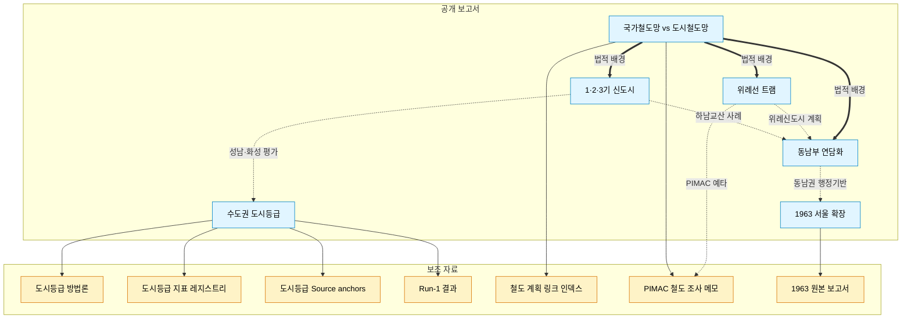

# Codex 작업 지시서: 연구 보고 아카이브 정비

## 0. 프로젝트 컨텍스트

이 repo는 한국 수도권 공간구조(신도시, 철도, 행정구역, 도시등급)에 대한 개인 연구 아카이브다. 루트에 최종 공개 보고서 6개가 있고, `supplements/` 아래에 방법론 문서, 지표 레지스트리, PIMAC 조사 메모, KOSIS 코드 맵 등 보조 자료가 축적돼 있다.

현재 문제는 다음과 같다.

1. README가 최종 보고서 6개만 나열해서, `supplements/`에 있는 방법론·지표·source anchor·PIMAC 분석 같은 중요 자산이 외부에서 보이지 않는다.
2. 최종 보고서와 supplements 사이의 상호 참조 링크가 전혀 없다. 도시등급 보고서를 읽는 사람은 뒤에 methodology v1.0이 있다는 걸 알 수 없다.
3. 6개 보고서가 서로 연관된 주제를 다루는데도 서로를 참조하지 않는다.
4. 문서에 시각자료가 단 하나도 없다. 지도, 다이어그램, 관계도 전부 부재.
5. 도시등급 methodology에 언급된 baseline CSV가 전부 로컬 절대경로(`/Users/jaeyoolpark/Project/...`)로만 있고 repo에는 없다.
6. `supplements/rail-research/notes/urban_rail_notes.md`가 작업 로그 형식이라 제3자가 읽기 어렵고, 여기 담긴 PIMAC 140건 전수조사 결과가 공개 보고서 형태로 노출되지 않는다.

이 지시서는 이 문제들을 단계별로 해결하는 작업 목록이다. **반드시 위에서 아래 순서대로 작업하라.** 앞 작업이 뒤 작업의 전제가 되는 경우가 많다.

---

## 작업 원칙

- 기존 최종 보고서 6개의 **본문 내용은 수정하지 마라**. 오직 상단에 "관련 문서" 블록을 추가하거나, 기존 인라인 언급을 링크로 바꾸는 정도만 허용된다.
- supplements 폴더의 기존 파일도 **내용 수정 금지**다. 이동(git mv)이나 신규 파일 생성은 허용.
- 모든 새 파일은 Markdown으로 작성하되, GitHub에서 바로 렌더링될 것을 전제로 한다. Mermaid 다이어그램은 ```mermaid 코드블록으로 작성한다.
- 파일명은 영문 또는 한글 하이픈 케이스를 유지한다 (기존 파일명 스타일 따라서).
- 커밋은 각 Task 단위로 끊는다. Task 1 끝 → 커밋, Task 2 끝 → 커밋 식으로. 커밋 메시지는 `Task N: <간단 요약>` 형식.
- 각 Task의 "확인 방법"을 수행해 통과하지 못하면 다음 Task로 넘어가지 말고 수정하라.

---

## Task 1: 새 최상위 README 작성

### 목적

현재 README는 5줄짜리 소개 + 최종 보고서 6개 목록이 전부다. supplements의 존재와 repo의 실제 정체성이 보이지 않는다. 이걸 전면 교체한다.

### 작업 내용

`README.md`를 아래 구조로 **완전히 새로 쓴다**. 기존 파일은 덮어쓰기.

```markdown
# 연구 보고 아카이브

한국 수도권 공간구조 — 신도시, 철도, 행정구역, 도시 기능 위계 — 에 대한 개인 연구 아카이브. 공식 통계와 1차 사료(국토교통부 정책정보, 국가법령정보센터, KOSIS, 동시대 신문 등)를 기반으로 한 보고서와, 그 보고서를 뒷받침하는 방법론·데이터·조사 메모를 함께 축적한다.

> **이 repo의 성격**: LLM 보조로 작성하되, 모든 주장은 공식 1차 자료로 검증하는 것을 원칙으로 한다. 각 문서는 "확인된 사실"과 "해석"을 구분해 서술한다.

## 문서 간 관계

(여기에 Task 2에서 만들 Mermaid 관계도가 들어간다. 지금은 플레이스홀더로 `<!-- 관계도: Task 2에서 삽입 -->` 주석만 두라.)

## 공개 보고서 (Reports)

한국 수도권의 공간구조를 각 관점에서 다룬 독립 보고서.

- [1기·2기·3기 신도시의 근본적 차이](./1기-2기-3기-신도시의-근본적-차이.md) — 세대별 신도시 정책의 문제의식과 공간 전략 비교
- [위례선 트램 보고서](./위례선-트램-보고서.md) — 서울 57년 만의 트램 부활, 환승 구조와 이용자 체감
- [서울 동남부 도시 연담화 세부사례 근거정리](./서울-동남부-도시-연담화-세부사례-근거정리.md) — 미사·감일·교산·위례 등 6개 축으로 본 연담화
- [1963년 서울 대확장 연구보고서](./서울-1963-확장-연구보고서.md) — 서울 행정구역 대확장의 공개 논의, 법적 절차, 주민 반응
- [국가철도망 구축계획과 도시철도망 구축계획 비교](./국가철도망-구축계획과-도시철도망-구축계획-비교.md) — 두 법정계획의 제도적 차이
- [수도권 도시등급 평가 보고서](./수도권-도시등급-평가-보고서.md) — 66개 기초지자체 상대 평가 (2026년 기준)

## 보조 자료 (Supplements)

각 연구 주제의 방법론, 데이터, 조사 메모, source anchor.

### 수도권 도시등급 — [`supplements/capital-area-city-tier/`](./supplements/capital-area-city-tier/)

도시등급 평가 보고서의 뒷단. 가중치 근거, 지표 레지스트리, exact KOSIS/e-나라지표 table ID, run-1 계산 결과까지 재현 가능한 형태로 공개.

- [방법론 문서 v1.0](./supplements/capital-area-city-tier/docs/seoul-capital-area-city-tier-methodology.md) — 중국식 도시등급 체계의 한국 수도권 적용, 가중치 선정 근거, 재판별 운영 규칙
- [지표 레지스트리](./supplements/capital-area-city-tier/docs/seoul-capital-area-city-tier-indicator-registry.md) — 차원별 대표값/보조값/source_family
- [Source anchors](./supplements/capital-area-city-tier/docs/seoul-capital-area-city-tier-source-anchors.md) — exact table ID 및 field 명세
- [Run-1 최종 결과](./supplements/capital-area-city-tier/docs/seoul-capital-area-run1-final-report.md) — 66개 단위 점수표 및 차원별 분해
- [KOSIS 수도권 행정구역 코드 맵](./supplements/capital-area-city-tier/docs/kosis-capital-area-region-codes-DT_1B26001.md)
- [최종 전달본](./supplements/capital-area-city-tier/docs/수도권_도시등급_최종전달본.md) — 원천 지표 포함 전체 표

### 철도 리서치 — [`supplements/rail-research/`](./supplements/rail-research/)

국가철도망·도시철도망 계획의 공식 링크 인덱스, PIMAC 철도 예타 보고서 전수 조사 메모.

- [최신 철도망 계획 공식 링크 인덱스](./supplements/rail-research/notes/latest-rail-plans-index.md) — 제4차 국가철도망, 서울·부산·인천·광주·경기 제2차 도시철도망의 공식 고시문·본보고서 직링크
- [도시철도·철도 조사 메모](./supplements/rail-research/notes/urban_rail_notes.md) — PIMAC F1 142건/F2 15건 전수 다운로드 기록, 수도권 50건 필터, 인덕원~수원/동탄 사업 변천 분석
- [국가철도망 vs 도시철도망 계획 비교 (사본)](./supplements/rail-research/notes/rail-plan-comparison.md)

### 서울 1963 확장 — [`supplements/seoul-1963-expansion/`](./supplements/seoul-1963-expansion/)

- [원본 연구 보고서 (사본)](./supplements/seoul-1963-expansion/docs/seoul-1963-expansion-research.md)

## 작성 원칙

- **사실과 해석의 분리**: 공식 자료가 직접 진술한 내용은 사실로, 그로부터 추론한 내용은 해석으로 구분한다.
- **1차 자료 우선**: 국가법령정보센터, 국토교통부 정책정보, KOSIS, 동시대 신문이 2차 해설보다 우선한다.
- **재현 가능성**: 통계 기반 분석은 table ID, 시점, 필드명까지 명시한다.
- **지명 표기**: 과거 지명은 "당시 지명 / 현재 지명" 병기, 한자 제목은 한글 독음 병기.

## 라이선스 및 이용

개인 연구 아카이브로, 공식 출처를 인용한 내용은 각 원출처의 저작권을 따른다. 본 repo의 서술·해석·편집물은 개인 저작이다.
```

### 확인 방법

- README.md가 위 구조와 동일한가
- 모든 링크가 실제 파일 경로를 가리키는가 (로컬에서 상대경로로 접근 가능해야 함)
- Mermaid 플레이스홀더 주석이 들어가 있는가

---

## Task 2: 문서 간 관계 Mermaid 다이어그램 작성 및 README 삽입

### 목적

Task 1에서 비워둔 관계도 자리에 Mermaid 다이어그램을 삽입한다. repo의 7개 최종 문서(보고서 6 + 방법론 1)와 주요 supplement가 어떻게 연결되는지 한눈에 보여준다.

### 작업 내용

README의 `<!-- 관계도: Task 2에서 삽입 -->` 주석을 아래 Mermaid 다이어그램으로 **교체**한다.

```markdown

```

### 확인 방법

- GitHub 웹 UI에서 README를 열면 다이어그램이 렌더링되는가 (로컬에서는 mermaid-cli 또는 mermaid.live로 구문 검증)
- 노드 텍스트에 오타가 없는가

---

## Task 3: 각 최종 보고서 상단에 "관련 문서" 블록 삽입

### 목적

독자가 어느 보고서를 먼저 열든 관련 문서로 이동할 수 있게 한다. 본문은 건드리지 않는다.

### 작업 내용

각 최종 보고서 파일의 **첫 번째 `---` 구분선 바로 직전**(즉 `## 초록` 또는 `## 한 줄 요약` 블록 끝난 직후, 본격 본문 시작 직전)에 아래 블록을 삽입한다. 이미 `---`이 여러 개인 문서는 **첫 `---` 바로 앞**에 둔다.

**주의**: 보고서별로 관련 문서 목록이 다르다. 아래 표에 지정된 것만 넣어라. 임의로 추가하지 말 것.

### 3-1. `1기-2기-3기-신도시의-근본적-차이.md`

```markdown
> **관련 문서**
> - 3기 신도시 하남교산의 연담화적 해석: [서울 동남부 도시 연담화 §4-3](./서울-동남부-도시-연담화-세부사례-근거정리.md)
> - 성남·화성 등 경기 상위권 도시의 지표 기반 평가: [수도권 도시등급 평가 보고서](./수도권-도시등급-평가-보고서.md)
> - 3기 신도시 광역교통 계획의 법적 위치: [국가철도망 vs 도시철도망 비교](./국가철도망-구축계획과-도시철도망-구축계획-비교.md)
```

진행 기록: 2026-04-18 `1기-2기-3기-신도시의-근본적-차이.md` 관련 문서 블록 반영 완료.

### 3-2. `위례선-트램-보고서.md`

```markdown
> **관련 문서**
> - 위례신도시를 둘러싼 행정분리-생활권통합 구조: [서울 동남부 도시 연담화 §4-4](./서울-동남부-도시-연담화-세부사례-근거정리.md)
> - 위례선과 신분당선·GTX의 법적 분류 차이: [국가철도망 vs 도시철도망 비교](./국가철도망-구축계획과-도시철도망-구축계획-비교.md)
> - 수도권 철도 예타 전수 조사 (인덕원~수원/동탄 사업 포함): [PIMAC 철도 조사 메모](./supplements/rail-research/notes/urban_rail_notes.md)
> - 최신 도시철도망 계획 공식 링크: [철도 계획 링크 인덱스](./supplements/rail-research/notes/latest-rail-plans-index.md)
```

### 3-3. `서울-동남부-도시-연담화-세부사례-근거정리.md`

```markdown
> **관련 문서**
> - 하남교산이 속한 3기 신도시 세대의 정책 성격: [1기·2기·3기 신도시](./1기-2기-3기-신도시의-근본적-차이.md)
> - 위례선 트램의 환승 구조와 이용자 체감: [위례선 트램 보고서](./위례선-트램-보고서.md)
> - 오늘날 강남·송파·강동 일대 행정 기반의 형성: [1963년 서울 대확장](./서울-1963-확장-연구보고서.md)
> - 송파하남선·강동하남남양주선 등의 법정 계획 근거: [국가철도망 vs 도시철도망 비교](./국가철도망-구축계획과-도시철도망-구축계획-비교.md)
```

### 3-4. `서울-1963-확장-연구보고서.md`

```markdown
> **관련 문서**
> - 1963년 편입지역이 형성한 동남권의 현재 연담화 양상: [서울 동남부 도시 연담화](./서울-동남부-도시-연담화-세부사례-근거정리.md)
> - 66개 기초지자체 기준 서울 자치구별 현재 위상: [수도권 도시등급 평가](./수도권-도시등급-평가-보고서.md)
```

### 3-5. `국가철도망-구축계획과-도시철도망-구축계획-비교.md`

```markdown
> **관련 문서**
> - 이 법적 구분이 3기 신도시 광역교통 설계에 적용되는 방식: [1기·2기·3기 신도시](./1기-2기-3기-신도시의-근본적-차이.md)
> - 도시철도망 계획 노선의 실제 사례 (위례선): [위례선 트램 보고서](./위례선-트램-보고서.md)
> - 광역철도·도시철도가 함께 작동하는 동남부 연담화: [서울 동남부 도시 연담화](./서울-동남부-도시-연담화-세부사례-근거정리.md)
> - 최신 계획 고시문·본보고서 직링크: [철도 계획 링크 인덱스](./supplements/rail-research/notes/latest-rail-plans-index.md)
> - 수도권 PIMAC 철도 예타 전수 조사: [PIMAC 철도 조사 메모](./supplements/rail-research/notes/urban_rail_notes.md)
```

### 3-6. `수도권-도시등급-평가-보고서.md`

```markdown
> **방법론 및 재현 가능성**
> 이 보고서의 가중치 근거, 차원 구성, 1차 계산(run-1) 결정 이력은 별도 방법론 문서에 기록되어 있다.
> - [방법론 문서 v1.0](./supplements/capital-area-city-tier/docs/seoul-capital-area-city-tier-methodology.md) — 중국식 도시등급의 한국 수도권 적용 논리, 가중치 선정, 운영 규칙
> - [지표 레지스트리](./supplements/capital-area-city-tier/docs/seoul-capital-area-city-tier-indicator-registry.md) — 차원별 대표값·보조값·source family
> - [Source anchors](./supplements/capital-area-city-tier/docs/seoul-capital-area-city-tier-source-anchors.md) — exact KOSIS/e-나라지표 table ID
> - [Run-1 최종 결과](./supplements/capital-area-city-tier/docs/seoul-capital-area-run1-final-report.md) — 차원별 분해 점수 포함 전체 표
>
> **관련 보고서**
> - 경기 상위 도시들의 신도시 정책적 성격: [1기·2기·3기 신도시](./1기-2기-3기-신도시의-근본적-차이.md)
> - 서울 자치구 경계의 역사적 기원: [1963년 서울 대확장](./서울-1963-확장-연구보고서.md)
```

### 확인 방법

- 6개 파일 모두 "관련 문서" (또는 도시등급은 "방법론 및 재현 가능성") 블록이 첫 `---` 구분선 직전에 있는가
- 각 링크가 실제로 존재하는 파일/앵커를 가리키는가 (로컬에서 열어 확인)
- 본문 내용은 한 글자도 바뀌지 않았는가 (`git diff`로 추가 라인만 있는지 확인)

---

## Task 4: supplements/ 각 폴더에 README 추가

### 목적

각 supplement 폴더가 자체적으로 무엇을 담고 있는지 설명하게 한다. 루트 README만 읽지 않고 supplements 폴더로 바로 진입한 사람도 길을 찾을 수 있게 한다.

### 4-1. `supplements/capital-area-city-tier/README.md` 신규 생성

```markdown
# 수도권 도시등급 — 보조 자료

공개 보고서 [수도권 도시등급 평가 보고서](../../수도권-도시등급-평가-보고서.md)의 방법론·지표·계산 결과를 담는 폴더.

## 문서

### 방법론
- [`docs/seoul-capital-area-city-tier-methodology.md`](./docs/seoul-capital-area-city-tier-methodology.md) — v1.0. 중국식 1선·신1선 체계의 한국 수도권 적용 논리, 8차원 지표 프레임, 가중치 선정, 1~9등급 운영 규칙, 재판별 절차. 이 프로젝트의 최상위 운영 문서.

### 지표 및 source anchor
- [`docs/seoul-capital-area-city-tier-indicator-registry.md`](./docs/seoul-capital-area-city-tier-indicator-registry.md) — 차원별 대표값/보조값/source family와 production status
- [`docs/seoul-capital-area-city-tier-source-anchors.md`](./docs/seoul-capital-area-city-tier-source-anchors.md) — exact KOSIS table ID, e-나라지표 idx_cd, 필드명까지 고정한 source anchor
- [`docs/kosis-capital-area-region-codes-DT_1B26001.md`](./docs/kosis-capital-area-region-codes-DT_1B26001.md) — KOSIS DT_1B26001 기준 수도권 66개 단위 행정구역 코드 맵

### 계산 결과
- [`docs/seoul-capital-area-run1-final-report.md`](./docs/seoul-capital-area-run1-final-report.md) — run-1 최종 점수표 및 차원별 분해
- [`docs/수도권_도시등급_최종전달본.md`](./docs/수도권_도시등급_최종전달본.md) — 원천 지표까지 포함한 전체 66개 단위 표

## 재현성

현재 단계에서 다음이 보장된다.

1. 지표 정의와 시점은 methodology 및 source anchors 문서에 고정되어 있다.
2. 66개 단위 행정구역 코드는 KOSIS DT_1B26001 트리에서 직접 추출해 고정했다.
3. 1차 계산(run-1)의 가중치와 등급 컷은 final-report에 명시되어 있다.

단, baseline CSV(계산 입력 데이터)는 현재 repo에 포함돼 있지 않다. 공개 여부는 추후 결정.

## 버전

- v1.0: 2026-04-13 기준 run-1. 메인 비교군은 수도권 66개 기초지자체. 경기 일반구는 보조 래더로 분리하되 이번 run에서는 제외.
```

### 4-2. `supplements/rail-research/README.md` 신규 생성

```markdown
# 철도 리서치 — 보조 자료

한국 철도망 계획 체계, 수도권 철도 사업 이력, PIMAC 예비타당성조사 보고서 전수 조사 기록.

## 문서

### 계획 인덱스
- [`notes/latest-rail-plans-index.md`](./notes/latest-rail-plans-index.md) — 제4차 국가철도망 구축계획(2021~2030), 서울·부산·인천·광주·경기 제2차 도시철도망 구축계획의 공식 페이지·고시문·본보고서 직링크 정리. 2026년 4월 기준 확인본.

### 법제 비교
- [`notes/rail-plan-comparison.md`](./notes/rail-plan-comparison.md) — 국가철도망 구축계획과 도시철도망 구축계획의 법적 근거, 수립 주체, 대상 철도, 예타와의 관계 비교. 루트의 공개 보고서와 동일 내용의 작업 사본.

### PIMAC 조사 메모
- [`notes/urban_rail_notes.md`](./notes/urban_rail_notes.md) — PIMAC 철도 예비타당성조사 보고서 F1 142건, 타당성재조사 F2 15건 전수 다운로드 기록. 수도권 50건 필터, 인덕원~수원 2011 예타 및 2014 타재조사 본문 분석, 현재 인덕원~동탄 사업 추진 타임라인 포함.

### 기타
- [`notes/AGENTS.md`](./notes/AGENTS.md) — notes 폴더의 운영 규약 (LLM agent가 이 폴더를 탐색할 때 참조).
- `notes/busan_rail_summary.txt` — 부산 철도 관련 raw extract. 예외적으로 notes에 남아 있음.

## 관련 공개 보고서

- [국가철도망 vs 도시철도망 비교](../../국가철도망-구축계획과-도시철도망-구축계획-비교.md)
- [위례선 트램 보고서](../../위례선-트램-보고서.md)
- [서울 동남부 도시 연담화](../../서울-동남부-도시-연담화-세부사례-근거정리.md)
```

### 4-3. `supplements/seoul-1963-expansion/README.md` 신규 생성

```markdown
# 서울 1963 확장 — 보조 자료

공개 보고서 [1963년 서울 대확장 연구보고서](../../서울-1963-확장-연구보고서.md)의 작업 원본 및 관련 자료.

## 문서

- [`docs/seoul-1963-expansion-research.md`](./docs/seoul-1963-expansion-research.md) — 루트 공개 보고서와 동일 내용의 원본 사본.

## 관련 공개 보고서

- [1963년 서울 대확장 연구보고서](../../서울-1963-확장-연구보고서.md)
- [서울 동남부 도시 연담화](../../서울-동남부-도시-연담화-세부사례-근거정리.md) — 1963 편입지역이 오늘날 연담화의 어떤 축을 이루는지

## 향후 확장 후보

- 1963 편입 84개 리의 GeoJSON 레이어
- 과천·광명 사례를 독립 문서로 분리
```

### 확인 방법

- 3개 README 파일이 각 폴더 루트에 생성됐는가
- 각 파일의 상대경로 링크가 실제 파일을 가리키는가
- GitHub 웹에서 폴더 열었을 때 README가 자동 렌더링되는가 (로컬에서는 파일 내용 육안 확인)

---

## Task 5: `supplements/capital-area-city-tier/data/` 디렉터리 준비

### 목적

methodology 문서에 언급된 baseline CSV들은 현재 `/Users/jaeyoolpark/Project/` 로컬 경로에 있고 repo에는 없다. 이걸 받아들일 폴더를 미리 만들고, 어떤 파일이 들어올 예정인지 명시한다. **실제 CSV는 이 Task에서는 넣지 않는다** — 파일이 없어서 넣을 수 없음. 플레이스홀더만 준비.

### 작업 내용

#### 5-1. 빈 디렉터리 생성

`supplements/capital-area-city-tier/data/.gitkeep` 을 빈 파일로 생성한다. (Git은 빈 디렉터리를 추적하지 않으므로 .gitkeep 관행 사용.)

#### 5-2. `supplements/capital-area-city-tier/data/README.md` 생성

```markdown
# 수도권 도시등급 — 계산 데이터

도시등급 평가의 baseline CSV 및 계산 결과 파일을 담을 폴더.

## 현재 상태

현재 이 폴더는 **비어 있다**. 방법론 문서([../docs/seoul-capital-area-city-tier-methodology.md](../docs/seoul-capital-area-city-tier-methodology.md))에서 참조하는 아래 파일들은 모두 작성자 로컬에 있으며, repo 공개 여부는 미정이다.

## 예정 파일

공개 시 아래 구조로 배치한다.

```
data/
├── baseline/
│   ├── seoul-capital-area-population-baseline-2026-03.csv
│   ├── seoul-capital-area-migration-baseline-2026-02.csv
│   ├── seoul-capital-area-employment-baseline-2025-H2.csv
│   ├── seoul-capital-area-commuting-baseline-2020.csv
│   ├── seoul-capital-area-fiscal-baseline-2025.csv
│   ├── seoul-capital-area-land-price-baseline-2025-latest.csv
│   └── seoul-capital-area-run1-merged-baseline.csv
└── scored/
    ├── seoul-capital-area-run1-scored-yicai-proxy.csv
    └── seoul-capital-area-run1-ranking-yicai-proxy-regraded.csv
```

## 각 파일의 출처

| 파일 | 출처 | 시점 | 비고 |
|---|---|---|---|
| population-baseline | 행정안전부 주민등록 인구통계 | 2026-03 | |
| migration-baseline | KOSIS DT_1B26001 T10(전입) | 2026-02 | |
| employment-baseline | KOSIS DT_1ES3A03_A01S | 2025 하반기 | |
| commuting-baseline | KOSIS DT_1PA2020 T40 | 2020 | census 기반 구조지표 |
| fiscal-baseline | KOSIS e-지방지표 unitySrvcId 955/1106 | 2025 | 재정자립도·재정자주도 |
| land-price-baseline | data.go.kr 15063473 | 2025 | 평균지가변동률 최신 비영월 |
| run1-merged-baseline | 위 6개 파일의 region×unit_name 조인 | 2026-04-13 | |
| run1-scored | run-1 yicai-proxy 5차원 점수 | 2026-04-13 | |
| run1-ranking-regraded | 순위 기반 최종 등급 | 2026-04-13 | |

## 공개 시 원칙

1. 모든 CSV는 UTF-8 + LF 줄바꿈, 첫 행 헤더.
2. 컬럼명은 snake_case 영문 또는 소스 그대로(예: `T40`).
3. 출처·시점은 별도 `_manifest.json` 으로 함께 관리.
```

### 확인 방법

- `supplements/capital-area-city-tier/data/.gitkeep` 파일이 존재하는가 (크기 0 바이트)
- `supplements/capital-area-city-tier/data/README.md`가 위 내용으로 생성됐는가

---

## Task 6: `latest-rail-plans-index.md` 승격 링크 처리

### 목적

`supplements/rail-research/notes/latest-rail-plans-index.md`는 현재 supplements 깊숙이 묻혀 있지만, 사실상 공개 보고서급 가치를 가진 공식 링크 인덱스다. 파일 자체는 이동하지 않고 (기존 링크 깨짐 방지), 루트 README와 관련 보고서에서 **더 눈에 띄게 링크**한다.

### 작업 내용

#### 6-1. Task 1에서 이미 루트 README의 "철도 리서치" 섹션에 링크했다. 추가 작업 없음 — 확인만 하라.

#### 6-2. `국가철도망-구축계획과-도시철도망-구축계획-비교.md` 본문 끝 "참고 법령" 섹션 바로 직전에 다음 블록을 추가한다.

**삽입 위치**: `## 참고 법령` 라인 바로 앞에.

**삽입 내용**:

```markdown
## 10. 최신 계획 공식 링크

현재 시점에서 공식 페이지와 첨부파일까지 직접 확인된 **제4차 국가철도망 구축계획(2021~2030)** 및 서울·부산·인천·광주·경기의 최신 도시철도망 구축계획 직링크는 별도 인덱스로 정리해 두었다.

- [최신 철도망 계획 공식 링크 인덱스](./supplements/rail-research/notes/latest-rail-plans-index.md)

---
```

이 삽입은 **본문 내용 변경이 아니라 별도 섹션 추가**이므로 Task 원칙 예외로 허용한다.

### 확인 방법

- `국가철도망-구축계획과-도시철도망-구축계획-비교.md`의 `## 참고 법령` 직전에 `## 10. 최신 계획 공식 링크` 섹션이 추가됐는가
- 링크가 실제 파일을 가리키는가

---

## Task 7: 각 supplements 폴더에 `AGENTS.md` 없는 곳에 추가

### 목적

`supplements/rail-research/notes/AGENTS.md`는 이미 존재한다. 같은 패턴으로 다른 supplements 폴더에도 agent 가이드를 둬서, LLM이 이 repo를 탐색할 때 일관되게 동작하게 한다.

### 작업 내용

#### 7-1. `supplements/capital-area-city-tier/AGENTS.md` 신규 생성

```markdown
# AGENTS — capital-area-city-tier

## 폴더 목적
수도권 66개 기초지자체 도시등급 평가의 방법론·지표·계산 결과 보관소.

## 진입 순서
1. `docs/seoul-capital-area-city-tier-methodology.md` — 전체 프레임
2. `docs/seoul-capital-area-city-tier-indicator-registry.md` — 차원별 지표
3. `docs/seoul-capital-area-city-tier-source-anchors.md` — exact source
4. `docs/seoul-capital-area-run1-final-report.md` — 실제 계산 결과
5. `docs/수도권_도시등급_최종전달본.md` — 공개 전달본

## 수정 시 규칙
- methodology의 가중치·차원 구성을 바꿀 경우, run-1 이후의 새 run 번호를 부여하고 별도 final-report를 생성한다. run-1 파일은 변경하지 않는다.
- source anchors를 변경할 때는 exact table ID와 시점을 함께 기록한다.
- 지표 레지스트리의 production status는 함부로 승격시키지 않는다. 실제 exact pull이 66개 단위 전체에 대해 작동할 때만 production-ready로 올린다.

## 금지
- 절대경로(`/Users/...`) 형태의 파일 참조를 repo 내 문서에 새로 추가하지 말 것. 기존 methodology의 절대경로는 작업 기록이므로 유지하되, 새 문서는 repo 상대경로만 사용.
- methodology의 특정 결정(예: 사업체 차원을 supplementary로 처리)을 "잘못된 것"으로 취급하지 말 것. 이 결정들은 exact source 확보 현황을 반영한 의식적 선택이다.
```

#### 7-2. `supplements/seoul-1963-expansion/AGENTS.md` 신규 생성

```markdown
# AGENTS — seoul-1963-expansion

## 폴더 목적
1963년 서울 행정구역 대확장 연구의 작업 원본 및 관련 자료 보관소.

## 진입 순서
1. `docs/seoul-1963-expansion-research.md` — 연구 본문

## 수정 시 규칙
- 본문의 "사실" 진술은 반드시 1차 사료(신문 기사 URL, 법령 조문, 서울역사편찬원 공식 자료)로 뒷받침되어야 한다.
- 지명은 "당시 지명 / 현재 지명" 병기 원칙을 유지한다.
- 한자 제목 인용 시 한글 독음 병기.
- 불확실한 대응 관계는 `정확 / 대체로 일치 / 부분 일치 / 불확실` 4단계 등급으로 명시한다 (§11 표 참조).

## 금지
- 후대 회고나 2차 해설을 1차 사료인 것처럼 인용하지 말 것.
- 공식 연표와 동시대 신문이 충돌할 때, 한쪽만 채택하지 말고 두 층위를 구분해 서술할 것 (§6의 공포일/시행일/실질 편입일 구분이 모델).
```

### 확인 방법

- 2개 AGENTS.md 파일이 각 폴더 루트에 존재하는가
- 기존 `supplements/rail-research/notes/AGENTS.md`는 건드리지 않았는가

---

## Task 8: 전체 링크 검증

### 목적

위 작업에서 생성·수정된 모든 Markdown 링크가 실제로 존재하는 파일을 가리키는지 확인한다.

### 작업 내용

#### 8-1. 스크립트 작성

repo 루트에 `scripts/check_links.py` 를 생성한다. 이 스크립트는 repo 내 모든 `.md` 파일의 상대경로 링크를 추출해 실제 파일 존재 여부를 검증한다.

```python
#!/usr/bin/env python3
"""Check that all relative Markdown links in this repo point to existing files."""
import re
import sys
from pathlib import Path

REPO = Path(__file__).resolve().parent.parent
LINK_RE = re.compile(r'\[([^\]]+)\]\(([^)]+)\)')

errors = []
checked = 0

for md in REPO.rglob("*.md"):
    if ".git" in md.parts:
        continue
    text = md.read_text(encoding="utf-8")
    for m in LINK_RE.finditer(text):
        label, target = m.group(1), m.group(2)
        # Skip external URLs, anchors-only, and mailto
        if target.startswith(("http://", "https://", "#", "mailto:")):
            continue
        # Strip anchor
        path_part = target.split("#", 1)[0]
        if not path_part:
            continue
        resolved = (md.parent / path_part).resolve()
        checked += 1
        if not resolved.exists():
            errors.append(f"{md.relative_to(REPO)}: broken link -> {target}")

print(f"Checked {checked} internal links across {len(list(REPO.rglob('*.md')))} Markdown files.")
if errors:
    print(f"\n{len(errors)} broken link(s):")
    for e in errors:
        print(f"  {e}")
    sys.exit(1)
print("All internal links OK.")
```

#### 8-2. 실행 및 통과 확인

```bash
python3 scripts/check_links.py
```

를 실행해 `All internal links OK.`가 출력되는지 확인한다. 깨진 링크가 있으면 해당 파일을 수정해 고쳐라 (생성 누락, 오타, 경로 착각 등).

### 확인 방법

- `scripts/check_links.py`가 실행 가능하고 종료코드 0으로 끝나는가
- 모든 Task 1~7에서 추가한 링크가 검증을 통과하는가

---

## Task 9: 최종 점검 및 커밋 정리

### 목적

모든 작업이 완료됐는지 최종 확인하고, 커밋 히스토리를 정리한다.

### 작업 내용

#### 9-1. 체크리스트

아래 항목을 모두 확인한다.

- [ ] 루트 `README.md`가 Task 1의 새 구조로 교체됨
- [ ] README의 관계도 Mermaid 블록이 렌더링 가능한 형태로 삽입됨
- [ ] 최종 보고서 6개 모두 "관련 문서" (또는 "방법론 및 재현 가능성") 블록 추가됨
- [ ] `supplements/capital-area-city-tier/README.md` 생성됨
- [ ] `supplements/rail-research/README.md` 생성됨
- [ ] `supplements/seoul-1963-expansion/README.md` 생성됨
- [ ] `supplements/capital-area-city-tier/data/.gitkeep` + `README.md` 생성됨
- [ ] `국가철도망-구축계획과-도시철도망-구축계획-비교.md`에 `## 10. 최신 계획 공식 링크` 섹션 추가됨
- [ ] `supplements/capital-area-city-tier/AGENTS.md` 생성됨
- [ ] `supplements/seoul-1963-expansion/AGENTS.md` 생성됨
- [ ] `scripts/check_links.py` 생성되고 통과함
- [ ] 기존 supplements 파일들의 본문이 수정되지 않았음 (`git log --all --follow -- <파일>` 또는 diff로 확인)
- [ ] 기존 최종 보고서 6개의 본문이 "관련 문서" 블록 추가를 제외하면 수정되지 않았음

#### 9-2. 변경 요약 파일 생성

repo 루트에 `CHANGELOG-codex-tasks.md` 를 생성해 아래 내용을 기록한다.

```markdown
# Codex Tasks 실행 결과

## 수행 일자
YYYY-MM-DD (실제 실행 날짜 기입)

## 변경 요약

### 신규 파일
- `README.md` (전면 교체)
- `scripts/check_links.py`
- `CHANGELOG-codex-tasks.md` (이 파일)
- `supplements/capital-area-city-tier/README.md`
- `supplements/capital-area-city-tier/AGENTS.md`
- `supplements/capital-area-city-tier/data/.gitkeep`
- `supplements/capital-area-city-tier/data/README.md`
- `supplements/rail-research/README.md`
- `supplements/seoul-1963-expansion/README.md`
- `supplements/seoul-1963-expansion/AGENTS.md`

### 기존 파일 수정 (상단 블록 추가만)
- `1기-2기-3기-신도시의-근본적-차이.md`
- `위례선-트램-보고서.md`
- `서울-동남부-도시-연담화-세부사례-근거정리.md`
- `서울-1963-확장-연구보고서.md`
- `국가철도망-구축계획과-도시철도망-구축계획-비교.md` (섹션 10 추가 포함)
- `수도권-도시등급-평가-보고서.md`

### 의도적으로 변경하지 않은 것
- 모든 supplements 하위 문서 (docs/, notes/ 의 기존 파일)
- 최종 보고서 본문 (관련 문서 블록 추가 제외)
- baseline CSV 실제 데이터 (data/ 폴더는 플레이스홀더만)

## 후속 작업 후보

이 Codex 작업에서 의도적으로 다루지 않은 것:

1. baseline CSV 실제 공개 — 개인정보·저작권 판단 후 별도 처리
2. 시각자료(지도, GeoJSON) 추가 — 별도 작업
3. 문서 톤 통일 (학술 vs 에세이) — 저자 판단 필요
4. `urban_rail_notes.md`의 공개본 분리 — 분량이 크고 재작성이 필요해 별도 작업
5. 분당-일산 격차, 환승 저항, 과천·광명 등의 독립 문서화 — 새 리서치 필요
```

### 확인 방법

- 위 체크리스트 모든 항목 체크
- `git log --oneline` 으로 커밋이 Task 단위로 정리되어 있는가 확인
- `git status` 가 clean 한가

---

## 전체 작업 종료 조건

1. Task 1~9 모두 통과
2. `python3 scripts/check_links.py` 가 종료코드 0
3. `git status` 가 clean
4. `CHANGELOG-codex-tasks.md` 생성 완료

모두 만족하면 작업 완료. 그렇지 않으면 실패한 Task로 돌아가 수정.

---

## 금지사항 (반복 강조)

- supplements 내 기존 문서 내용 수정 금지 (이동/링크 추가만 허용)
- 최종 보고서 6개의 본문 내용 수정 금지 (상단 블록 추가만 허용, 단 Task 6의 국가철도망 비교 문서는 예외로 섹션 10 추가 허용)
- 가중치·지표·방법론 판단에 손대지 말 것 — 이건 리서치 내용이지 편집 대상이 아님
- 파일명에 공백·특수문자 추가 금지 — 기존 한글 하이픈 케이스 유지
- baseline CSV를 임의로 만들어 넣지 말 것 — 데이터는 별도 작업
