# 연구 보고 아카이브

한국 수도권 공간구조 - 신도시, 철도, 행정구역, 도시 기능 위계 - 에 대한 개인 연구 아카이브. 공식 통계와 1차 사료(국토교통부 정책정보, 국가법령정보센터, KOSIS, 동시대 신문 등)를 기반으로 한 보고서와, 그 보고서를 뒷받침하는 방법론·데이터·조사 메모를 함께 축적한다.

> **이 repo의 성격**: LLM 보조로 작성하되, 모든 주장은 공식 1차 자료로 검증하는 것을 원칙으로 한다. 각 문서는 "확인된 사실"과 "해석"을 구분해 서술한다.

## 문서 간 관계

```mermaid
graph TD
    subgraph Reports["공개 보고서"]
        R1["1·2·3기 신도시"]
        R2["위례선 트램"]
        R3["동남부 연담화"]
        R4["1963 서울 확장"]
        R5["국가철도망 vs 도시철도망"]
        R6["수도권 도시등급"]
        R7["대한민국 신도시사"]
    end

    subgraph Supplements["보조 자료"]
        S1["도시등급 방법론"]
        S2["도시등급 지표 레지스트리"]
        S3["도시등급 Source anchors"]
        S4["Run-1 결과"]
        S5["철도 계획 링크 인덱스"]
        S6["PIMAC 철도 조사 메모"]
        S7["1963 원본 보고서"]
        S8["보고서 작성 규격"]
    end

    subgraph Books["원문 재구성 도서"]
        B1["한국형 신도시 가이드라인 연구"]
        B2["도시·공간 트렌드 2024"]
        B3["1·2기 신도시 주민의 삶"]
        B4["3기 신도시 개발전략·계획기준"]
        B5["1·2기 신도시 건설 영향"]
        B6["성남시사 50년사"]
    end

    R1 -.하남교산 사례.-> R3
    R1 -.성남·화성 평가.-> R6
    R2 -.위례신도시 계획.-> R3
    R4 -.동남권 행정기반.-> R3
    R5 ==법적 배경==> R1
    R5 ==법적 배경==> R2
    R5 ==법적 배경==> R3
    R7 ==총괄 서사==> R1
    R7 -.서울 내부 신시가지.-> R4
    R7 -.목동·상계·성남·영동.-> R3

    R6 --> S1
    R6 --> S2
    R6 --> S3
    R6 --> S4

    R5 --> S5
    R5 --> S6
    R2 -.PIMAC 예타.-> S6

    R4 --> S7
    S8 -.작성 기준.-> R7

    B1 -.신도시 계획 기준·사례 원문.-> R1
    B1 -.계획도시사 기준.-> R7
    B1 -.교통·BRT·트램 맥락.-> R2
    B1 -.도시 운영·경관 사례.-> R3
    B2 -.서울메트로폴리탄·신도시 맥락.-> R1
    B2 -.수도권 공간구조 맥락.-> R7
    B2 -.수도권 공간구조·연담화 맥락.-> R3
    B2 -.도시 기능·위계 분석 맥락.-> R6
    B3 -.1·2기 신도시 주민만족·생활권 원문.-> R1
    B3 -.주민 경험 평가.-> R7
    B3 -.분당·일산·동탄·운정 생활권.-> R3
    B3 -.주거만족·도시기능 평가.-> R6
    B4 -.3기 신도시 계획기준·전략 원문.-> R1
    B4 -.3기 계획기준.-> R7
    B4 -.교산·창릉 등 수도권 연계 맥락.-> R3
    B4 -.자족·기반시설·도시기능 기준.-> R6
    B5 -.1·2기 신도시 건설효과·주택시장 원문.-> R1
    B5 -.1·2기 평가.-> R7
    B5 -.광역 공간구조·생활권 변화.-> R3
    B5 -.경제·생활기반 충족도 기준.-> R6
    B6 -.광주대단지·성남 도시사 원문.-> R7
    B6 -.분당·판교·위례 지역사.-> R1
    B6 -.성남·동남권 공간 변천.-> R3
    B6 -.성남 도시기능·공간구조 원문.-> R6

    classDef report fill:#e1f5ff,stroke:#0284c7,color:#000
    classDef supp fill:#fef3c7,stroke:#d97706,color:#000
    classDef book fill:#dcfce7,stroke:#16a34a,color:#000
    class R1,R2,R3,R4,R5,R6,R7 report
    class S1,S2,S3,S4,S5,S6,S7,S8 supp
    class B1,B2,B3,B4,B5,B6 book
```

## 공개 보고서 (Reports)

한국 수도권의 공간구조를 각 관점에서 다룬 독립 보고서.

- [대한민국 신도시의 역사](./대한민국-신도시의-역사.md) - 전근대 계획도시의 선례부터 산업·행정 계획도시, 목동·상계, 1·2·3기 신도시와 노후계획도시 정비까지 이어지는 총괄 보고서
- [1기·2기·3기 신도시의 근본적 차이](./1기-2기-3기-신도시의-근본적-차이.md) - 세대별 신도시 정책의 문제의식과 공간 전략 비교
- [위례선 트램 보고서](./위례선-트램-보고서.md) - 서울 57년 만의 트램 부활, 환승 구조와 이용자 체감
- [서울 동남부 도시 연담화 세부사례 근거정리](./서울-동남부-도시-연담화-세부사례-근거정리.md) - 미사·감일·교산·위례 등 6개 축으로 본 연담화
- [1963년 서울 대확장 연구보고서](./서울-1963-확장-연구보고서.md) - 서울 행정구역 대확장의 공개 논의, 법적 절차, 주민 반응
- [국가철도망 구축계획과 도시철도망 구축계획 비교](./국가철도망-구축계획과-도시철도망-구축계획-비교.md) - 두 법정계획의 제도적 차이
- [수도권 도시등급 평가 보고서](./수도권-도시등급-평가-보고서.md) - 66개 기초지자체 상대 평가 (2026년 기준)
- [1기 신도시 연구보고서](./1기-신도시-연구보고서.md) - 정책 배경, 공급 규모, 입주 시기, 교통축, 구조적 쟁점 정리

## 원문 재구성 도서 (Books)

PDF 원문을 LLM이 읽고 인용하기 쉬운 Markdown 구조로 재작성한 자료. OCR이 아니라 페이지 이미지 대조와 육안 검토를 바탕으로 장·절, 표, 그림 설명, 주요 수치 인덱스를 정리한다.

### 한국형 신도시 가이드라인 연구 - [`books/korean-newtown-guideline/`](./books/korean-newtown-guideline/)

신도시 계획 가이드라인, 기반시설, 스마트시티, 특화사례를 다룬 원문 자료를 섹션별 Markdown과 LLM 단일 번들로 정리했다.

- [문서 인덱스](./books/korean-newtown-guideline/docs/korean-newtown-guideline/index.md) - 섹션별 목차와 페이지 범위
- [주요 수치](./books/korean-newtown-guideline/docs/korean-newtown-guideline/stats.md) - 면적, 인구, 사업비, 시설 규모 등 선별 수치
- [기계처리용 manifest](./books/korean-newtown-guideline/docs/korean-newtown-guideline/manifest.yml) - 섹션 ID, 파일명, 페이지 범위, 주제 태그
- [LLM 단일 번들](./books/korean-newtown-guideline/dist/korean-newtown-guideline.llm.md) - RAG/긴 컨텍스트 입력용 통합본
- [원본 PDF](./books/korean-newtown-guideline/sources/OTKCRK170383.pdf) - Git LFS 관리

### 도시·공간 트렌드 2024 : 서울메트로폴리탄을 중심으로 - [`books/city-space-trends-2024/`](./books/city-space-trends-2024/)

서울·인천·경기를 서울메트로폴리탄으로 보고, 삶터·일터·놀터·돌봄터·링크 관점에서 2024년 도시·공간 트렌드와 LH사업 적용방안을 정리한 원문 자료다. OCR 없이 PDF 내장 텍스트층과 215쪽 전체 페이지 이미지를 대조해 완성본 Markdown으로 재구성했다.

- [문서 인덱스](./books/city-space-trends-2024/docs/city-space-trends-2024/index.md) - 섹션별 목차와 페이지 범위
- [주요 수치](./books/city-space-trends-2024/docs/city-space-trends-2024/stats.md) - 설문, 신도시 용지비율, 제도·공간 분석 수치
- [기계처리용 manifest](./books/city-space-trends-2024/docs/city-space-trends-2024/manifest.yml) - 섹션 ID, 파일명, 페이지 범위, 주제 태그
- [LLM 단일 번들](./books/city-space-trends-2024/dist/city-space-trends-2024.llm.md) - RAG/긴 컨텍스트 입력용 통합본
- [원본 PDF](./books/city-space-trends-2024/sources/OTKCRK240315.pdf) - Git LFS 관리
- [전체 페이지 이미지](./books/city-space-trends-2024/docs/city-space-trends-2024/assets/pages/) - PDF 1-215쪽 JPEG 보존본

### 1·2기 신도시 종합평가 연구 (Ⅱ) - 신도시 주민의 삶 - [`books/newtown-resident-life-evaluation/`](./books/newtown-resident-life-evaluation/)

분당·일산·동탄·운정 주민의 거주만족도, 이주특성, 통근·생활권, 랜드마크, 공동체 의식, 온라인 담론을 설문조사와 텍스트마이닝으로 분석한 원문 자료다. OCR 없이 PDF 내장 텍스트층과 243쪽 전체 페이지 이미지를 대조해 완성본 Markdown으로 재구성했다.

- [문서 인덱스](./books/newtown-resident-life-evaluation/docs/newtown-resident-life-evaluation/index.md) - 섹션별 목차와 페이지 범위
- [주요 수치](./books/newtown-resident-life-evaluation/docs/newtown-resident-life-evaluation/stats.md) - 설문 표본, 만족도, 통근·생활권, 텍스트마이닝 수치
- [기계처리용 manifest](./books/newtown-resident-life-evaluation/docs/newtown-resident-life-evaluation/manifest.yml) - 섹션 ID, 파일명, 페이지 범위, 주제 태그
- [LLM 단일 번들](./books/newtown-resident-life-evaluation/dist/newtown-resident-life-evaluation.llm.md) - RAG/긴 컨텍스트 입력용 통합본
- [원본 PDF](./books/newtown-resident-life-evaluation/sources/OTKCRK210996.pdf) - Git LFS 관리
- [전체 페이지 이미지](./books/newtown-resident-life-evaluation/docs/newtown-resident-life-evaluation/assets/pages/) - PDF 1-243쪽 JPEG 보존본

### 1·2기 신도시 종합평가 연구 (Ⅰ) - 신도시 건설의 영향 - [`books/newtown-construction-impact-evaluation/`](./books/newtown-construction-impact-evaluation/)

1·2기 신도시 건설이 수도권 공간구조, 주택시장, 개발 거버넌스, 생활 SOC, 경제·생활기반 충족도에 남긴 영향을 평가한 원문 자료다. OCR 없이 PDF 내장 텍스트층과 480쪽 전체 페이지 이미지를 대조해 완성본 Markdown으로 재구성했다.

- [문서 인덱스](./books/newtown-construction-impact-evaluation/docs/newtown-construction-impact-evaluation/index.md) - 섹션별 목차와 페이지 범위
- [주요 수치](./books/newtown-construction-impact-evaluation/docs/newtown-construction-impact-evaluation/stats.md) - 공급량, 계획달성률, 인구분산, 주택가격, 생활 SOC, 충족도 수치
- [기계처리용 manifest](./books/newtown-construction-impact-evaluation/docs/newtown-construction-impact-evaluation/manifest.yml) - 섹션 ID, 파일명, 페이지 범위, 주제 태그
- [LLM 단일 번들](./books/newtown-construction-impact-evaluation/dist/newtown-construction-impact-evaluation.llm.md) - RAG/긴 컨텍스트 입력용 통합본
- [원본 PDF](./books/newtown-construction-impact-evaluation/sources/OTKCRK210995.pdf) - Git LFS 관리
- [전체 페이지 이미지](./books/newtown-construction-impact-evaluation/docs/newtown-construction-impact-evaluation/assets/pages/) - PDF 1-480쪽 JPEG 보존본

### 3기 신도시 개발전략 및 계획기준 수립 연구 - [`books/third-newtown-development-strategy/`](./books/third-newtown-development-strategy/)

3기 신도시를 `공간혁신과 공생발전의 미래도시`로 정의하고, 남양주 왕숙·하남 교산·인천 계양·고양 창릉·부천 대장 등 대규모 공공주택지구의 개발전략과 계획기준을 정리한 원문 자료다. OCR 없이 PDF 내장 텍스트층과 491쪽 전체 페이지 이미지를 대조해 완성본 Markdown으로 재구성했다.

- [문서 인덱스](./books/third-newtown-development-strategy/docs/third-newtown-development-strategy/index.md) - 섹션별 목차와 페이지 범위
- [주요 수치](./books/third-newtown-development-strategy/docs/third-newtown-development-strategy/stats.md) - 지구 면적, 계획호수, 생활권, 주택, 교통, 기반시설 기준 수치
- [기계처리용 manifest](./books/third-newtown-development-strategy/docs/third-newtown-development-strategy/manifest.yml) - 섹션 ID, 파일명, 페이지 범위, 주제 태그
- [LLM 단일 번들](./books/third-newtown-development-strategy/dist/third-newtown-development-strategy.llm.md) - RAG/긴 컨텍스트 입력용 통합본
- [원본 PDF](./books/third-newtown-development-strategy/sources/OTKCRK200194.pdf) - Git LFS 관리
- [전체 페이지 이미지](./books/third-newtown-development-strategy/docs/third-newtown-development-strategy/assets/pages/) - PDF 1-491쪽 JPEG 보존본

### 성남시사 50년사 - [`books/seongnam-city-history-50/`](./books/seongnam-city-history-50/)

성남시 공식 `성남시사(50년사)` 게시판의 Index 및 제1-50권 PDF를 내려받아 권별 Markdown, 도판 이미지, 수치·지명 색인, LLM 단일 번들로 재구성한 원문 아카이브다. 성남·분당·판교·위례, 광주대단지, 서울 동남권 연담화, 신도시 전후 지명층을 분석할 때 1차 근거로 쓴다.

- 처리 완료: 제1-50권 Markdown 50개 / LLM 번들 50개
- 렌더링 페이지 이미지: 5,864개
- OCR 사용: 없음. PDF 내장 텍스트층과 페이지 이미지 대조 기반
- 병렬 처리: 권별 보조 에이전트 초안과 통합 메모를 사용하고, 공통 색인은 coordinator가 병합

- [문서 인덱스](./books/seongnam-city-history-50/docs/seongnam-city-history-50/index.md) - 전체 50권 처리 상태와 권별 산출물
- [주요 수치](./books/seongnam-city-history-50/docs/seongnam-city-history-50/stats.md) - 권별 핵심 수치와 통합 메모 기반 병합 후보
- [도판 색인](./books/seongnam-city-history-50/docs/seongnam-city-history-50/figures.md) - 권별 렌더링 이미지와 주요 도판 후보
- [지도·지명 색인](./books/seongnam-city-history-50/docs/seongnam-city-history-50/toponyms.md) - 고지도 계통, 행정 지리, 핵심 지명
- [교통로·장시 색인](./books/seongnam-city-history-50/docs/seongnam-city-history-50/transport-markets.md) - 역로, 고속도로, 철도, 터미널, 시장권
- [source-page-index](./books/seongnam-city-history-50/docs/seongnam-city-history-50/source-page-index.md) - 권별 원문 쪽 범위와 감사 링크
- [기계처리용 manifest](./books/seongnam-city-history-50/docs/seongnam-city-history-50/manifest.yml) - PDF 목록, 권별 상태, 주제 태그
- [컬렉션 manifest](./books/seongnam-city-history-50/dist/seongnam-city-history-50.manifest.json) - RAG/배치 처리용 통합 메타데이터
- [원본 PDF 묶음](./books/seongnam-city-history-50/sources/) - Index 및 제1-50권, Git LFS 관리

| 권 | 제목 | 상태 | 산출물 |
|---:|---|---|---|
| 1 | 성남의 자연환경 | text-layer-reviewed | [Markdown](./books/seongnam-city-history-50/docs/seongnam-city-history-50/vol-01-natural-environment.md) / [LLM](./books/seongnam-city-history-50/dist/seongnam-history-50-vol-01.llm.md) |
| 2 | 성남의 인구 및 성씨와 토지 이용의 변화 | text-layer-reviewed | [Markdown](./books/seongnam-city-history-50/docs/seongnam-city-history-50/vol-02-population-clans-landuse.md) / [LLM](./books/seongnam-city-history-50/dist/seongnam-history-50-vol-02.llm.md) |
| 3 | 옛 지도와 지리지로 보는 성남 | text-layer-reviewed | [Markdown](./books/seongnam-city-history-50/docs/seongnam-city-history-50/vol-03-old-maps-geographies-toponyms.md) / [LLM](./books/seongnam-city-history-50/dist/seongnam-history-50-vol-03.llm.md) |
| 4 | 성남의 교통로와 장시의 발달 | text-layer-reviewed | [Markdown](./books/seongnam-city-history-50/docs/seongnam-city-history-50/vol-04-transport-routes-markets.md) / [LLM](./books/seongnam-city-history-50/dist/seongnam-history-50-vol-04.llm.md) |
| 5 | 역사① 선사시대부터 고려시대까지의 성남 | text-layer-reviewed | [Markdown](./books/seongnam-city-history-50/docs/seongnam-city-history-50/vol-05-history-prehistory-to-goryeo.md) / [LLM](./books/seongnam-city-history-50/dist/seongnam-history-50-vol-05.llm.md) |
| 6 | 역사② 조선시대의 성남 | text-layer-reviewed | [Markdown](./books/seongnam-city-history-50/docs/seongnam-city-history-50/vol-06-joseon-era-seongnam.md) / [LLM](./books/seongnam-city-history-50/dist/seongnam-history-50-vol-06.llm.md) |
| 7 | 역사③ 성남의 의병 항쟁과 독립투쟁사 | text-layer-reviewed | [Markdown](./books/seongnam-city-history-50/docs/seongnam-city-history-50/vol-07-righteous-army-independence-struggle.md) / [LLM](./books/seongnam-city-history-50/dist/seongnam-history-50-vol-07.llm.md) |
| 8 | 역사④ 광주대단지와 8·10성남(광주대단지)항쟁 | text-layer-reviewed | [Markdown](./books/seongnam-city-history-50/docs/seongnam-city-history-50/vol-08-gwangju-daedanji-8-10-uprising.md) / [LLM](./books/seongnam-city-history-50/dist/seongnam-history-50-vol-08.llm.md) |
| 9 | 역사⑤ 성남시 승격과 도시개발 50년 | text-layer-reviewed | [Markdown](./books/seongnam-city-history-50/docs/seongnam-city-history-50/vol-09-cityhood-urban-development-50-years.md) / [LLM](./books/seongnam-city-history-50/dist/seongnam-history-50-vol-09.llm.md) |
| 10 | 성남 역사 인물 50선 | text-layer-reviewed | [Markdown](./books/seongnam-city-history-50/docs/seongnam-city-history-50/vol-10-historical-figures-50.md) / [LLM](./books/seongnam-city-history-50/dist/seongnam-history-50-vol-10.llm.md) |
| 11 | 성남의 문화유산 | text-layer-reviewed | [Markdown](./books/seongnam-city-history-50/docs/seongnam-city-history-50/vol-11-cultural-heritage.md) / [LLM](./books/seongnam-city-history-50/dist/seongnam-history-50-vol-11.llm.md) |
| 12 | 성남의 민속 | text-layer-reviewed | [Markdown](./books/seongnam-city-history-50/docs/seongnam-city-history-50/vol-12-folklore.md) / [LLM](./books/seongnam-city-history-50/dist/seongnam-history-50-vol-12.llm.md) |
| 13 | 성남시 선거와 지방자치 30년 | text-layer-reviewed | [Markdown](./books/seongnam-city-history-50/docs/seongnam-city-history-50/vol-13-elections-local-autonomy.md) / [LLM](./books/seongnam-city-history-50/dist/seongnam-history-50-vol-13.llm.md) |
| 14 | 성남시 자치행정과 지방재정 | text-layer-reviewed | [Markdown](./books/seongnam-city-history-50/docs/seongnam-city-history-50/vol-14-local-administration-finance.md) / [LLM](./books/seongnam-city-history-50/dist/seongnam-history-50-vol-14.llm.md) |
| 15 | 성남 지역 시민운동과 참여 자치 | text-layer-reviewed | [Markdown](./books/seongnam-city-history-50/docs/seongnam-city-history-50/vol-15-civic-movement-participatory-governance.md) / [LLM](./books/seongnam-city-history-50/dist/seongnam-history-50-vol-15.llm.md) |
| 16 | 성남시 경제와 산업 | text-layer-reviewed | [Markdown](./books/seongnam-city-history-50/docs/seongnam-city-history-50/vol-16-economy-industry.md) / [LLM](./books/seongnam-city-history-50/dist/seongnam-history-50-vol-16.llm.md) |
| 17 | 성남의 산업구조 | text-layer-reviewed | [Markdown](./books/seongnam-city-history-50/docs/seongnam-city-history-50/vol-17-industrial-structure.md) / [LLM](./books/seongnam-city-history-50/dist/seongnam-history-50-vol-17.llm.md) |
| 18 | 성남의 산업단지와 기업체 | text-layer-reviewed | [Markdown](./books/seongnam-city-history-50/docs/seongnam-city-history-50/vol-18-industrial-complexes-companies.md) / [LLM](./books/seongnam-city-history-50/dist/seongnam-history-50-vol-18.llm.md) |
| 19 | 성남 교육의 역사와 학교 교육 | text-layer-reviewed | [Markdown](./books/seongnam-city-history-50/docs/seongnam-city-history-50/vol-19-education-history-school-education.md) / [LLM](./books/seongnam-city-history-50/dist/seongnam-history-50-vol-19.llm.md) |
| 20 | 성남시 청소년의 삶과 문화 | text-layer-reviewed | [Markdown](./books/seongnam-city-history-50/docs/seongnam-city-history-50/vol-20-youth-life-culture.md) / [LLM](./books/seongnam-city-history-50/dist/seongnam-history-50-vol-20.llm.md) |
| 21 | 평생교육과 성남 | text-layer-reviewed | [Markdown](./books/seongnam-city-history-50/docs/seongnam-city-history-50/vol-21-lifelong-education-seongnam.md) / [LLM](./books/seongnam-city-history-50/dist/seongnam-history-50-vol-21.llm.md) |
| 22 | 성남의 문화와 예술 | text-layer-reviewed | [Markdown](./books/seongnam-city-history-50/docs/seongnam-city-history-50/vol-22-culture-and-arts.md) / [LLM](./books/seongnam-city-history-50/dist/seongnam-history-50-vol-22.llm.md) |
| 23 | 성남의 축제와 관광 | text-layer-reviewed | [Markdown](./books/seongnam-city-history-50/docs/seongnam-city-history-50/vol-23-festivals-tourism.md) / [LLM](./books/seongnam-city-history-50/dist/seongnam-history-50-vol-23.llm.md) |
| 24 | 성남 시민의 종교와 신앙생활 | text-layer-reviewed | [Markdown](./books/seongnam-city-history-50/docs/seongnam-city-history-50/vol-24-religion-faith-life.md) / [LLM](./books/seongnam-city-history-50/dist/seongnam-history-50-vol-24.llm.md) |
| 25 | 성남의 체육 | text-layer-reviewed | [Markdown](./books/seongnam-city-history-50/docs/seongnam-city-history-50/vol-25-sports.md) / [LLM](./books/seongnam-city-history-50/dist/seongnam-history-50-vol-25.llm.md) |
| 26 | 사회복지와 성남 | text-layer-reviewed | [Markdown](./books/seongnam-city-history-50/docs/seongnam-city-history-50/vol-26-social-welfare-seongnam.md) / [LLM](./books/seongnam-city-history-50/dist/seongnam-history-50-vol-26.llm.md) |
| 27 | 성남의 보건 의료와 정책 | text-layer-reviewed | [Markdown](./books/seongnam-city-history-50/docs/seongnam-city-history-50/vol-27-healthcare-policy.md) / [LLM](./books/seongnam-city-history-50/dist/seongnam-history-50-vol-27.llm.md) |
| 28 | 성남의 지역 언론과 매체 | text-layer-reviewed | [Markdown](./books/seongnam-city-history-50/docs/seongnam-city-history-50/vol-28-local-media-and-press.md) / [LLM](./books/seongnam-city-history-50/dist/seongnam-history-50-vol-28.llm.md) |
| 29 | 성남의 공간구조와 생활권 | text-layer-reviewed | [Markdown](./books/seongnam-city-history-50/docs/seongnam-city-history-50/vol-29-spatial-structure-living-areas.md) / [LLM](./books/seongnam-city-history-50/dist/seongnam-history-50-vol-29.llm.md) |
| 30 | 성남 본시가지 일대의 변천 | text-layer-reviewed | [Markdown](./books/seongnam-city-history-50/docs/seongnam-city-history-50/vol-30-main-city-area-transformation.md) / [LLM](./books/seongnam-city-history-50/dist/seongnam-history-50-vol-30.llm.md) |
| 31 | 상대원과 성남하이테크밸리 일대의 변천 | text-layer-reviewed | [Markdown](./books/seongnam-city-history-50/docs/seongnam-city-history-50/vol-31-sangdaewon-seongnam-high-tech-valley.md) / [LLM](./books/seongnam-city-history-50/dist/seongnam-history-50-vol-31.llm.md) |
| 32 | 여수동·도촌동·야탑동 일대의 변천 | text-layer-reviewed | [Markdown](./books/seongnam-city-history-50/docs/seongnam-city-history-50/vol-32-yeosu-dochon-yatap-area-transformation.md) / [LLM](./books/seongnam-city-history-50/dist/seongnam-history-50-vol-32.llm.md) |
| 33 | 1기 신도시 분당의 변천① | text-layer-reviewed | [Markdown](./books/seongnam-city-history-50/docs/seongnam-city-history-50/vol-33-bundang-new-town-transition-1.md) / [LLM](./books/seongnam-city-history-50/dist/seongnam-history-50-vol-33.llm.md) |
| 34 | 1기 신도시 분당의 변천② | text-layer-reviewed | [Markdown](./books/seongnam-city-history-50/docs/seongnam-city-history-50/vol-34-first-newtown-bundang-transition-2.md) / [LLM](./books/seongnam-city-history-50/dist/seongnam-history-50-vol-34.llm.md) |
| 35 | 판교 일대의 변천 | text-layer-reviewed | [Markdown](./books/seongnam-city-history-50/docs/seongnam-city-history-50/vol-35-pangyo-area-transformation.md) / [LLM](./books/seongnam-city-history-50/dist/seongnam-history-50-vol-35.llm.md) |
| 36 | 운중동·대장동 일대의 변천 | text-layer-reviewed | [Markdown](./books/seongnam-city-history-50/docs/seongnam-city-history-50/vol-36-unjung-daejang-area-transformation.md) / [LLM](./books/seongnam-city-history-50/dist/seongnam-history-50-vol-36.llm.md) |
| 37 | 위례신도시 일대의 변천 | text-layer-reviewed | [Markdown](./books/seongnam-city-history-50/docs/seongnam-city-history-50/vol-37-wirye-new-town-area-transformation.md) / [LLM](./books/seongnam-city-history-50/dist/seongnam-history-50-vol-37.llm.md) |
| 38 | 고등·신촌지구 일대의 변천 | text-layer-reviewed | [Markdown](./books/seongnam-city-history-50/docs/seongnam-city-history-50/vol-38-godeung-sinchon-district-transformation.md) / [LLM](./books/seongnam-city-history-50/dist/seongnam-history-50-vol-38.llm.md) |
| 39 | 성남 콘텐츠 50선 | text-layer-reviewed | [Markdown](./books/seongnam-city-history-50/docs/seongnam-city-history-50/vol-39-seongnam-content-50.md) / [LLM](./books/seongnam-city-history-50/dist/seongnam-history-50-vol-39.llm.md) |
| 40 | 토박이와 이주민의 성남살이 | text-layer-reviewed | [Markdown](./books/seongnam-city-history-50/docs/seongnam-city-history-50/vol-40-natives-migrants-seongnam-life.md) / [LLM](./books/seongnam-city-history-50/dist/seongnam-history-50-vol-40.llm.md) |
| 41 | 모란 상설시장과 민속5일장 | text-layer-reviewed | [Markdown](./books/seongnam-city-history-50/docs/seongnam-city-history-50/vol-41-moran-permanent-market-folk-five-day-market.md) / [LLM](./books/seongnam-city-history-50/dist/seongnam-history-50-vol-41.llm.md) |
| 42 | 성남의 전통 민속놀이 | text-layer-reviewed | [Markdown](./books/seongnam-city-history-50/docs/seongnam-city-history-50/vol-42-traditional-folk-games.md) / [LLM](./books/seongnam-city-history-50/dist/seongnam-history-50-vol-42.llm.md) |
| 43 | 판교 테크노컬처밸리 | text-layer-reviewed | [Markdown](./books/seongnam-city-history-50/docs/seongnam-city-history-50/vol-43-pangyo-techno-culture-valley.md) / [LLM](./books/seongnam-city-history-50/dist/seongnam-history-50-vol-43.llm.md) |
| 44 | 판교 게임·콘텐츠특구 | text-layer-reviewed | [Markdown](./books/seongnam-city-history-50/docs/seongnam-city-history-50/vol-44-pangyo-game-content-special-zone.md) / [LLM](./books/seongnam-city-history-50/dist/seongnam-history-50-vol-44.llm.md) |
| 45 | 성남 주택의 변화상과 특색 건축물 | text-layer-reviewed | [Markdown](./books/seongnam-city-history-50/docs/seongnam-city-history-50/vol-45-housing-change-distinctive-architecture.md) / [LLM](./books/seongnam-city-history-50/dist/seongnam-history-50-vol-45.llm.md) |
| 46 | 한 권으로 읽는 어린이 성남시사 | text-layer-reviewed | [Markdown](./books/seongnam-city-history-50/docs/seongnam-city-history-50/vol-46-childrens-seongnam-history.md) / [LLM](./books/seongnam-city-history-50/dist/seongnam-history-50-vol-46.llm.md) |
| 47 | 성남시사 50년사 제47권 한 권으로 읽는 청소년 성남시사 | text-layer-reviewed | [Markdown](./books/seongnam-city-history-50/docs/seongnam-city-history-50/vol-47-youth-seongnam-city-history.md) / [LLM](./books/seongnam-city-history-50/dist/seongnam-history-50-vol-47.llm.md) |
| 48 | 포토에세이, 성남 ALIGN | text-layer-reviewed | [Markdown](./books/seongnam-city-history-50/docs/seongnam-city-history-50/vol-48-photo-essay-seongnam-align.md) / [LLM](./books/seongnam-city-history-50/dist/seongnam-history-50-vol-48.llm.md) |
| 49 | 자료로 보는 성남 | text-layer-reviewed | [Markdown](./books/seongnam-city-history-50/docs/seongnam-city-history-50/vol-49-data-for-seongnam.md) / [LLM](./books/seongnam-city-history-50/dist/seongnam-history-50-vol-49.llm.md) |
| 50 | 길라잡이 성남 사전(事典) | text-layer-reviewed | [Markdown](./books/seongnam-city-history-50/docs/seongnam-city-history-50/vol-50-guidebook-seongnam-dictionary.md) / [LLM](./books/seongnam-city-history-50/dist/seongnam-history-50-vol-50.llm.md) |

## 보조 자료 (Supplements)

각 연구 주제의 방법론, 데이터, 조사 메모, source anchor.

### 수도권 도시등급 - [`supplements/capital-area-city-tier/`](./supplements/capital-area-city-tier/)

도시등급 평가 보고서의 뒷단. 가중치 근거, 지표 레지스트리, exact KOSIS/e-나라지표 table ID, run-1 계산 결과까지 재현 가능한 형태로 공개.

- [방법론 문서 v1.0](./supplements/capital-area-city-tier/docs/seoul-capital-area-city-tier-methodology.md) - 중국식 도시등급 체계의 한국 수도권 적용, 가중치 선정 근거, 재판별 운영 규칙
- [지표 레지스트리](./supplements/capital-area-city-tier/docs/seoul-capital-area-city-tier-indicator-registry.md) - 차원별 대표값/보조값/source_family
- [Source anchors](./supplements/capital-area-city-tier/docs/seoul-capital-area-city-tier-source-anchors.md) - exact table ID 및 field 명세
- [Run-1 최종 결과](./supplements/capital-area-city-tier/docs/seoul-capital-area-run1-final-report.md) - 66개 단위 점수표 및 차원별 분해
- [KOSIS 수도권 행정구역 코드 맵](./supplements/capital-area-city-tier/docs/kosis-capital-area-region-codes-DT_1B26001.md)
- [최종 전달본](./supplements/capital-area-city-tier/docs/수도권_도시등급_최종전달본.md) - 원천 지표 포함 전체 표

### 철도 리서치 - [`supplements/rail-research/`](./supplements/rail-research/)

국가철도망·도시철도망 계획의 공식 링크 인덱스, PIMAC 철도 예타 보고서 전수 조사 메모.

- [최신 철도망 계획 공식 링크 인덱스](./supplements/rail-research/notes/latest-rail-plans-index.md) - 제4차 국가철도망, 서울·부산·인천·광주·경기 제2차 도시철도망의 공식 고시문·본보고서 직링크
- [도시철도·철도 조사 메모](./supplements/rail-research/notes/urban_rail_notes.md) - PIMAC F1 142건/F2 15건 전수 다운로드 기록, 수도권 50건 필터, 인덕원~수원/동탄 사업 변천 분석
- [국가철도망 vs 도시철도망 계획 비교 (사본)](./supplements/rail-research/notes/rail-plan-comparison.md)

### 서울 1963 확장 - [`supplements/seoul-1963-expansion/`](./supplements/seoul-1963-expansion/)

- [원본 연구 보고서 (사본)](./supplements/seoul-1963-expansion/docs/seoul-1963-expansion-research.md)

### 1기 신도시 보조 메모

- [1기 신도시 보류 서술 메모](./1기-신도시-보류-서술-메모.md) - 본문에서 채택하지 않은 서술과 보류 이유 정리
- [1기 신도시 자료 정리 메모](./1기-신도시-자료-정리-메모.md) - 주제별 자료 정리와 근거 강도 메모
- [보고서 작성 원칙과 규격](./REPORT_STYLE.md) - 1963 서울 확장 보고서의 자료 위계, 문서 구조, 참고문헌 양식을 재사용하기 위한 작성 규격 메모

## 작성 원칙

- **사실과 해석의 분리**: 공식 자료가 직접 진술한 내용은 사실로, 그로부터 추론한 내용은 해석으로 구분한다.
- **1차 자료 우선**: 국가법령정보센터, 국토교통부 정책정보, KOSIS, 동시대 신문이 2차 해설보다 우선한다.
- **재현 가능성**: 통계 기반 분석은 table ID, 시점, 필드명까지 명시한다.
- **지명 표기**: 과거 지명은 "당시 지명 / 현재 지명" 병기, 한자 제목은 한글 독음 병기.

## 라이선스 및 이용

개인 연구 아카이브로, 공식 출처를 인용한 내용은 각 원출처의 저작권을 따른다. 본 repo의 서술·해석·편집물은 개인 저작이다.
