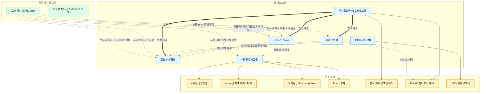

# 연구 보고 아카이브

한국 수도권 공간구조 - 신도시, 철도, 행정구역, 도시 기능 위계 - 에 대한 개인 연구 아카이브. 공식 통계와 1차 사료(국토교통부 정책정보, 국가법령정보센터, KOSIS, 동시대 신문 등)를 기반으로 한 보고서와, 그 보고서를 뒷받침하는 방법론·데이터·조사 메모를 함께 축적한다.

> **이 repo의 성격**: LLM 보조로 작성하되, 모든 주장은 공식 1차 자료로 검증하는 것을 원칙으로 한다. 각 문서는 "확인된 사실"과 "해석"을 구분해 서술한다.

## 문서 간 관계

## 공개 보고서 (Reports)

한국 수도권의 공간구조를 각 관점에서 다룬 독립 보고서.

- [1기·2기·3기 신도시의 근본적 차이](./1기-2기-3기-신도시의-근본적-차이.md) - 세대별 신도시 정책의 문제의식과 공간 전략 비교
- [위례선 트램 보고서](./위례선-트램-보고서.md) - 서울 57년 만의 트램 부활, 환승 구조와 이용자 체감
- [서울 동남부 도시 연담화 세부사례 근거정리](./서울-동남부-도시-연담화-세부사례-근거정리.md) - 미사·감일·교산·위례 등 6개 축으로 본 연담화
- [1963년 서울 대확장 연구보고서](./서울-1963-확장-연구보고서.md) - 서울 행정구역 대확장의 공개 논의, 법적 절차, 주민 반응
- [국가철도망 구축계획과 도시철도망 구축계획 비교](./국가철도망-구축계획과-도시철도망-구축계획-비교.md) - 두 법정계획의 제도적 차이
- [수도권 도시등급 평가 보고서](./수도권-도시등급-평가-보고서.md) - 66개 기초지자체 상대 평가 (2026년 기준)
- [1기 신도시 연구보고서](./1기-신도시-연구보고서.md) - 정책 배경, 공급 규모, 입주 시기, 교통축, 구조적 쟁점 정리

## 원문 재구성 도서 (Books)

PDF 원문을 LLM이 읽고 인용하기 쉬운 Markdown 구조로 재작성한 자료. OCR이 아니라 페이지 이미지 대조와 육안 검토를 바탕으로 장·절, 표, 그림 설명, 주요 수치 인덱스를 정리한다.

### 한국형 신도시 가이드라인 연구 - [`books/korean-newtown-guideline/`](./books/korean-newtown-guideline/)

신도시 계획 가이드라인, 기반시설, 스마트시티, 특화사례를 다룬 원문 자료를 섹션별 Markdown과 LLM 단일 번들로 정리했다.

- [문서 인덱스](./books/korean-newtown-guideline/docs/korean-newtown-guideline/index.md) - 섹션별 목차와 페이지 범위
- [주요 수치](./books/korean-newtown-guideline/docs/korean-newtown-guideline/stats.md) - 면적, 인구, 사업비, 시설 규모 등 선별 수치
- [기계처리용 manifest](./books/korean-newtown-guideline/docs/korean-newtown-guideline/manifest.yml) - 섹션 ID, 파일명, 페이지 범위, 주제 태그
- [LLM 단일 번들](./books/korean-newtown-guideline/dist/korean-newtown-guideline.llm.md) - RAG/긴 컨텍스트 입력용 통합본
- [원본 PDF](./books/korean-newtown-guideline/sources/OTKCRK170383.pdf) - Git LFS 관리

### 도시·공간 트렌드 2024 : 서울메트로폴리탄을 중심으로 - [`books/city-space-trends-2024/`](./books/city-space-trends-2024/)

서울·인천·경기를 서울메트로폴리탄으로 보고, 삶터·일터·놀터·돌봄터·링크 관점에서 2024년 도시·공간 트렌드와 LH사업 적용방안을 정리한 원문 자료다. OCR 없이 PDF 내장 텍스트층과 215쪽 전체 페이지 이미지를 대조해 완성본 Markdown으로 재구성했다.

- [문서 인덱스](./books/city-space-trends-2024/docs/city-space-trends-2024/index.md) - 섹션별 목차와 페이지 범위
- [주요 수치](./books/city-space-trends-2024/docs/city-space-trends-2024/stats.md) - 설문, 신도시 용지비율, 제도·공간 분석 수치
- [기계처리용 manifest](./books/city-space-trends-2024/docs/city-space-trends-2024/manifest.yml) - 섹션 ID, 파일명, 페이지 범위, 주제 태그
- [LLM 단일 번들](./books/city-space-trends-2024/dist/city-space-trends-2024.llm.md) - RAG/긴 컨텍스트 입력용 통합본
- [원본 PDF](./books/city-space-trends-2024/sources/OTKCRK240315.pdf) - Git LFS 관리
- [전체 페이지 이미지](./books/city-space-trends-2024/docs/city-space-trends-2024/assets/pages/) - PDF 1-215쪽 JPEG 보존본

## 보조 자료 (Supplements)

각 연구 주제의 방법론, 데이터, 조사 메모, source anchor.

### 수도권 도시등급 - [`supplements/capital-area-city-tier/`](./supplements/capital-area-city-tier/)

도시등급 평가 보고서의 뒷단. 가중치 근거, 지표 레지스트리, exact KOSIS/e-나라지표 table ID, run-1 계산 결과까지 재현 가능한 형태로 공개.

- [방법론 문서 v1.0](./supplements/capital-area-city-tier/docs/seoul-capital-area-city-tier-methodology.md) - 중국식 도시등급 체계의 한국 수도권 적용, 가중치 선정 근거, 재판별 운영 규칙
- [지표 레지스트리](./supplements/capital-area-city-tier/docs/seoul-capital-area-city-tier-indicator-registry.md) - 차원별 대표값/보조값/source_family
- [Source anchors](./supplements/capital-area-city-tier/docs/seoul-capital-area-city-tier-source-anchors.md) - exact table ID 및 field 명세
- [Run-1 최종 결과](./supplements/capital-area-city-tier/docs/seoul-capital-area-run1-final-report.md) - 66개 단위 점수표 및 차원별 분해
- [KOSIS 수도권 행정구역 코드 맵](./supplements/capital-area-city-tier/docs/kosis-capital-area-region-codes-DT_1B26001.md)
- [최종 전달본](./supplements/capital-area-city-tier/docs/수도권_도시등급_최종전달본.md) - 원천 지표 포함 전체 표

### 철도 리서치 - [`supplements/rail-research/`](./supplements/rail-research/)

국가철도망·도시철도망 계획의 공식 링크 인덱스, PIMAC 철도 예타 보고서 전수 조사 메모.

- [최신 철도망 계획 공식 링크 인덱스](./supplements/rail-research/notes/latest-rail-plans-index.md) - 제4차 국가철도망, 서울·부산·인천·광주·경기 제2차 도시철도망의 공식 고시문·본보고서 직링크
- [도시철도·철도 조사 메모](./supplements/rail-research/notes/urban_rail_notes.md) - PIMAC F1 142건/F2 15건 전수 다운로드 기록, 수도권 50건 필터, 인덕원~수원/동탄 사업 변천 분석
- [국가철도망 vs 도시철도망 계획 비교 (사본)](./supplements/rail-research/notes/rail-plan-comparison.md)

### 서울 1963 확장 - [`supplements/seoul-1963-expansion/`](./supplements/seoul-1963-expansion/)

- [원본 연구 보고서 (사본)](./supplements/seoul-1963-expansion/docs/seoul-1963-expansion-research.md)

### 1기 신도시 보조 메모

- [1기 신도시 보류 서술 메모](./1기-신도시-보류-서술-메모.md) - 본문에서 채택하지 않은 서술과 보류 이유 정리
- [1기 신도시 자료 정리 메모](./1기-신도시-자료-정리-메모.md) - 주제별 자료 정리와 근거 강도 메모

## 작성 원칙

- **사실과 해석의 분리**: 공식 자료가 직접 진술한 내용은 사실로, 그로부터 추론한 내용은 해석으로 구분한다.
- **1차 자료 우선**: 국가법령정보센터, 국토교통부 정책정보, KOSIS, 동시대 신문이 2차 해설보다 우선한다.
- **재현 가능성**: 통계 기반 분석은 table ID, 시점, 필드명까지 명시한다.
- **지명 표기**: 과거 지명은 "당시 지명 / 현재 지명" 병기, 한자 제목은 한글 독음 병기.

## 라이선스 및 이용

개인 연구 아카이브로, 공식 출처를 인용한 내용은 각 원출처의 저작권을 따른다. 본 repo의 서술·해석·편집물은 개인 저작이다.
