# 대한민국 신도시의 역사

부제: 전근대 계획도시의 선례, 산업·행정 계획도시, 서울 내부 신시가지, 수도권 1·2·3기 신도시와 재정비 시대

작성일: 2026-04-29

## 초록

이 보고서는 대한민국 신도시의 역사를 하나의 출발일이나 하나의 정책 세대로 환원하지 않는다. 신도시는 법령상 하나의 단일 고정 명칭이라기보다, 주택공급, 산업입지, 행정기능 분산, 수도권 과밀 완화, 광역교통, 자족기능, 노후도시 정비가 시기별로 결합된 계획도시 정책의 묶음에 가깝다. 따라서 본문은 조선 정조대 수원 화성을 전근대 계획도시의 선례로 별도 배치하고, 대한민국의 본격 신도시사는 1960년대 산업화와 서울 대규모 신시가지 조성, 1970년대 산업기지도시와 행정기능 분산, 1980년대 목동·상계 등 도시내 신도시, 1989년 이후 1기 신도시, 2000년대 2기 신도시와 균형발전형 목적도시, 2018년 이후 3기 신도시, 2024년 이후 노후계획도시 정비라는 시간층으로 나누어 읽는다. 결론적으로 대한민국 신도시사는 "서울 밖에 집을 많이 지은 역사"만이 아니라, 국가가 도시문제를 어떤 공간 단위로 정의하고 어떤 기반시설과 제도로 해결하려 했는지의 변화사다.

보고서의 핵심 주장은 두 가지다. 첫째, 신도시는 언제나 "새 도시"였지만, 그 새로움의 이유는 시기마다 달랐다. 울산과 창원은 산업정책의 도시였고, 영동과 여의도는 서울 확장의 도시였으며, 성남은 이주와 행정 실패가 겹친 도시였고, 목동과 상계는 서울 내부 주택공급 실험이었다. 1기 신도시는 주택 200만 호 정책과 수도권 주택난에 대한 대량 공급의 응답이었고, 2기 신도시는 난개발 방지와 권역별 거점, 3기 신도시는 서울 인접성과 광역교통 선반영을 더 강하게 내세운다.

둘째, 신도시의 평가는 공급 호수나 조성 면적만으로는 충분하지 않다. 실제 평가에는 이주와 보상, 입주 시점의 기반시설, 광역교통 개통 지연, 도시 내부 고용, 생활 SOC, 행정구역 갈등, 도시명과 이미지의 정치, 30년 뒤 재정비 가능성이 함께 포함된다. 그래서 이 보고서는 공식 정책자료, 당시 신문 기사, 1·2기 평가 자료, 3기 계획기준 자료를 함께 대조한다.[^34][^37][^39]

**주제어:** 신도시, 계획도시, 목동, 상계, 1기 신도시, 2기 신도시, 3기 신도시, 노후계획도시

---

## 1. 문제 제기

"대한민국 신도시의 역사"라는 말은 직관적으로는 간단해 보이지만, 실제로는 여러 층위가 겹쳐 있다. 어떤 사람은 분당·일산 같은 1기 신도시를 떠올리고, 어떤 사람은 창원·울산 같은 산업도시를 떠올리며, 또 어떤 자료는 목동·상계 같은 서울 내부 대규모 택지개발지를 "도시내 신도시"로 부른다. 국가유산청 계열 해설 자료에서는 정조의 수원 화성을 한국 최초의 계획 신도시로 설명하기도 한다.[^29]

이 보고서는 이 혼선을 제거하기보다, 오히려 혼선 자체를 분석의 출발점으로 삼는다. 신도시라는 말은 시기마다 다른 문제를 해결하기 위해 호출되었다. 1960-70년대에는 산업화와 행정기능 배치가 중요했고, 1980년대에는 서울 내부의 대규모 주거단지와 주택난 해소가 중요했으며, 1989년 이후에는 수도권 외곽 대규모 주택공급이 전면화되었다. 2000년대에는 난개발 방지와 자족기능, 2018년 이후에는 서울 접근성, 광역교통, 자족용지, 주변도시와의 연계가 더 중요해졌다.[^20]

여기서 가장 조심해야 할 오류는 세 가지다. 첫째, "신도시"를 1기 신도시부터 시작된 말처럼 좁히는 오류다. 그렇게 쓰면 울산, 영동, 성남, 과천, 목동, 상계 같은 선행 층위가 빠진다. 둘째, 신도시를 너무 넓게 잡아 모든 새 주거단지를 같은 등급으로 묶는 오류다. 그렇게 되면 수도권 1·2·3기 신도시처럼 공식 정책 세대가 가진 특성이 흐려진다. 셋째, 신도시를 공급 성과로만 보는 오류다. 그렇게 되면 성남 광주대단지 사건, 영동 개발의 투기와 교육 계층화, 동탄·위례의 명칭 전략, 1기 신도시의 노후화 문제가 설명되지 않는다.

따라서 이 보고서는 신도시를 세 겹으로 읽는다. 하나는 정책 문서가 부여한 공식 범위, 다른 하나는 실제 도시공간이 만들어진 역사, 마지막 하나는 주민이 체감한 생활권과 갈등이다. 세 겹이 겹치는 곳이 많을수록 "신도시"라는 말은 강하게 적용되고, 하나만 충족할수록 보조 사례나 선례로 다루는 것이 안전하다.

따라서 이 보고서가 답하려는 질문은 네 가지다.

1. 대한민국 신도시사는 어디서부터 시작한다고 보는 것이 가장 안전한가.
2. 목동과 상계는 1기 신도시 이전의 어떤 단계로 보아야 하는가.
3. 1기·2기·3기 신도시는 단순한 연대기 구분을 넘어 무엇이 달라졌는가.
4. 앞으로 이 주제를 더 연구하려면 어떤 자료와 분석틀을 추가해야 하는가.

이 네 질문은 단순한 목차가 아니다. 첫 번째 질문은 시대 범위를 정하고, 두 번째 질문은 서울 내부 개발을 신도시사에 넣을 수 있는지를 판단하며, 세 번째 질문은 공식 세대 구분의 의미를 검증하고, 네 번째 질문은 수집 자료를 앞으로 연구 가능한 형태로 재구성하기 위한 기준을 제공한다.

---

## 2. 자료와 방법

이 보고서는 `서울-1963-확장-연구보고서.md`에서 사용한 방식처럼, "확인된 사실"과 "해석"을 분리한다. 한 시점을 신도시사의 유일한 시작점으로 고정하지 않고, 공식 발표, 법령, 사업 착공, 첫 입주, 준공, 주민 체감, 노후 정비를 별도의 시간층으로 둔다.

### 2.1 자료 위계

| 자료 유형 | 사용 목적 | 한계 |
|---|---|---|
| 국토교통부·LH 공식 신도시 자료 | 세대별 정의, 대상지, 규모, 정책목표 확인 | 정책 홍보 문구가 포함되어 실제 성과와 구분 필요 |
| 국가법령정보센터 | 법적 근거, 시행일, 제도 변화 확인 | "신도시"라는 생활적 표현과 법률 용어가 1:1로 대응하지 않음 |
| 서울기록원·서울시 자료 | 목동·상계 등 서울 내부 대규모 택지개발의 행정 기록 확인 | 개별 문서의 맥락과 전체 사업사를 추가 대조해야 함 |
| 국가유산청·수원시 계열 자료 | 정조 수원 화성의 계획도시적 성격 확인 | 대한민국 신도시 정책과 직접 연결하면 시대착오가 됨 |
| 선행 평가 보고서와 부속 정리자료 | 1·2기 평가, 3기 계획기준, 기존 분석 재검토 | 원문, 통계, 지도와 지속 대조 필요 |

### 2.2 용어 구분

| 용어 | 이 보고서의 사용 방식 |
|---|---|
| 계획도시 | 국가·지방정부 또는 공공 주체가 도시 기능과 공간구조를 의도적으로 설계한 도시 일반 |
| 신시가지 | 기존 도시 내부 또는 주변에 새로 조성된 대규모 도시구역 |
| 도시내 신도시 | 목동·상계처럼 서울 내부에서 대규모 택지개발로 조성된 신시가지 |
| 수도권 신도시 | 1기·2기·3기처럼 수도권 주택공급과 광역공간 재편을 위해 조성된 대규모 계획도시 |
| 목적도시 | 행정중심복합도시, 혁신도시, 기업도시처럼 특정 국가 기능 또는 산업 기능을 강하게 부여받은 도시 |
| 노후계획도시 | 처음에는 신도시였으나 시간이 지나 재정비·재건축·생활기반 보강의 대상이 된 계획도시 |

여기서 중요한 점은 "대한민국 신도시"의 직접 범위와 "한국 계획도시사의 선례"를 구분하는 것이다. 정조대 수원은 계획도시의 역사적 선례로는 중요하지만, 대한민국 정부의 신도시 정책으로 분류할 수는 없다. 반대로 목동·상계는 1기 신도시가 아니지만, 서울 내부 대규모 택지개발과 신시가지 조성의 경험으로서 1기 이전 단계를 이해하는 데 중요하다.

### 2.3 단락별 보강 기준

본문의 각 단락은 다음 네 가지 질문 중 적어도 하나에 답하도록 구성한다.

| 질문 | 의미 |
|---|---|
| 왜 이 사례가 신도시사에 들어가는가 | 단순 개발사업과 계획도시를 구분하기 위한 기준 |
| 어떤 자료로 확인되는가 | 공식 자료, 당시 기사, 내부 정리본, 법령 중 어떤 근거에 기대는지 표시 |
| 어떤 오해를 막아야 하는가 | "성남=분당", "영동=강남 아파트 개발", "2기=판교와 위례" 같은 축약을 방지 |
| 다음 연구에서 무엇을 더 봐야 하는가 | 고시문, 실시계획, 통근 OD, 보상 자료, 주민 구술 등 추가 자료 방향 |

이 기준을 두는 이유는 보고서가 단순 요약문으로 흐르지 않게 하기 위해서다. 신도시사는 행정자료만으로는 너무 깨끗하게 보이고, 당시 기사만으로는 시장 분위기와 갈등만 과장될 수 있다. 따라서 한 단락 안에서도 "공식 목표", "현장 갈등", "후대 평가"를 가능한 한 나누어 쓴다.

본문의 도판은 원본 서버에 직접 연결하지 않고, 확인한 원본 이미지를 `assets/newtown-history-maps/`에 내려받아 첨부한다. 캡션에는 원출처와 그 도판이 뒷받침하는 논점을 함께 적어, 그림이 장식이 아니라 본문 근거로 작동하도록 한다.

### 2.4 판단 등급

이 보고서에서 어떤 사례를 신도시사에 포함할 때는 세 등급을 사용한다.

| 등급 | 기준 | 예시 |
|---|---|---|
| 정확 | 공식 신도시 세대나 법정·정책 명칭과 거의 일치 | 1기, 2기, 3기 수도권 신도시 |
| 대체로 일치 | 공식 세대명은 아니지만 계획도시·신시가지로 신도시사에 직접 연결 | 울산신시가지, 영동, 과천, 행복도시·혁신도시 |
| 부분 일치 | 선례, 주변층위, 도시 내부 개발로서 보조적으로 다룸 | 정조 수원, 목동, 상계, 성남 원도심 |

이 등급은 가치판단이 아니라 분석상의 안전장치다. 목동이 "부분 일치"라고 해서 중요도가 낮다는 뜻은 아니다. 오히려 목동은 서울 내부 공영개발을 이해하는 데 매우 중요하다. 다만 수도권 1기 신도시와 같은 정책 범주로 직접 합치면 개념이 흐려지므로 등급을 분리한다.

---

## 3. 신도시를 읽는 시간층

| 시기·날짜 | 층위 | 확인되는 내용 | 해석 |
|---|---|---|---|
| 1789-1796 | 전근대 계획도시 선례 | 수원 읍치 이전, 화성 축성, 행궁·성곽·가로망 조성 | 대한민국 신도시사는 아니지만, 한국 계획도시사의 강한 선례 |
| 1950년대 | 전후 도시확장 | 전후복구와 비계획적 시가지 확장, 토지구획정리사업 중심[^20] | 신도시 이전의 도시 팽창기 |
| 1960년대 | 현대적 신도시의 출발 | 울산신시가지, 여의도·영동, 성남 이주정착지[^20] | 산업화와 서울 확장이 신도시적 개발을 밀어냄 |
| 1970년대 | 산업기지도시·행정분산 | 구미·창원·여천·포항, 잠실, 과천[^20] | 산업정책과 행정기능 분산이 계획도시를 만든 단계 |
| 1980년대 | 도시내 신도시 | 목동·상계의 주택중심 도시내 신도시, 개포·고덕 등 대규모 주거단지[^20] | 서울 내부의 대량 주택공급 실험 |
| 1983-12-09 | 목동 현장 착공층 | 목동 신시가지 개발 기공식 기록 확인[^30] | 행정 계획이 현장 사업으로 전환된 대표 날짜 |
| 1989-1996 | 1기 수도권 신도시 | 분당·일산·평촌·산본·중동 조성, 29만 호대 공급[^21][^41] | 서울 주택난과 과밀 완화에 대응한 대규모 외곽 주거지 |
| 1990년대 | 분산개발·난개발 | 대규모 신도시 비판 이후 소규모 분산개발과 준농림지 개발 허용, 기반시설 부족 문제[^20] | 1기 이후의 반작용과 2기 등장 배경 |
| 2000년대 | 2기·균형발전형 도시 | 2기 신도시, 혁신도시, 행복도시 건설[^20][^22] | 주택공급에 자족·거점·균형발전 논리가 결합 |
| 2018년 이후 | 3기 신도시 | 왕숙·왕숙2, 교산, 계양, 창릉, 대장 등 6개 지구[^20] | 서울 인접, 30분대 접근, 자족용지와 광역교통 선반영 |
| 2024-04-27 이후 | 노후계획도시 정비 | 노후계획도시 특별법 시행[^23] | 신도시가 새 도시 건설에서 생애주기 관리 대상으로 이동 |

이 표가 보여주는 핵심은 간단하다. 대한민국 신도시사는 "새 땅에 새 아파트를 지었다"는 단순한 이야기가 아니다. 시기마다 국가가 해결하려는 도시문제가 달랐고, 그 문제의 언어가 산업, 행정, 주택, 교통, 자족성, 정비로 바뀌었다.

이 시간층은 또한 "발표일"과 "도시가 실제로 작동하기 시작한 시점"이 다르다는 점을 보여준다. 신도시는 보도자료가 나오는 날 탄생하지 않는다. 지구 지정, 보상, 착공, 분양, 첫 입주, 학교 개교, 철도 개통, 상권 형성, 일자리 유치가 서로 다른 속도로 진행된다. 주민에게는 첫 입주일이 더 중요할 수 있고, 정책평가에는 준공일이나 광역교통 개통일이 더 중요할 수 있다. 그래서 신도시사를 쓸 때는 한 날짜로 도시의 생애를 대표시키는 방식이 부적절하다.

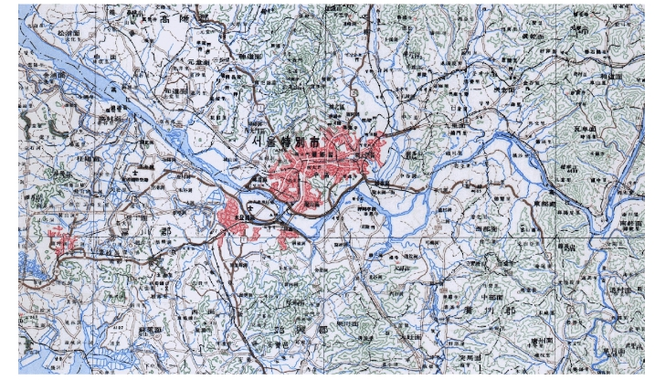

*자료: 서울기록원 「서울의 도시성장과 환경기초시설」에 수록된 1960년대 서울시 일대 지형도. 서울의 팽창과 한강 이남 개발 이전의 공간구조를 확인하기 위해 첨부했다.[^45]*

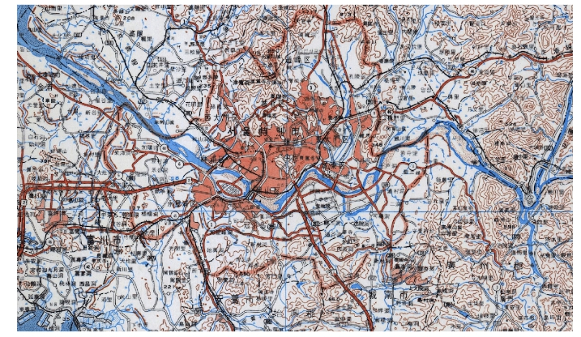

*자료: 서울기록원 「서울의 도시성장과 환경기초시설」에 수록된 1970년대 서울시 일대 지형도. 영동·여의도·잠실 개발이 서울의 시간층 안에서 어떻게 등장했는지 비교하기 위한 도판이다.[^45]*

특히 1기와 2기는 이 시간층 차이가 크다. 1기는 빠른 대량공급의 성격이 강했기 때문에 주택 입주와 교통·업무 기능의 시차가 문제로 남았다. 2기는 자족기능과 광역교통을 더 강조했지만, 도시별 개발기간이 길고 일부 사업은 장기간 진행되면서 계획 목표와 체감 성과의 간격이 커졌다. 3기는 이 문제를 알고 출발했기 때문에 광역교통 선반영과 자족용지를 내세우지만, 아직 성과가 완전히 검증되지는 않았다.

| 시간층 | 보고서에서 확인할 질문 |
|---|---|
| 발표 | 왜 이 도시가 필요하다고 설명했는가 |
| 지정 | 어떤 법적·행정적 범위가 확정되었는가 |
| 보상·이주 | 기존 주민과 토지 소유자는 어떻게 처리되었는가 |
| 착공·분양 | 실제 주택공급은 언제 시작되었는가 |
| 첫 입주 | 주민은 어떤 기반시설 조건에서 들어왔는가 |
| 교통 개통 | 서울·모도시 접근성은 언제 체감되었는가 |
| 일자리 형성 | 자족기능은 용지 계획을 넘어 실제 고용으로 이어졌는가 |
| 노후화 | 도시가 20-30년 뒤 다시 계획 대상이 되었는가 |

---

## 4. 전근대 선례: 정조의 수원

정조대 수원 화성은 이 보고서에서 제한적으로 다룬다. 이 주제는 "대한민국" 신도시 정책의 직접 범위 밖에 있다. 다만 수원 화성은 한국 계획도시사의 강력한 선례로 반복해서 언급되므로, 현대 신도시사와 구분되는 전사로 배치할 필요가 있다.

국가유산청 계열 해설은 수원 화성이 사도세자의 능침을 옮기고 읍치를 팔달산 아래로 이전하면서 축성되었으며, 정치적 구상, 국방, 상업, 가로망, 행궁, 성곽이 결합된 도시였다고 설명한다.[^29] 같은 자료의 동영상 해설은 수원 화성을 한국 최초의 계획 신도시라고도 볼 수 있다고 설명한다.[^29]

그러나 이 보고서에서는 이 표현을 그대로 대한민국 신도시사의 출발점으로 옮기지 않는다. 이 보고서의 기준은 다음과 같다.

> 정조의 수원은 대한민국 신도시 정책의 시작은 아니지만, 한국에서 계획도시를 상상하고 구현한 전근대적 선례로 볼 수 있다.

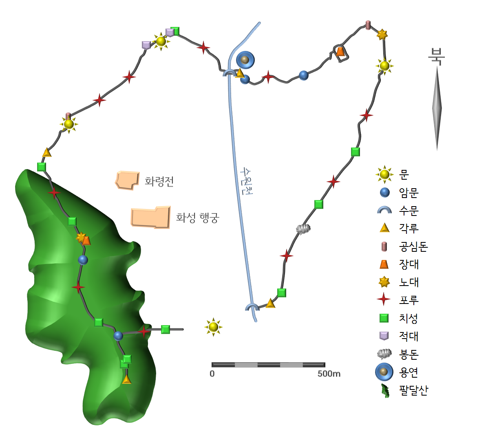

*자료: Jpbarrass, Wikimedia Commons, 「Hwaseong Fortress Map - Korean」. 저작권자가 퍼블릭 도메인으로 공개한 수원 화성 지도이며, 국가유산청 계열 해설의 "계획 신도시" 설명과 대조하기 위해 첨부했다.[^61][^29]*

이 구분은 중요하다. 수원 화성을 길게 다루면 보고서의 중심이 대한민국 도시정책사에서 조선 후기 도시사로 이동한다. 따라서 본문에서는 수원을 "전사"로 두고, 본론의 출발점은 1960년대 이후 현대적 신도시와 신시가지 개발로 둔다.

그럼에도 수원은 배제하기 어렵다. 수원 화성은 정치적 목적, 행정 중심, 군사 방어, 상업 육성, 가로망과 성곽, 행궁이 결합된 계획도시였기 때문이다. 현대 신도시가 주택, 교통, 자족, 행정기능을 묶는 것처럼, 수원 화성도 한 도시 안에 여러 국가 기능을 배치하려는 기획이었다. 다만 그 기획의 제도, 경제, 기술, 국민국가적 맥락이 현대 대한민국 신도시와 다르기 때문에 "선례" 이상의 의미를 부여하면 해석이 과도해진다.

따라서 수원 화성은 본 보고서에서 세 가지 용도로만 사용한다. 첫째, 한국사 안에서 계획도시적 상상이 오래되었다는 전사. 둘째, 도시가 정치적 기획과 공간 설계의 결합물이라는 설명. 셋째, 현대 신도시의 직접 기원이 아니라 비교 가능한 역사적 거울이라는 제한적 위치다. 이 정도의 비중이면 대한민국 신도시사의 중심을 유지하면서도, 정조 수원이 가진 계획도시사적 의미를 보존할 수 있다.

---

## 5. 현대 한국 신도시의 출발: 산업화, 서울 확장, 행정기능 분산

국토교통부·LH 계열의 3기 신도시 공식 설명은 신도시 개발의 역사를 1950년대 전후복구와 비계획적 시가지 확장부터 정리한다. 이어 1960년대에는 공업화와 경제개발정책이 본격화되면서 현대적 의미의 신도시가 처음 건설되었다고 설명하고, 울산신시가지, 여의도, 영동, 성남을 언급한다.[^20]

이 대목은 대한민국 신도시사를 쓸 때 매우 중요하다. 1기 신도시가 1989년에 등장했다고 해서 신도시적 개발이 그때 처음 생긴 것은 아니다. 그 이전에도 산업도시, 서울 내부 신시가지, 이주정착지, 행정기능 분산 도시가 있었다. 다만 1989년 1기 신도시는 "수도권 주택난 해소를 위한 대규모 외곽 신도시"라는 형태를 강하게 제도화했다는 점에서 다른 단계다.

하지만 이 항목들을 하나의 범주로 압축하면 분석상 손실이 크다. 울산은 산업화의 도시이고, 영동은 강남 개발과 토지구획정리, 투기, 도시기능 이전의 도시이며, 성남은 서울의 무허가 주거지 정리와 이주정착지, 광주대단지 사건을 거쳐 만들어진 도시다. 같은 "현대적 신도시의 출발"이라도 도시가 겪은 폭력성과 갈등의 결은 완전히 다르다.

### 5.1 1960-70년대 선행 사례의 이질성

1960-70년대의 신도시적 개발은 오늘날 1·2·3기 신도시처럼 세대명으로 정리되지는 않는다. 그러나 대한민국 도시정책이 이미 "새로운 도시구역을 만들어 산업·주거·행정 문제를 처리한다"는 방식을 사용하기 시작했다는 점에서 중요하다.

이 시기 사례는 다음처럼 구분할 수 있다.

| 사례 | 통상적 설명 | 실제 분석 층위 |
|---|---|---|
| 울산신시가지 | 공업화와 경제개발정책의 도시 | 산업입지, 노동력 수용, 공업도시 관리 |
| 여의도 | 한강 개발과 서울 신시가지 | 제방·매립·업무지구·아파트 개발 |
| 영동 | 서울 강남의 신시가지 | 토지구획정리, 제3한강교·경부고속도로, 땅값 상승, 투기, 학교·공공기관 이전 |
| 성남 | 서울 철거민 이주정착지 | 무허가 주거지 정리, 광주대단지 조성, 생존권 항의, 1971년 광주대단지 사건, 성남시 탄생 |
| 잠실 | 서울 동남부 개발 | 한강 물길 변경, 매립, 광주대단지와 서울 연결, 아파트 단지화 |
| 과천 | 행정기능 분산 도시 | 정부 기능 이전, 수도권 행정도시, 주거와 행정의 결합 |

따라서 1960-70년대는 "신도시 전사"가 아니라, 이후 수도권 신도시 정책이 반복하게 될 거의 모든 문제가 먼저 나온 시기다. 토지, 이주, 분양, 교통, 행정구역, 공공기관 이전, 투기, 학교, 생활권 문제가 이때 이미 한꺼번에 등장한다.

이 시기에서 특히 중요한 것은 "도시를 새로 만든다"는 행위가 항상 중립적인 기술사업이 아니었다는 점이다. 울산과 창원처럼 국가 산업정책을 실현하기 위한 도시가 있었고, 영동처럼 미래의 지가 상승 기대가 도시 형성과 동시에 폭발한 곳이 있었으며, 성남처럼 서울의 빈곤을 외곽으로 밀어내는 과정에서 주민 생존권 문제가 터진 곳도 있었다. 그러므로 1960-70년대 신도시사는 개발의 성공담과 행정 실패의 기록을 동시에 읽어야 한다.

이 관점은 이후 장에도 그대로 이어진다. 1기 신도시는 대량 공급의 성과가 있지만 서울 의존 통근 구조와 노후화 문제가 남았고, 2기 신도시는 자족기능을 공식 목표로 올렸지만 도시별 편차가 컸으며, 3기 신도시는 교통과 자족을 초기부터 설계했지만 아직 실현 여부가 검증되지 않았다. 즉 대한민국 신도시사는 매 세대마다 이전 세대의 문제를 알고 출발하지만, 완전히 해결하지는 못한 역사다.

### 5.2 영동 개발: 강남은 조용히 생긴 신도시가 아니다

영동 개발은 서울 내부 신시가지 개발이면서 동시에 강남이라는 새 중심지를 만든 국가·서울시 프로젝트였다. 서울역사박물관의 「강남 40년: 영동에서 강남으로」 전시는 1960년대 강북의 팽창, 1969년 제3한강교, 1970년 경부고속도로, 영동지구 토지구획정리사업, 공무원아파트, 공공기관·학교 이전, 고속버스터미널, 지하철 2호선 등을 강남 개발 촉진정책의 흐름으로 정리한다.[^32]

즉 영동은 "서울 남쪽에 아파트를 지었다"는 설명으로 환원되지 않는다. 강북의 과밀을 덜기 위해 강남으로 도심 기능과 인구를 옮기려 했고, 이를 위해 다리, 고속도로, 토지구획정리, 주택, 학교, 버스노선, 공공기관 이전이 묶였다. 서울신문의 회고 기사도 1966년 서울시가 강남구·서초구 일대를 토지구획정리예정지로 지정한 것을 강남 개발의 출발점으로 설명하고, 1970년 영동 2지구 개발 발표와 상공부 청사 이전 구상이 땅값 상승의 계기가 되었음을 짚는다.[^1]

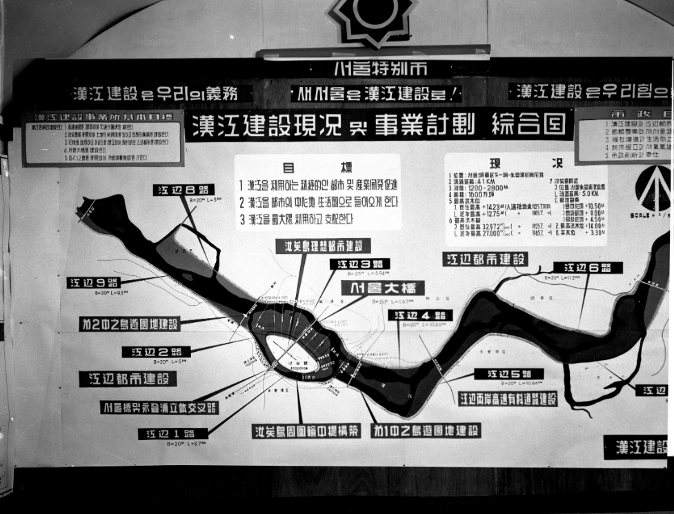

*자료: 서울기록원 「서울의 도시성장과 환경기초시설」에 수록된 1968년 한강건설현황 및 사업계획 종합도. 영동 개발을 강남 아파트 단지 조성이 아니라 한강·교량·간선도로·토지구획정리의 결합으로 읽어야 함을 보여주는 자료다.[^45]*

영동 개발의 분석 포인트는 세 가지다.

| 분석축 | 내용 |
|---|---|
| 기반시설 | 제3한강교와 경부고속도로가 강북과 강남, 서울과 전국 고속교통망을 연결 |
| 토지제도 | 영동 1·2지구 토지구획정리사업이 농촌·야산·논밭을 도시 필지로 재편 |
| 사회적 파장 | 땅값 급등, 부동산 투기, 복덕방·복부인 담론, 8학군, 밤문화, 강남 이미지가 함께 형성 |

이 점에서 영동은 "신도시"라는 이름이 붙지 않았더라도 신도시사의 핵심 선행 사례로 다룰 수 있다. 1기 신도시가 서울 외곽에 대규모 주거지를 만든 사례라면, 영동은 서울 내부에서 새 중심지를 만든 사례다. 더 넓게 보면, 영동은 대한민국 도시개발이 어떻게 기반시설 투자, 토지 재편, 공공기관 이전, 교육정책, 부동산 기대심리를 한 덩어리로 움직였는지를 보여주는 원형적 사례다.

영동 개발을 1기 신도시와 비교하면 차이가 더 분명하다. 1기 신도시는 서울의 주택수요를 외곽으로 흡수하려는 정책이었다. 반면 영동은 서울 내부의 중심을 강북에서 강남으로 옮기는 장기적 공간 재편이었다. 이것은 단순히 "서울 남쪽에 새 주거지를 만든 것"이 아니라, 업무, 교통, 교육, 상업, 토지시장, 도시 이미지를 한꺼번에 이동시킨 일이다. 그래서 영동은 수도권 외곽 신도시는 아니지만, 현대 한국 도시개발의 문법을 보여주는 핵심 선행 사례다.

또 하나 봐야 할 점은 영동 개발이 후대 신도시의 "교통 선투자" 논리와도 이어진다는 것이다. 제3한강교와 경부고속도로가 먼저 강남의 가능성을 키웠고, 이후 토지구획정리와 공공기관·학교 이전이 뒤따랐다. 3기 신도시가 GTX, S-BRT, TOD, 자족용지 같은 언어를 쓰는 것도 결국 교통과 토지이용을 한꺼번에 묶으려는 방식이다. 차이는 영동의 경우 그 과정에서 부동산 투기와 계층 이미지가 매우 강하게 결합했다는 점이다.

### 5.3 성남과 광주대단지: 이주정착지가 아니라 도시정책의 실패와 항의

성남은 별도의 사례로 다룰 필요가 있다. 성남의 출발은 "서울의 철거민 이주정착지"라는 행정적 표현보다 훨씬 복합적이다. 성남시사 제6권은 성남 도시발달사를 광주대단지, 분당, 판교와 위례까지 이어지는 압축적 도시개발사로 정리하고, 제2장과 제3장에서 광주대단지 사업의 배경, 조성 과정의 난맥상, 8·10 광주대단지 사건의 발생 배경과 전개를 별도 장으로 다룬다.[^33]

광주대단지는 서울의 무허가 주거지를 정리하고 인구를 외곽으로 분산시키려는 사업이었다. 그러나 이주민 입장에서는 교통, 생계, 기반시설, 토지대금, 분양증 전매 금지, 행정 약속 불이행이 한꺼번에 닥친 사건이었다. 성남시사 목차만 보아도 "공간적·사회적 격리에 따른 빈곤과 공포", "분양증 전매 금지와 일시불 상환 조치"가 사건 배경의 핵심 항목으로 제시된다.[^33]

1971년 8월 10일 광주대단지 사건은 그래서 단순한 소요나 주변부 해프닝이 아니다. 그것은 신도시적 개발이 기존 도시의 빈곤을 외곽으로 옮기는 방식으로 작동했을 때 어떤 정치적 폭발이 생기는지를 보여준다. 서울경제의 회고 기사와 성남시 자료들은 이 사건을 오늘날 성남의 역사적 뿌리이자 주민운동·도시빈민 문제와 연결해 설명한다.[^2][^19]

성남을 신도시사에 넣을 때는 세 층위의 분리가 필요하다.

| 층위 | 시기와 성격 | 분석상 주의 |
|---|---|---|
| 광주대단지·성남 원도심 | 1960년대 말-1970년대 초 이주정착지와 시 승격 과정 | 이주, 빈곤, 기반시설 부재, 행정 실패, 항의의 역사 |
| 분당 | 1989년 이후 1기 신도시 | 수도권 주택난 해소와 계획도시 모델 |
| 판교·위례 | 2000년대 이후 2기 신도시 | 자족기능, 강남 접근성, 서울·경기 접경 개발 |

이 구분이 없으면 성남은 너무 쉽게 "성남=신도시" 또는 "성남=분당·판교"로 납작해진다. 정확히는 성남이라는 한 지방자치단체 안에 광주대단지의 폭력적 이주사, 분당의 1기 신도시사, 판교·위례의 2기 신도시사가 겹쳐 있다. 그래서 성남은 대한민국 신도시사의 압축판이다.

성남은 특히 "같은 행정구역 안의 다른 시간층"을 보여준다. 수정·중원 일대의 원도심은 광주대단지와 도시빈민 이주의 역사에서 출발했고, 분당은 1기 신도시로서 1990년대 수도권 주택공급 정책의 대표 사례가 되었으며, 판교는 2기 신도시와 지식산업 기능의 성공 사례로 읽힌다. 위례는 다시 서울 송파, 성남, 하남이 만나는 접경형 2기 신도시다. 따라서 성남은 현재 행정단위만으로 묶기보다, 원도심·분당·판교·위례를 각각 다른 정책 세대와 사건사로 분리해 읽는 편이 적절하다.

이런 점에서 성남은 추가 연구 가치가 매우 크다. 광주대단지 사건을 도시정책 실패로 분석하고, 분당을 1기 신도시의 주택공급과 통근 구조로 분석하며, 판교를 2기 신도시의 자족기능과 지식산업 집적으로 분석하고, 위례를 행정경계형 신도시로 분석하면 한 도시 안에서 한국 신도시사의 거의 모든 주제가 나온다. 성남은 단순 사례가 아니라, 신도시사 전체를 압축해 보여주는 연구 현장이다.

### 5.4 1970년대 산업기지도시와 과천

1970년대 계획도시를 다룰 때는 "산업기지도시"와 "서울 내부 신시가지", "행정기능 분산 도시"를 따로 읽어야 한다. 3기 신도시 계획기준 연구는 1960-70년대 초반의 한국 신도시 정책을 경제개발계획과 공업화정책에 따른 산업단지 배후도시 건설에서 출발한 것으로 정리하고, 울산신시가지, 구미, 창원, 여천, 포항, 성남, 여의도, 영동, 반월, 잠실, 과천을 같은 시기 전개과정 안에 놓는다.[^43] 하지만 같은 시기라는 이유만으로 같은 유형은 아니다.

울산은 이 흐름의 출발점이다. 울산신시가지는 1962년 현대적 의미의 신도시로 건설되기 시작한 사례로 정리되며,[^43] 울산미포국가산업단지는 1962년 경제개발계획의 핵심 구상을 울산에서 실현하려 한 공업화의 전진기지로 설명된다.[^57] 여기서 중요한 것은 울산이 "아파트 신도시"가 아니라 산업입지, 노동력, 항만, 정유·화학, 조선·자동차 산업, 배후 주거와 도시기반을 한꺼번에 묶은 국가 산업화의 공간이었다는 점이다. 울산을 넣어야 신도시사가 수도권 주택정책으로만 좁아지지 않는다.

창원은 울산보다 더 노골적인 산업기지형 계획도시다. KDI 경제정책 시계열서비스에 수록된 「창원기계공업기지 건설계획」은 창원기계공업기지를 "국제수준의 기계공업 기지화"라는 목표 아래 경남 마산시 웅남동 일원에 조성하고, 소재·요소부품·기계류 수출의 전진기지로 삼으려 했다고 정리한다.[^44] 또한 이 계획은 토지이용, 사업규모, 기지조성, 자금지원, 시행계획까지 포함한 도시·산업 결합 계획이었다.[^44] 그러므로 창원은 공장 옆에 주거지를 붙인 사례가 아니라, 산업정책이 도시형태를 직접 생산한 사례다.

구미, 여천, 포항, 반월도 이 계열에 놓인다. 이 도시들은 서울 주택난을 덜기 위해 만든 외곽 주거도시라기보다, 특정 산업의 입지와 생산체계를 만들기 위해 도시기반을 동원한 사례다. 주택은 중요했지만 목적은 주택공급 자체가 아니었다. 공장, 도로, 항만, 공업용수, 배후 주거, 노동력 재생산, 지역 행정체계가 함께 움직였고, 이 점에서 후대의 기업도시와 산업클러스터형 신도시를 이해하는 선례가 된다.

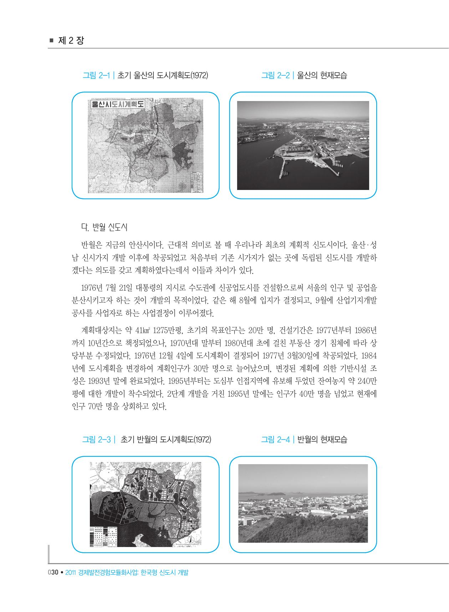

*자료: KSP 「2011 경제발전경험모듈화사업: 한국형 신도시 개발」에 수록된 초기 울산·반월·창원 도시계획도 페이지. 산업기지도시를 주거 신도시가 아니라 생산기능과 배후도시가 결합된 계획도시로 보아야 한다는 점을 보강한다.[^62]*

서울 내부에서는 여의도와 잠실이 다른 방식으로 신도시사의 선례가 된다. 서울기록원은 여의도개발을 1968년 밤섬 폭파, 여의도 종합개발계획 모형, 윤중제 공사, 1971년 여의도 시범아파트 준공과 함께 보여준다.[^45] 여의도는 섬을 제방과 매립, 교량, 공동구, 고층 아파트, 업무·정치 기능으로 재구성한 사례다. 이후 국회의사당, 증권·금융 기능, 방송·업무 기능이 결합하면서 여의도는 단순 주거지가 아니라 서울의 새 업무 중심지로 성장했다.

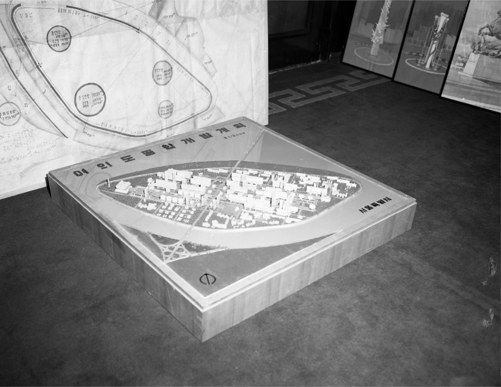

*자료: 서울기록원 「서울의 도시성장과 환경기초시설」에 수록된 1968년 여의도 종합개발계획 모형. 섬을 제방·교량·공동구·업무기능으로 재구성한 서울 내부 계획도시의 성격을 보여준다.[^45]*

잠실은 물길과 땅 자체를 바꾼 사례다. 서울기록원 자료는 1971년 4월 16일 잠실도와 송파 사이 한강 지류가 막히면서 잠실섬이 육지로 변했고, 서울시가 잠실섬을 육속화해 새 시가지와 종합체육시설을 건립하려 했다고 설명한다.[^45] 김백영의 잠실 올림픽타운 연구도 잠실지구 개발사업이 1970년대 초 본격화되었고, 1974년 이후 단순 주거타운을 넘어 국제 스포츠경기와 미래 이상도시를 겨냥한 종합계획 대상으로 재설정되었다고 분석한다.[^47] 잠실은 아파트 개발이면서 동시에 한강개발, 강남 개발, 스포츠시설, 올림픽 도시 만들기가 겹친 계획도시였다.

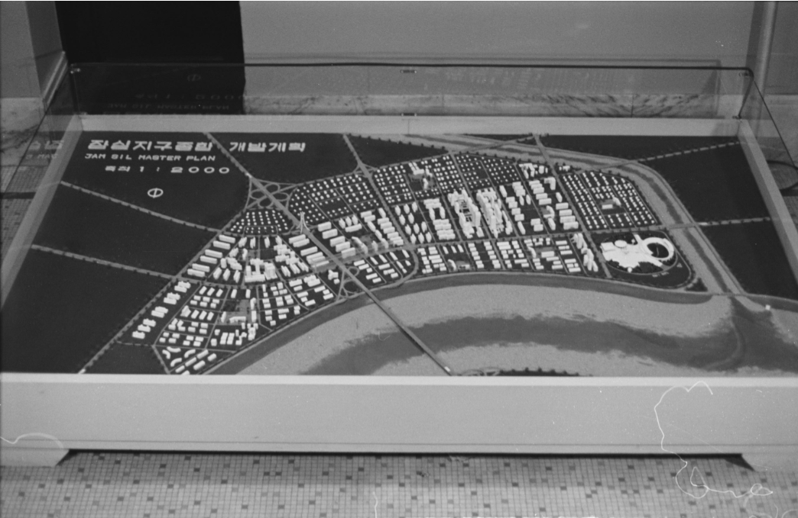

*자료: 서울기록원 「서울의 도시성장과 환경기초시설」에 수록된 1970년 잠실지구 종합개발계획 모형. 잠실을 주택단지 하나가 아니라 하천 정비, 새 시가지, 체육시설, 후대 올림픽 도시 만들기의 결절로 읽기 위한 도판이다.[^45]*

과천은 산업도시도, 서울 내부 신시가지도 아니다. 과천은 정부 기능을 서울 중심부 밖으로 옮기는 행정기능 분산 도시다. 국가기록원은 1982년 7월 19일 보건사회부를 시작으로 정부 각 부처의 과천 이전이 본격화되었다고 정리하고, 별도 자료에서 정부제2종합청사와 과천의 변화를 다룬다.[^46] 이 때문에 과천은 후대 행정중심복합도시와 비교할 수 있다. 다만 과천은 서울권 안의 행정기능 분산이고, 세종은 수도권 집중 완화를 명시적으로 내건 국가균형발전형 행정도시라는 점에서 성격이 다르다.

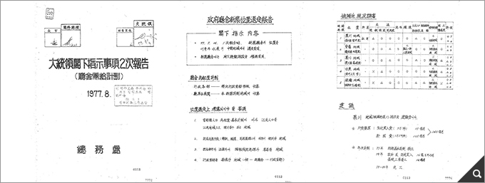

*자료: 국가기록원 「정부제2종합청사와 과천의 변화」. 과천을 주택공급형 신도시가 아니라 행정기능 분산 도시로 읽기 위한 보조 도판이다.[^46]*

이 시기 도시들을 나란히 놓으면 대한민국 신도시의 초기 문법이 보인다. 산업기지도시는 "생산기능을 어디에 배치할 것인가"라는 질문에서 출발했고, 여의도·잠실·영동은 "서울의 팽창을 어떤 공간구조로 흡수할 것인가"라는 질문에서 출발했으며, 성남은 "서울의 빈곤과 철거를 어디로 보낼 것인가"라는 질문을 폭력적으로 드러냈고, 과천은 "행정기능을 어디까지 분산할 수 있는가"라는 질문을 제도화했다. 1989년 1기 신도시는 이 문제들 가운데 주택공급과 수도권 외곽 분산을 가장 강하게 제도화한 단계로 보아야 한다.

### 5.5 1960-70년대의 종합 평가

1960-70년대 신도시적 개발은 공식 세대명으로 단일하게 묶이지 않지만, 이후 신도시 정책의 원형을 만든다. 이 시기에는 네 가지 원형이 나타난다.

| 원형 | 대표 사례 | 후대와의 연결 |
|---|---|---|
| 산업정책형 계획도시 | 울산, 구미, 창원, 여천, 포항, 반월 | 산업단지, 기업도시, 혁신도시, 첨단산업 클러스터와 연결 |
| 서울 확장형 신시가지 | 여의도, 영동, 잠실 | 목동·상계, 1기 신도시, 강남권 수요 대체 논리와 연결 |
| 이주정착·외곽 분산형 도시 | 성남 광주대단지 | 원주민·이주민 갈등, 보상, 기반시설 지연 문제와 연결 |
| 행정기능 분산형 계획도시 | 과천 | 세종 행정중심복합도시, 도청이전신도시와 비교 가능 |

이 네 원형은 뒤섞이며 반복된다. 2기 신도시의 동탄·고덕은 산업과 주거가 결합하고, 위례는 서울 확장과 강남권 수요 대체 논리가 강하며, 3기 신도시는 기존 도시 주민과 신규 개발지의 갈등을 다시 드러낸다. 목적도시인 행복도시·혁신도시·기업도시는 1970년대 산업기지도시와 과천의 문제의식을 다른 제도 형식으로 이어받는다.

따라서 1960-70년대는 단순한 배경이 아니라, 대한민국 신도시 정책의 문제 목록이 처음 한꺼번에 펼쳐진 시기다. 이후 세대가 바뀌어도 질문은 크게 달라지지 않는다. 다만 국가가 강조하는 기능이 산업에서 주택으로, 주택에서 자족·교통으로, 다시 균형발전과 노후도시 정비로 이동했을 뿐이다.

---

## 6. 1980년대 도시내 신도시: 목동과 상계

목동과 상계는 이 보고서에서 별도 절로 둔다. 이 둘은 1기 신도시가 아니지만, 1기 신도시 이전에 서울 내부에서 대규모 주거지 개발이 어떻게 이루어졌는지를 보여주는 핵심 사례다.

3기 신도시 공식 설명은 1980년대에 목동과 상계동에 주택 중심의 도시내 신도시가 건설되었고, 개포·고덕·목동·상계가 서울시내 대규모 주거단지로 조성되었다고 정리한다.[^20] 서울시도 목동·상계를 대규모 택지개발지구 도시관리방안의 대상으로 다루고 있다.[^27]

목동과 상계의 중요성은 "서울 안에도 신도시적 개발이 있었다"는 점이다. 1기 신도시를 분당·일산에서 시작하면 신도시사는 외곽 개발사로만 보인다. 그러나 목동과 상계를 넣으면 서울 내부에서 이미 대규모 택지개발, 공영개발, 아파트 단지화, 학교·상업·공원·열병합 같은 생활기반 조성이 실험되고 있었음을 볼 수 있다. 즉 1기 신도시는 아무 것도 없는 상태에서 갑자기 나온 것이 아니라, 서울 내부 대규모 주거지 개발 경험을 외곽으로 확장한 측면이 있다.

다만 목동·상계를 1기 신도시와 같은 범주로 넣는 데에는 개념상 구분이 필요하다. 목동과 상계는 서울 내부 신시가지이고, 1기 신도시는 수도권 외곽의 공식 신도시 세대다. 이 차이를 유지하면서도 둘의 연계를 함께 다룰 수 있다. 그래서 이 보고서는 목동과 상계를 "도시내 신도시" 또는 "1기 이전 중간 단계"로 다룬다.

### 6.1 목동: 공영개발과 기록의 두께

서울기록원은 목동 신시가지 개발 기공 기록을 공개하고 있다. 해당 기록은 1983년 12월 9일 강서구 목동 현장에서 목동 신시가지 개발사업 기공식이 열렸다는 사실을 확인해 준다.[^30] 또 서울기록원은 목동 신시가지 개발 관련 기록 약 1만 권이 발견되었다고 소개한다.[^31]

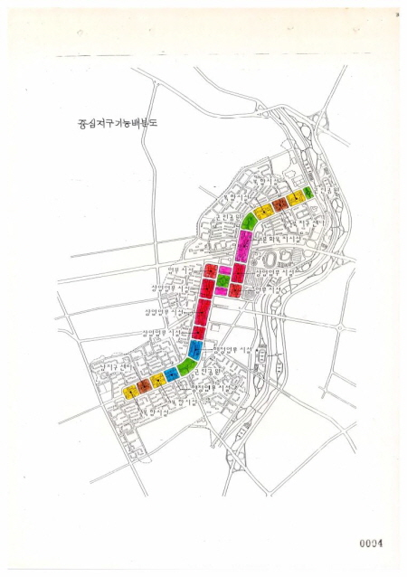

*자료: 서울기록원 목동 신시가지 관련 전시의 「목동지구 도시설계(안) 보고」 이미지. 목동을 단순 아파트 단지가 아니라 도시설계·공영개발 기록이 남은 서울 내부 신시가지로 읽기 위해 첨부했다.[^63]*

목동은 연구자료로 특히 가치가 있다. 단순히 아파트 단지가 남아 있기 때문이 아니라, 개발 기록 자체가 두껍게 남아 있기 때문이다. 목동을 분석하면 공영개발, 택지 조성, 분양, 학교·상가·도로·열병합시설, 이주와 보상, 행정문서의 생산 방식까지 함께 볼 수 있다.

목동의 핵심은 공영개발형 신시가지라는 점이다. 목동은 서울 내부에 있으면서도 기존 도심의 자연 성장과는 다르게, 계획된 가로망과 대규모 아파트 단지, 학교, 상업시설, 공원, 기반시설이 묶여 들어간다. 이 점은 후대 1기 신도시의 기본 문법과 통한다. 다만 목동은 서울 외곽의 독립 신도시라기보다 서울 내부의 새로운 생활권이므로, 서울의 교육·교통·주택시장과 매우 밀접하게 맞물린다.

또한 목동은 기록의 두께 때문에 연구 방법론 측면에서도 중요하다. 서울기록원 자료처럼 행정문서가 많이 남아 있으면, 단순히 결과로서의 아파트 단지를 보는 데 그치지 않고 계획 변경, 보상, 분양, 기반시설 설치, 행정협의 과정을 따라갈 수 있다. 신도시 연구에서 상대적으로 확보하기 어려운 것은 "어떻게 결정되었는가"의 기록인데, 목동은 그 질문에 접근하기 좋은 사례다.

다만 목동을 공영개발의 성공사례로만 해석하는 관점은 경계해야 한다. 1980년대 목동·신정동 신시가지 개발 과정에서도 철거와 이주 문제가 있었다. 당시 목동본당 신자들과 지역주민들은 목동지역 철거대책 추진위원회를 구성해 선입주 후 철거, 세입자 아파트 입주권, 원가 분양, 현실 보상, 장기분할 상환 아파트 등을 요구했으나, 기사에 따르면 요구가 관철되지 못한 상태에서 목1동 지역 철거가 시작되었다.[^3] 이 사례는 목동 신시가지가 오늘날의 안정된 중산층 주거지 이미지와 달리, 출발 단계에서는 기존 거주민의 주거권 문제를 안고 있었다는 점을 보여준다.

따라서 목동 연구에는 두 갈래 접근이 필요하다. 하나는 행정이 남긴 공영개발 기록을 따라가는 연구이고, 다른 하나는 개발로 밀려난 주민의 요구와 보상 논리를 따라가는 연구다. 목동은 "잘 계획된 신시가지"이면서 동시에 "누가 그 계획 안에 들어오고 누가 밖으로 밀려났는가"를 물어야 하는 사례다.

목동을 더 파고들 때의 질문은 다음과 같다.

| 질문 | 이유 |
|---|---|
| 공영개발 방식은 민간 개발과 무엇이 달랐는가 | 후대 택지개발과 공공 주도 개발의 선례를 확인 |
| 학교·상업·공원은 입주와 동시에 충분했는가 | 생활 SOC의 초기 성숙도를 평가 |
| 기존 주민의 이주와 보상은 어떻게 처리되었는가 | 새 입주민 중심 서술을 보완 |
| 목동의 교육·주거 이미지가 언제 형성되었는가 | 도시 브랜드와 주택시장 효과를 분석 |

### 6.2 상계: 대규모 아파트 개발과 남은 저층주거지

상계 역시 서울 내부 대규모 주거지 조성의 핵심 사례다. 공식 신도시 역사 설명은 상계를 1980년대 도시내 신도시 및 대규모 주거단지 흐름에 포함한다.[^20] 서울시의 최근 상계5동 재개발 자료는 상계 일대가 1960년대 이주민 정착, 1980년대 주변 대규모 아파트 개발, 그리고 일부 노후 저층주거지의 잔존이라는 층위를 동시에 갖고 있음을 보여준다.[^28]

따라서 상계는 목동처럼 비교적 완결된 "신시가지 전체"로만 읽기 어렵다. 상계의 의미는 대규모 아파트 개발과 그 주변에 남은 저층주거지, 이주민 정착지, 재개발 압력이 한 공간 안에서 겹친다는 데 있다. 이 점은 1기 신도시와도 다르다. 분당·일산이 비교적 독립적인 외곽 신도시라면, 상계는 서울 내부의 기존 도시조직과 더 복잡하게 맞물린다.

상계의 핵심은 주변부성이다. 상계는 서울 내부 대규모 아파트 개발의 대표 사례이면서도, 그 주변에는 기존 저층주거지, 이주민 정착의 흔적, 재개발 압력이 같이 남아 있다. 그래서 상계는 "계획된 아파트 도시"와 "계획 바깥의 주변부"를 동시에 보여준다. 이 점은 목동과 다르다. 목동이 상대적으로 공영개발 신시가지의 완결성을 보여준다면, 상계는 대규모 개발 이후에도 주변부가 어떻게 남고 다시 재개발 대상이 되는지를 보여준다.

상계는 1기 신도시와 비교할 때도 의미가 있다. 분당·일산은 서울 밖에 새 도시를 만들었지만, 상계는 서울 안에서 도시 북부의 주거지 확장을 수행했다. 따라서 상계는 "서울 내부의 외곽"이라는 독특한 위치를 갖는다. 행정구역상 서울이지만 생활권과 도시 이미지에서는 주변부성이 강했고, 이 점이 후대 재개발·재건축 논의와도 이어진다.

상계는 또 다른 의미에서 목동보다 더 노골적인 갈등 사례다. 상계동 일대는 서울 편입 이후 도시빈민 이주정책과 무허가 정착지가 형성된 곳이었고, 1985년 택지개발과 주공아파트 약 3만 가구 신시가지 계획이 발표되면서 격렬한 철거 반대 투쟁이 전개되었다는 연구가 있다.[^42] 이 흐름은 김동원 감독의 다큐멘터리 「상계동 올림픽」으로도 남았다. 즉 상계는 "대규모 아파트 단지가 들어섰다"가 아니라, 난민정착지, 무허가주거지, 철거민 투쟁, 중산층 아파트 단지화가 한 공간에서 이어진 사례다.

목동과 상계를 같이 놓으면 1980년대 서울 내부 신시가지의 공통 문제가 보인다. 새 아파트 단지와 새 생활권은 도시계획의 성과로 남지만, 그 이전에 살던 사람들에게는 철거, 보상, 세입자 권리, 이주지 확보의 문제로 다가왔다. 이 점은 성남 광주대단지와도 이어진다. 성남이 서울의 빈곤을 외곽으로 밀어낸 사례라면, 목동·상계는 서울 내부에서 새 주거지 개발이 기존 주민을 밀어내며 진행된 사례다.

| 사례 | 겉으로 보이는 결과 | 함께 봐야 할 갈등 |
|---|---|---|
| 목동 | 공영개발형 신시가지, 교육·주거 브랜드 | 철거민 대책 요구, 세입자 입주권, 보상과 선이주 문제 |
| 상계 | 서울 동북부 대규모 아파트 단지 | 무허가정착지, 철거 반대 투쟁, 올림픽 전후 도시미화와 개발 압력 |
| 성남 광주대단지 | 서울 외곽 이주정착지와 후대 성남시 | 생계·교통·기반시설 부재, 분양증·토지대금 문제, 1971년 사건 |

이 세 사례는 모두 "주택공급"이라는 지표의 설명력이 제한적임을 보여준다. 공급된 주택 수만 보면 도시는 성공처럼 보이지만, 이주한 사람과 밀려난 사람의 장부를 같이 보면 완전히 다른 도시사가 나온다.

### 6.3 목동·상계의 위치

목동·상계는 "1기 신도시의 직접 기원"이라고 단정하기보다, 다음과 같이 위치시키는 것이 안전하다.

| 사례 | 당시 성격 | 1기 신도시와의 관계 | 판정 |
|---|---|---|---|
| 목동 | 서울 내부 공영개발형 신시가지, 도시내 신도시 | 대규모 주거단지·공영개발 경험을 보여주는 선행 단계 | 부분 일치 |
| 상계 | 서울 동북부 대규모 주거단지와 이주·재개발 층위가 겹친 신시가지 | 서울 내부 주거지 확장과 1기 이전 주택공급 압력을 보여주는 사례 | 부분 일치 |

즉 목동과 상계는 "수도권 외곽 신도시"는 아니지만, 서울 내부 대규모 택지개발이 수도권 외곽 신도시로 확장되기 전의 중간 단계로 볼 수 있다.

목동·상계는 앞으로 별도 연구로 독립시킬 가치가 있다. 목동은 공영개발과 행정문서의 두께, 상계는 이주·저층주거지·대규모 아파트 개발·재개발 압력의 중첩이라는 점에서 서로 보완적인 사례다. 두 곳을 비교하면 "서울 내부 신도시"라는 표현이 단순한 은유가 아니라 실제 개발 방식과 생활권 형성의 문제임을 보여줄 수 있다.

| 비교축 | 목동 | 상계 |
|---|---|---|
| 개발 이미지 | 계획적 공영개발 신시가지 | 대규모 아파트 개발과 주변 저층주거지의 중첩 |
| 연구자료 강점 | 행정문서와 기록의 두께 | 이주·재개발·주변부성 분석 가능 |
| 1기와의 관계 | 공공 주도 대규모 주거단지 경험 | 서울 내부 주택공급 압력과 외곽성 |
| 후대 쟁점 | 재건축, 교육·주거 브랜드, 기반시설 노후화 | 재개발, 저층주거지 보존·해체, 생활권 불균형 |

---

## 7. 1기 신도시: 주택 200만 호와 외곽 대규모 주거지

1기 신도시는 분당, 일산, 평촌, 산본, 중동의 다섯 곳이다. 국토교통부와 LH 계열 자료는 1기 신도시를 1980년대 후반 주택난과 부동산 가격 상승에 대응해 서울 근교에 조성한 대규모 신도시로 설명한다.[^21][^20] 별도 1기 연구보고서도 계획 주택공급을 약 29만2000호로 정리한다.[^41]

1기 신도시의 핵심은 대량 공급과 속도다. 서울의 주택수요를 외곽에서 흡수하고, 개발제한구역 바깥 또는 기존 도시 인접부에 계획도시를 조성했다. 분당과 일산은 규모가 큰 핵심 도시였고, 평촌·산본·중동은 기존 도시와 더 밀접한 중형 신도시였다.

1기를 이해할 때는 `주택 200만 호 건설`이라는 정책 배경을 핵심 전제로 두어야 한다. 1기 신도시는 도시디자인 실험이기 이전에, 서울과 수도권의 주택가격 상승과 주택 부족에 대한 대량 공급 정책이었다. 별도 1기 신도시 연구보고서도 1기를 단일 출범일이 아니라 1989년부터 1996년까지 이어진 조성·입주·준공 과정으로 정리한다.[^41] 이 점 때문에 1기는 "언제 발표되었나"보다 "얼마나 빨리 공급되었고, 어떤 기반시설이 뒤따랐나"가 더 중요하다.

또한 1기 내부의 차이를 살펴볼 필요가 있다. 분당과 일산은 규모가 크고 독자적 생활권을 형성할 잠재력이 컸다. 평촌·산본·중동은 기존 도시와 더 밀착되어 있었고, 상대적으로 면적이 작았다. 이 차이는 후대 평가에도 영향을 준다. 큰 신도시는 자족성과 중심성의 가능성이 크지만, 통근과 광역교통 부담도 커진다. 기존 도시 밀착형 신도시는 생활권 통합이 빠를 수 있지만 독자적 도시 이미지나 일자리 중심성은 약할 수 있다.

| 도시 | 면적 | 계획 주택공급 | 첫 입주 | 해석 |
|---|---:|---:|---:|---|
| 분당 | 19,639천㎡ | 97.6천 호 | 1991.09 | 1기 최대 규모, 강남 접근성과 판교 후속축의 영향이 큼 |
| 일산 | 15,736천㎡ | 69.0천 호 | 1992.08 | 서북부 대형 신도시, 국제·문화·평화축 구상과 연결 |
| 평촌 | 5,106천㎡ | 42.0천 호 | 1992.03 | 안양 기존 시가지와 밀착된 중형 신도시 |
| 산본 | 4,203천㎡ | 42.0천 호 | 1992.04 | 군포 기존 시가지와 연결된 중형 신도시 |
| 중동 | 5,456천㎡ | 41.4천 호 | 1993.02 | 부천 기존 시가지와 도시구조 개편 효과가 강한 사례 |

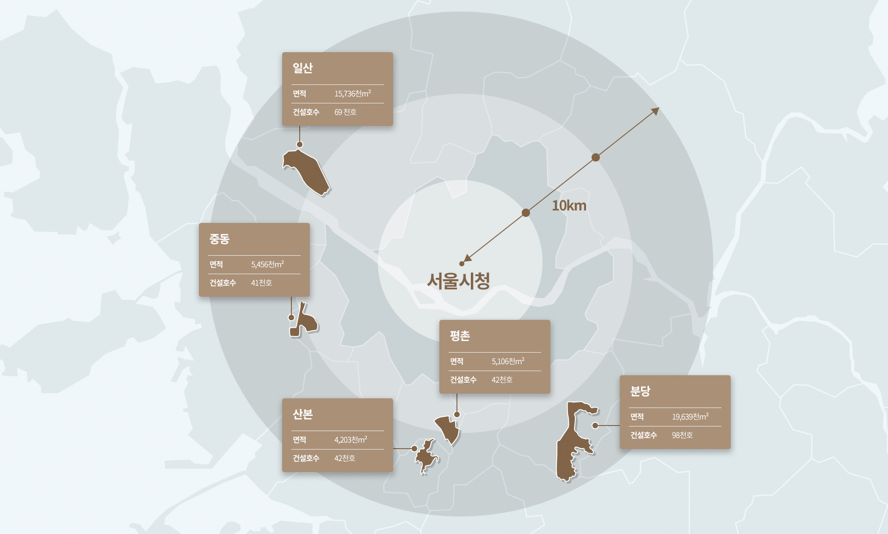

*자료: LH 3기 신도시 공식 사이트의 신도시 이야기 페이지에 수록된 1기 신도시 위치도. 분당·일산·평촌·산본·중동이 서울 근교의 서로 다른 축에 배치되었음을 확인하기 위한 도판이다.[^20]*

1기의 주요 성과는 분명하다. 단기간에 대량의 주택을 공급했고, 서울 주택난과 가격 압력 완화에 일정한 효과를 냈으며, 수도권의 주거 선택지를 크게 넓혔다. `1·2기 신도시 종합평가 연구` 정리본도 1기 신도시의 주택가격 안정화와 인구분산 효과를 주요 평가축으로 정리하고 있다.[^34]

하지만 한계도 분명하다. 업무시설과 일자리 기반이 충분하지 않아 베드타운 논란이 지속되었고, 광역교통은 입주 속도를 따라가지 못한 경우가 많았다. 시간이 지나면서 1기 신도시는 신규 공급의 상징에서 노후계획도시 정비의 대표 대상으로 바뀌었다. 이것이 신도시사의 중요한 전환이다. 신도시는 한 번 만들면 끝나는 도시가 아니라, 30년 뒤 다시 계획해야 하는 도시다.

1·2기 신도시 종합평가 연구의 정리본은 1기 신도시의 공급량을 28.4만 호, 2기 신도시의 공급량을 62.3만 호로 정리한다. 같은 자료는 1기 신도시의 인구 목표 달성률을 106%, 주택 목표 달성률을 113%로 제시하고, 1기 신도시 입주 이후 서울 아파트 가격 안정화 효과가 비교적 뚜렷했다고 요약한다.[^36] 이 수치는 1기의 공급 성과를 말할 때 중요한 근거다.

하지만 같은 평가자료는 신도시가 서울 인구분산에 기여하면서도 수도권 전체 집중을 키운 양면성을 함께 지적한다. 수도권 인구비율은 1980년 35.5%, 1990년 42.8%, 2000년 46.3%, 2010년 49.1%, 2019년에는 50%를 넘는 흐름으로 정리된다.[^36] 즉 1기 신도시는 서울 과밀을 완화했지만, 더 큰 스케일에서는 수도권 집중을 강화한 측면도 있다. 이 양면성을 빼면 1기 평가는 지나치게 칭찬이나 비판 어느 한쪽으로 기울게 된다.

### 7.1 1기 신도시별 읽기

1기 다섯 도시는 같은 세대지만 같은 도시가 아니다. 도시별로 읽는 초점은 다음처럼 달라야 한다.

| 도시 | 읽기 초점 | 추가 검증자료 |
|---|---|---|
| 분당 | 1기 최대 규모, 강남 접근성, 판교 후속축, 노후 정비 압력 | 분당선·신분당선 개통, 판교테크노밸리 고용, 재건축 선도지구 |
| 일산 | 서북부 대형 신도시, 문화·국제·평화 이미지, 서울 서북권 교통 | 일산선, 자유로, GTX-A, 고양시 업무·전시 기능 |
| 평촌 | 안양 기존 시가지와 밀착, 중형 신도시의 생활권 통합 | 4호선·과천선, 안양권 상업·교육시설 |
| 산본 | 군포 기존 시가지와 연결, 비교적 작은 면적의 주거지 | 안산선, 산본역 생활권, 노후 아파트 정비 |
| 중동 | 부천 도시구조 개편, 경인축 중형 신도시 | 7호선 연장, 경인고속도로, 부천 원도심과의 관계 |

이 표가 중요한 이유는 1기를 하나의 성적표로 평가하지 않기 위해서다. 분당의 강남 접근성, 일산의 서북부 축, 평촌·산본·중동의 기존 도시 밀착성은 서로 다른 조건이다. 따라서 "1기는 성공했는가"라는 질문보다 "어떤 지표에서는 성공했고, 어떤 지표에서는 한계가 남았는가"라고 묻는 편이 정확하다.

### 7.2 1기의 성과와 한계

1기의 성과는 공급량, 입주 속도, 주택가격 안정화, 생활권 형성에서 확인된다. 1990년대 초 대량 입주가 시작되면서 서울의 주택수요 일부를 흡수했고, 분당·일산 같은 대형 신도시는 독자적인 도시 이미지를 빠르게 형성했다. 시간이 지나면서 상업·문화·교육·의료 기반도 축적되었고, 1기 신도시는 수도권 중산층 주거지의 대표 모델이 되었다.

그러나 한계도 초기부터 구조적이었다. 첫째, 업무기능과 고용기능은 주거 공급 속도보다 늦었다. 둘째, 광역교통은 입주 시점의 체감 수요를 충분히 따라가지 못했다. 셋째, 원주민 보상과 이주 갈등이 충분히 사회적으로 기록되지 않았다. 넷째, 도시가 30년을 넘어서면서 아파트 노후화, 기반시설 용량, 주차, 상하수도, 학교 재배치, 이주대책 문제가 다시 전면화되었다.

따라서 1기는 "성공한 공급정책"이면서 동시에 "두 번째 계획을 요구하는 도시"다. 이 표현이 중요하다. 1기 신도시는 실패했기 때문에 정비하는 것이 아니라, 성공적으로 도시가 되었기 때문에 다시 계획해야 하는 단계에 들어섰다. 노후계획도시 특별법은 바로 이 전환을 제도화한 것이다.

---

## 8. 1990년대 반작용과 2기 신도시

1기 이후 1990년대에는 대규모 신도시 일시개발에 대한 비판, 소규모 분산적 택지개발, 준농림지 개발 허용, 기반시설 부족과 난개발 문제가 부각되었다.[^20] 2기 신도시는 바로 이 반작용 속에서 등장했다.

국토교통부의 2기 수도권 신도시 안내는 2기 신도시가 서울 등 주변지역과의 교통체계 구축, 쾌적한 주거환경, 자족기능 확보를 통해 수도권 과밀해소와 주거안정에 기여하도록 계획되었다고 설명한다.[^22]

2기의 핵심은 "주택공급 + 난개발 방지 + 권역별 거점 + 자족기능"이다. 1기가 서울 주택난에 대한 빠른 외곽 공급이었다면, 2기는 1990년대 준농림지 난개발과 교통·기반시설 부족 문제를 반성하면서 더 낮은 밀도, 더 큰 녹지율, 더 넓은 광역교통 대책, 더 강한 자족기능을 내세운 세대다. 다만 2기는 도시별 출발 사연이 매우 다르기 때문에, "2기 신도시"라는 단일한 정책세대로만 다루면 도시별 차이가 흐려진다.

1·2기 종합평가 연구는 2기 신도시를 1기의 단순 반복으로 보지 않는다. 이 자료는 1기 신도시 공급량을 28.4만 호, 2기 신도시 공급량을 62.3만 호로 정리하고, 2기는 1기보다 공급량은 크지만 사업기간이 길고 여러 지역에 분산되어 가격 안정화 효과가 상대적으로 약하게 관찰된다고 정리한다.[^36] 또한 2기 신도시는 서울 직접 분산보다 주변지역 재편 효과가 크고, 경제부문 충족도에서는 목표 달성이 충분하지 않았다고 요약한다.[^34]

따라서 2기를 "1기보다 발전한 세대"라고만 설명하면 완결되지 않는다. 공식 목표는 발전했지만, 성과는 도시별로 갈렸다. 판교는 일자리와 도시 이미지에서 강한 성과를 보였고, 동탄2는 규모와 자족복합도시 실험의 크기가 두드러졌다. 위례는 강남권 수요 대체와 행정경계형 개발의 복잡함을 보여주며, 검단·김포한강·파주운정·양주는 외곽 거점형 신도시의 교통 숙제를 보여준다. 고덕은 주택공급형 신도시와 산업·국제화 목적도시의 중간 성격을 가진다.

### 8.1 2기의 범위: 수도권 10개와 넓은 의미의 12개

국토교통부의 「제2기 수도권신도시 건설안내」는 수도권 10개 신도시를 표로 제시한다. 성남 판교, 화성 동탄1, 화성 동탄2, 김포 한강, 파주 운정, 광교, 양주 옥정·회천, 위례, 고덕 국제화, 인천 검단이다.[^22] LH 3기 신도시 공식 비교표는 여기에 아산 탕정·배방, 대전 도안을 더해 2기 신도시를 12개 지구로 설명한다.[^20] 이 보고서는 수도권 주택정책의 계보를 볼 때는 10개를 기본 범위로 두고, 전국 계획도시사의 확장 범위에서는 아산 탕정·배방과 대전 도안을 함께 보는 방식을 택한다.

| 구분 | 위치 | 면적 | 주택건설 | 수용인구 | 개발기간 | 핵심 해석 |
|---|---|---:|---:|---:|---|---|
| 성남 판교 | 성남시 판교동 일원 | 8.9㎢ | 29.3천 호 | 88천 인 | 2003-2017 | 강남 접근성과 지식산업 기능이 결합된 2기의 대표 성공 사례 |
| 화성 동탄1 | 화성시 동탄면 일원 | 9.0㎢ | 41.5천 호 | 126천 인 | 2001-2018 | 수도권 서남부 거점도시, 동탄2와 결합해 거대 생활권 형성 |
| 화성 동탄2 | 화성시 석우동·반송동·동탄면 일원 | 24.0㎢ | 116.5천 호 | 286천 인 | 2008-2021 | 2기 수도권 신도시 중 최대급 규모, 동탄1의 확장형 중핵도시 |
| 김포 한강 | 김포시 김포2동 일원 | 11.7㎢ | 61.3천 호 | 167천 인 | 2002-2017 | 서울 서부·김포축 성장거점, 교통 지연 논란이 긴 사례 |
| 파주 운정 | 파주시 교하읍 일원 | 16.6㎢ | 88.2천 호 | 217천 인 | 2003-2023 | 일산·교하·금촌과 맞물리는 서북부 생활거점 |
| 광교 | 수원시 이의동·용인시 상현동 일원 | 11.3㎢ | 31.3천 호 | 78천 인 | 2005-2019 | 도청 이전, 행정·첨단·업무 기능이 결합된 남부 거점 |
| 양주 옥정·회천 | 양주시 옥정동 외 | 11.2㎢ | 63.4천 호 | 163천 인 | 2007-2018 | 경기북부 안정적 택지공급과 거점 형성 |
| 위례 | 송파구 거여·장지동, 성남 창곡동, 하남 학암동 일원 | 6.8㎢ | 44.8천 호 | 110천 인 | 2008-2020 | 원래 송파신도시로 논의된 강남권 수요 대체형 신도시 |
| 고덕 국제화 | 평택시 서정동·고덕면 일원 | 13.4㎢ | 57.2천 호 | 140천 인 | 2008-2020 | 평택항·미군기지 이전·국제화·산업단지와 결합된 남부 거점 |
| 인천 검단 | 인천 서구 불로·원당·마전·당하동 일원 | 11.2㎢ | 74.7천 호 | 184천 인 | 2009-2023 | 서북부 공급 확대형 신도시, 강남 수요 대체력 논쟁이 컸던 사례 |

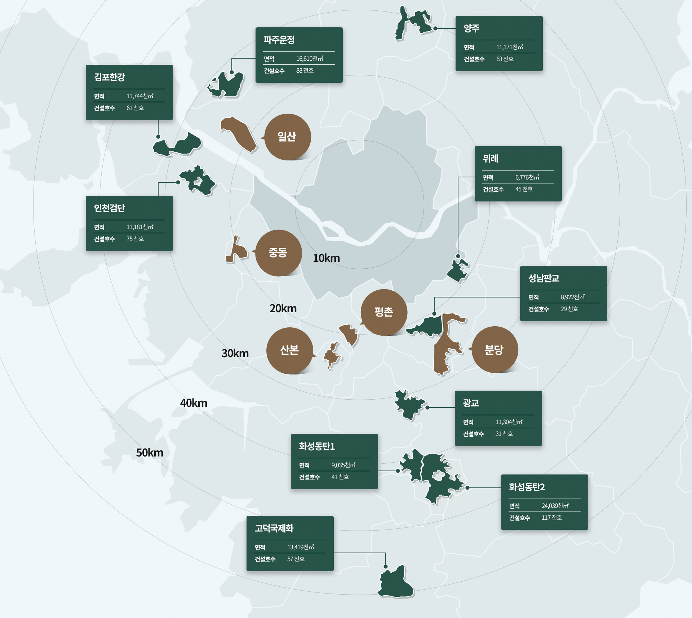

*자료: LH 3기 신도시 공식 사이트의 신도시 이야기 페이지에 수록된 2기 신도시 위치도. 2기가 판교·위례만이 아니라 동탄1·동탄2, 김포한강, 파주운정, 검단, 양주, 고덕 등 여러 외곽·거점형 도시로 분산되어 있음을 보여준다.[^20]*

이 표에서 가장 먼저 보아야 할 것은 동탄2다. 2기를 판교와 위례 중심으로만 설명하면 동탄2가 빠지고, 그러면 2기의 규모감이 완전히 왜곡된다. 국토교통부 표 기준 동탄2는 24.0㎢, 116.5천 호, 286천 인으로 제시된다.[^22] 1기 분당보다 면적이 크고, 동탄1과 합쳐 하나의 광역 생활권을 만든다. 따라서 동탄2는 2기의 "부록"이 아니라 2기 신도시의 규모·자족·광역교통 논리를 가장 크게 밀어붙인 사례다.

2기를 유형별로 다시 나누면 다음과 같다.

| 유형 | 해당 도시 | 핵심 질문 |
|---|---|---|
| 강남권 수요 대체형 | 판교, 동탄1, 위례 | 강남 접근성, 주택수요 흡수, 자족기능의 실제 성과 |
| 수도권 남부 거점형 | 동탄2, 광교, 고덕 | 산업·행정·비즈니스 기능이 주거와 결합했는가 |
| 서북부·서부 외곽 거점형 | 김포한강, 파주운정, 검단 | 광역교통과 서울 접근성이 생활 만족도를 따라갔는가 |
| 경기북부 공급·거점형 | 양주 옥정·회천 | 북부권 안정적 택지공급과 자족기능이 충분했는가 |
| 전국 확장형 | 아산 탕정·배방, 대전 도안 | 수도권 신도시 세대 구분 밖에서 계획도시사가 어떻게 확장되는가 |

이렇게 나누면 2기가 왜 복잡한지 보인다. 판교와 검단을 같은 문장으로 평가하기 어렵고, 동탄2와 위례를 같은 기준으로만 평가하기도 어렵다. 판교의 쟁점은 일자리 집적과 강남 접근성이고, 검단의 쟁점은 서북부 공급과 수요 적합성, 위례의 쟁점은 접경 행정과 강남권 시장 기대, 동탄2의 쟁점은 거대 자족도시 실험과 광역교통이다.

### 8.2 당시 기사로 본 2기의 형성 과정

2기는 공식 안내표만으로는 형성과정을 충분히 설명하기 어렵다. 당시 신문 기사를 같이 보면, 2기가 단순한 계획도시 목록이 아니라 부동산 가격 급등, 난개발 논쟁, 강남 수요 대체, 투기 우려, 공영개발, 후분양, 교통 선투자 논쟁 속에서 만들어졌다는 점이 보인다.

| 시점 | 사건 | 당시 기사에서 확인되는 쟁점 | 해석 |
|---|---|---|---|
| 2000-12 | 판교 신도시 논의 | 수도권 난개발을 막기 위해 판교 등 신도시 개발을 늦출 이유가 없다는 건교부 장관 발언이 보도됨[^4] | 2기의 첫 문제의식은 "더 짓자"만이 아니라 "무질서한 개발을 계획개발로 바꾸자"였음 |
| 2004-12 | 판교 조성·분양 세부안 | 판교가 2001년 12월 택지개발예정지구로 지정되었고, 녹지율·신분당선·교통 지연 우려가 함께 보도됨[^5] | 판교는 친환경·첨단·강남 접근성의 기대와 입주 초기 교통 우려가 같이 존재 |
| 2005-08 | 송파신도시 추진 | 8.31 대책의 공급 카드로 송파신도시가 추진되고, 거여지구 군부대·골프장 부지, 200만 평, 5만 가구 구상이 보도됨[^6] | 위례의 전신은 강남 집값 안정과 강남권 주택수요 흡수 카드였음 |
| 2006-04 | 송파 개발 윤곽 | 송파신도시가 205만 평, 4만6000가구, 후분양, 임대주택 비중이 큰 공영개발형 구상으로 보도됨[^7] | 강남 대체와 서민 주거안정이라는 두 목표가 처음부터 긴장 관계였음 |
| 2006-04 | 화성·동탄신도시 명칭 전략 | 한국토지공사가 "화성신도시"보다 "화성·동탄신도시" 명칭을 적극 활용하려 했고, 기사에서는 화성 연쇄살인 사건 이미지가 분양에 줄 악영향을 이유로 들었음[^8] | 동탄이라는 이름은 행정명보다 도시 이미지와 분양 브랜드의 논리가 강하게 작동한 사례 |
| 2006-10 | 검단신도시 확정 국면 | 검단은 분당급 규모에 가깝지만 강남 수요 분산 효과에는 회의적이라는 기사들이 나옴[^9] | 2기 후반부에는 "공급 확대"와 "수요가 있는 곳인가"의 논쟁이 강해짐 |
| 2007-06 | 동탄2 발표 | 11.15 대책의 후속으로 "분당급 신도시" 확보 방침에 따라 동탄2 개발방안이 발표되고, 동탄1 동측에 대규모 주택·첨단 비즈니스 용지·선교통 후입주 원칙이 제시됨[^10] | 동탄2는 2기의 자족·교통·대량공급 논리를 가장 크게 밀어붙인 사례 |
| 2007-08 | 송파신도시 명칭 변경 | 송파·거여 택지개발지구의 공식 명칭이 위례 택지개발지구로 바뀐다는 보도가 나옴[^11] | 위례는 "송파신도시"라는 정치·시장적 이름에서 역사지명 기반의 광역지구명으로 이동 |
| 2008-05 | 고덕국제화계획지구 | 평택 고덕이 국제화계획지구, 글로벌교육문화타운, 자족형 신도시, 첨단산업단지 구상과 함께 보도됨[^12] | 고덕은 주택공급형 2기와 목적도시형 계획도시의 중간 성격을 가짐 |

이 기사들은 2기를 더 입체적으로 만든다. 판교는 난개발 방지와 강남 접근성, 송파·위례는 강남 수요 대체와 공영개발, 동탄은 명칭과 도시 이미지, 동탄2는 수도권 남부의 거대 자족도시, 검단은 서북부 공급 확대와 수요 적합성 논쟁, 고덕은 국제화·산업·교육기능이 결합된 도시로 출발했다.

### 8.3 이름의 정치: 화성신도시, 동탄신도시, 송파신도시

2기 신도시에서는 도시 이름 자체가 정책의 일부였다. 이름은 지도 위의 표기가 아니라 분양성, 지역 이미지, 강남 접근성, 행정구역 간 이해관계, 역사적 상징을 함께 싣는 장치였다.

동탄의 경우가 특히 선명하다. 한국경제 보도는 한국토지공사가 경기도 화성 동탄택지개발지구를 가리킬 때 "화성신도시" 대신 "화성·동탄신도시"라는 이름을 강조했다고 보도했다. 기사에서 제시된 이유는 화성 연쇄살인 사건 이미지가 아직 강하게 남아 분양에 악영향을 줄 수 있다는 판단이었다.[^8] 이는 도시 명칭이 단순한 행정명 선택이 아니라, 미래 입주민에게 팔리는 도시 이미지의 설계였다는 뜻이다.

위례도 이름의 정치가 강한 사례다. 2005년 8.31 대책 국면에서는 "송파신도시"라는 이름이 강남권 주택수요 대체 카드로 작동했다.[^6] 그러나 2007년에는 송파·거여 택지개발지구의 공식 명칭이 위례 택지개발지구로 바뀐다는 보도가 나왔다.[^11] "송파"가 강남권 시장 기대를 끌어올리는 이름이었다면, "위례"는 서울 송파, 성남, 하남에 걸친 접경 개발을 역사 지명으로 묶는 이름이었다.

| 사례 | 초기·당시 명칭 | 굳어진 명칭 | 명칭이 드러내는 문제 |
|---|---|---|---|
| 화성 동탄1 | 화성신도시, 화성·동탄신도시 | 동탄신도시 | 부정적 지역 이미지 회피, 분양 브랜드, 신도시 정체성 형성 |
| 화성 동탄2 | 동탄1 동측 분당급 신도시, 동탄2 | 동탄2신도시 | 동탄1과 결합한 거대 생활권, 남부 거점 이미지 강화 |
| 송파·거여 | 송파신도시 | 위례신도시 | 강남권 공급 카드에서 서울·성남·하남 접경 광역지구로 이동 |
| 고덕 | 고덕국제화계획지구 | 고덕국제신도시 계열 명칭 | 평택항, 미군기지 이전, 국제화, 산업도시 이미지 결합 |

따라서 2기 신도시 연구에서는 지구명 변화의 별도 추적이 필요하다. 이름이 바뀌는 순간, 정책이 겨냥한 시장과 정치적 설명 방식도 같이 바뀐다. 동탄은 부정적 이미지 회피와 새 브랜드 형성의 사례이고, 위례는 강남권 대체 공급이라는 이름에서 접경 광역도시라는 이름으로 이동한 사례다.

이름의 변화는 연구자료로도 중요하다. 도시명은 주민 정체성, 분양 홍보, 언론 프레임, 행정구역 갈등을 동시에 드러낸다. "화성신도시"라는 이름이 "동탄"으로 이동한 것은 부정적 지역 이미지와 분양성의 문제를 보여주고, "송파신도시"가 "위례"로 이동한 것은 서울 송파구 중심의 명칭이 성남·하남과 맞지 않는다는 행정경계 문제를 보여준다. 이름을 보면 도시가 팔리고 설명되는 방식이 보인다.

그래서 2기 신도시를 분석할 때는 다음 자료를 따로 모아야 한다. 첫째, 최초 보도자료와 지구 지정 당시 명칭. 둘째, 명칭 공모 또는 명칭 변경 고시. 셋째, 언론이 사용한 관용명. 넷째, 입주민이 실제로 사용하는 생활권 명칭. 이 네 가지가 다르면 그 차이 자체가 분석 대상이다.

비슷한 사례는 더 있다. 화성·동탄과 송파·위례는 대표 사례일 뿐이고, 2기와 목적도시 전체를 보면 이름은 거의 항상 정책의 압축파일처럼 작동했다.

| 사례 | 이전·경합 명칭 | 굳어진 명칭 | 의미 |
|---|---|---|---|
| 수원 이의지구 | 수원이의지구, 경기첨단행정신도시, 광교테크노밸리 | 광교신도시 | 행정·첨단·친환경 이미지를 도시 브랜드로 만들려는 시도 |
| 김포양촌지구 | 김포양촌지구 신도시 | 김포한강신도시 | 양촌이라는 행정·농촌적 지명보다 한강을 앞세운 광역 브랜드화 |
| 파주 운정·교하 | 운정신도시, 교하신도시, 파주신도시 혼용 | 운정신도시 | 역사 지명, 기존 입주민 인식, 교통·분양 혼선을 둘러싼 명칭 갈등 |
| 행정중심복합도시 | 행정중심복합도시, 행복도시, 금강·한울 등 공모 후보 | 세종 | 국가균형발전 도시를 역사적·국가적 상징으로 포장 |
| 평택 고덕 | 고덕국제화계획지구 | 고덕국제신도시 계열 명칭 | 국제화, 미군기지 이전, 평택항, 산업축 이미지를 결합 |

광교는 특히 좋은 비교 사례다. 초기에는 수원 이의동 일대 행정신도시라는 지리적·기능적 이름으로 불렸고, 명칭 공모에서는 "광교테크노밸리"가 선정되었다는 보도가 나왔다.[^13] 1·2기 신도시 종합평가 정리본은 이후 2005년 12월 공동시행자 협의체에서 광교테크노밸리 명칭을 신도시 전체에 적용하면 혼란이 생길 수 있어, R&D지구는 광교테크노밸리로 두고 사업지구명은 광교신도시로 하는 의견이 제기되었으며, 개발계획 승인 때 광교신도시로 최종 변경되었다고 정리한다.[^35]

김포한강도 같은 유형이다. 2008년 보도에 따르면 국토해양부는 김포 양촌지구 신도시를 김포 한강신도시로 바꾸는 지정 변경을 승인했고, 그 이유로 친근한 명칭, 새로운 도시브랜드 창출, 명품신도시 홍보효과가 제시되었다.[^14] 여기서 "한강"은 단순 위치명이 아니라, 김포를 수도권 서북부 외곽이 아니라 한강을 끼고 있는 신도시로 보이게 하는 브랜드 장치다.

파주운정은 명칭이 지역 정체성과 행정 편의, 주민 이해관계의 충돌로 번진 사례다. 파주 일대에서는 운정신도시, 교하신도시, 파주신도시가 혼용되었고, 교하라는 오래된 지명을 써야 한다는 주장과 이미 운정으로 입주·분양·교통 인식이 굳었다는 주장이 맞섰다. 2011년 보도는 파주시가 교하신도시 명칭을 폐지하고 운정신도시로 통일하는 흐름을 전하며, 명칭 혼용이 대중교통 이용과 분양 과정에서도 혼선을 낳았다고 설명한다.[^15]

세종은 수도권 2기 신도시는 아니지만, 명칭 정치의 규모가 더 큰 사례다. 행정중심복합도시건설추진위원회는 국민공모와 토론을 거쳐 행정중심복합도시의 명칭을 세종으로 확정했다.[^16] "행정중심복합도시"가 기능을 설명하는 이름이라면, "세종"은 국가 상징과 균형발전의 정당성을 실어 나르는 이름이다. 이 때문에 세종은 명칭이 도시의 법적 지위, 국가 정체성, 균형발전 담론을 한꺼번에 담는 사례로 볼 수 있다.

이 사례들을 묶으면 명칭 변경의 유형도 나눌 수 있다.

| 유형 | 설명 | 대표 사례 |
|---|---|---|
| 부정 이미지 회피형 | 기존 행정명이나 지역 이미지가 분양·정착에 불리하다고 판단 | 화성·동탄 |
| 광역 브랜드 창출형 | 행정지명보다 더 넓고 긍정적인 자연·상징 이미지를 사용 | 김포양촌→김포한강, 송파→위례 |
| 기능 이미지 강조형 | 행정, 첨단, 국제화, 자족성 같은 계획 목표를 이름에 반영 | 이의→광교, 고덕국제화 |
| 지역 정체성 충돌형 | 오래된 지명과 새 신도시 브랜드가 충돌 | 파주 운정·교하 |
| 국가 상징 부여형 | 국가 프로젝트의 정당성과 상징을 이름으로 강화 | 행정중심복합도시→세종 |

따라서 "이름의 정치"는 부록이 아니라 독립 분석 항목이어야 한다. 도시 이름은 누가 그 도시를 팔고, 누가 그 도시를 기억하고, 누가 그 도시의 소속감을 갖는지를 드러낸다.

### 8.4 동탄1·동탄2: 2기 안의 거대 복합 생활권

동탄은 단일 생활권으로만 처리하기 어렵다. 동탄1과 동탄2는 같은 화성 동탄권이지만, 정책 시점과 규모가 다르다.

동탄1은 서울에서 약 40km 떨어진 수도권 서남부 거점도시로 설명된다. 국토교통부 자료는 동탄1을 수도권 과밀억제권역 외곽의 중핵 거점도시로 만들고, 병점·오산·수원과의 지역 간 연결을 고려한 가로망, 중앙공원, 첨단산업용지, 광역교통망을 계획했다고 설명한다.[^22]

동탄2는 동탄1보다 훨씬 큰 단계다. 2007년 6월 당시 발표문은 동탄2를 동탄1 동측에 조성하는 대규모 신도시로 설명하며, 동탄1·2를 합치면 수도권 신도시 중 가장 큰 규모가 된다고 보도했다.[^10] 이후 국토교통부 공식 안내에서는 동탄2의 사업개요가 24.0㎢, 주택 116.5천 호, 인구 286천 인, 사업기간 2008-2021년으로 정리된다.[^22]

동탄2의 계획 언어는 2기의 특징을 가장 강하게 드러낸다. 국토교통부 자료는 동탄2를 수도권 남부 비즈니스 중핵도시, 첨단지식산업의 거점, 한국적 신도시, 지속가능한 도시로 설명하고, 광역비즈니스콤플렉스, 동탄테크노밸리, 문화디자인밸리, 워터프론트콤플렉스, 커뮤니티시범단지, 신주거문화타운 같은 특별계획구역을 제시한다.[^22] 이는 1기 신도시의 "대규모 주거지"와 달리, 도시 안에 산업·문화·비즈니스·수변·커뮤니티 기능을 패키지로 넣으려 한 시도다.

다만 동탄2도 계획과 체감을 분리해 보는 편이 적절하다. 당시 발표는 "선교통 후입주" 원칙을 내세웠지만, 실제 주민 체감에서는 광역교통의 완성 시점, 서울 접근 시간, GTX-A 개통 전후의 변화, 동탄역 중심성과 동탄 내부 교통의 불균형이 별도 검증 과제로 남는다. 따라서 동탄2는 "2기의 완성형"이라기보다, 2기가 꿈꾼 거대 자족도시 모델의 가장 큰 실험장으로 보는 편이 더 정확하다.

동탄을 평가할 때는 동탄1과 동탄2를 분리할 필요가 있다. 동탄1은 2기 신도시 초반의 남부권 공급·자족도시 실험이고, 동탄2는 그보다 큰 규모의 확장형 거점도시다. 같은 "동탄"이지만 도시 내부의 중심도 다르다. 동탄1은 동탄신도시 초기 생활권과 삼성전자 화성사업장 등 주변 산업수요의 영향을 강하게 받았고, 동탄2는 동탄역, 광역비즈니스콤플렉스, 특별계획구역, GTX-A 같은 후대 교통·업무축과 더 강하게 연결된다.

| 평가축 | 동탄1 | 동탄2 |
|---|---|---|
| 정책 시점 | 2기 초반 남부권 신도시 | 2007년 발표된 대규모 확장형 신도시 |
| 규모 | 9.0㎢, 41.5천 호 | 24.0㎢, 116.5천 호 |
| 핵심 이미지 | 화성·동탄 명칭 전략, 초기 자족도시 | 분당급 신도시, 거대 자족복합도시, 선교통 후입주 |
| 생활권 쟁점 | 주변 산업수요, 초기 교통, 전세·매매 수요 | 동탄역 중심성, GTX-A, 내부 교통, 광역업무 기능 |
| 연구 질문 | 동탄이라는 도시 브랜드가 어떻게 형성되었나 | 거대 자족도시 계획이 실제 고용·교통으로 이어졌나 |

동탄은 2기 신도시 연구에서 특히 "이름", "규모", "자족", "교통"이 모두 겹친 사례다. 화성이라는 부정적 이미지 회피에서 출발한 명칭 전략, 동탄1·2를 합친 거대 생활권, 선교통 후입주 원칙, 동탄역 중심의 후대 광역교통 변화가 모두 한 도시에 얽혀 있다. 동탄 분석에서 이 축들이 생략되면 2기 신도시의 핵심 국면이 약화된다.

### 8.5 위례: 송파신도시에서 위례신도시로

위례는 2기 신도시 중 이름의 변천이 핵심 쟁점이 되는 사례다. 초기에는 "송파신도시"로 불렸다. 2005년 8.31 대책 보도에서 송파신도시는 강남 집값 불안을 차단하기 위한 공급 카드로 설명되었고, 거여지구 군부대와 골프장 부지가 주요 입지로 거론되었다.[^6] 당시 기사들은 강남권 수요를 흡수할 수 있는지, 임대·소형 비중이 높아 강남 대체 기능이 약해지는 것은 아닌지, 그린벨트 해제의 명분이 충분한지 등을 함께 다뤘다.[^7]

2007년에는 명칭이 바뀐다. 한국경제 보도는 2007년 8월 송파신도시의 공식 명칭이 송파·거여 택지개발지구에서 위례 택지개발지구로 변경될 예정이라고 전했다.[^11] 이 명칭 변경은 단순한 브랜드 교체가 아니다. "송파"라는 이름은 강남권 대체 공급의 시장적 의미를 강하게 띠었고, "위례"라는 이름은 송파구·성남시·하남시에 걸친 광역 지구를 역사지명으로 묶는 방식이었다.

위례의 위치도 특이하다. 국토교통부 표는 위례의 위치를 송파구 거여동·장지동, 성남시 창곡동, 하남시 학암동 일원으로 제시한다.[^22] 즉 위례는 단일 지방자치단체 내부의 신도시가 아니라 서울·경기 여러 행정구역이 맞물린 접경 신도시다. 이 때문에 개발 주체, 교통, 학교, 행정서비스, 생활권 정체성의 문제가 다른 2기 신도시보다 복잡하다.

위례의 해석은 다음과 같이 정리할 수 있다.

| 층위 | 내용 |
|---|---|
| 초기 정책명 | 송파신도시 |
| 공식 지구명 변화 | 송파·거여 택지개발지구에서 위례 택지개발지구로 변경 |
| 핵심 정책 목표 | 강남권 주택수요 흡수, 공영개발, 서민 주거안정 |
| 공간적 특징 | 서울 송파, 성남, 하남에 걸친 행정경계형 신도시 |
| 분석상 주의 | "송파에 지은 신도시"가 아니라 서울·경기 접경의 광역 생활권으로 보아야 함 |

위례는 2기 신도시 중에서도 행정경계 문제가 가장 선명하다. 같은 신도시 안에 서울 송파구, 성남시, 하남시가 들어오므로 주민의 생활권은 하나처럼 움직이지만 행정서비스, 학교 배정, 교통 민원, 기반시설 책임은 여러 지방자치단체로 나뉜다. 이런 도시에서는 "어느 시의 신도시인가"라는 질문보다 "하나의 생활권을 여러 행정주체가 어떻게 관리하는가"가 더 중요하다.

도시설계 측면에서도 위례는 주목할 요소가 있다. 한국 신도시 가이드라인 정리본은 위례의 휴먼링 길이를 4.4km, 트랜짓몰 길이를 1.2km로 정리한다.[^40] 이는 위례가 단순 아파트 공급지가 아니라 보행축, 대중교통축, 중심상업축을 하나의 구조로 만들려 한 사례임을 보여준다. 다만 실제 평가는 위례선 트램, 위례신사선, 버스 접근성, 서울·성남·하남 행정서비스의 체감 차이를 별도 검토 항목으로 둔다.

위례의 핵심 질문은 네 가지다. 첫째, 강남권 수요 대체라는 초기 목표가 실제 주택시장 안정에 얼마나 기여했는가. 둘째, 송파·성남·하남 접경이라는 행정 구조가 주민 생활에 어떤 불편과 장점을 만들었는가. 셋째, 휴먼링·트랜짓몰 같은 계획 요소가 실제 보행·상업·대중교통 이용으로 이어졌는가. 넷째, 이름이 송파에서 위례로 바뀐 뒤 도시 정체성이 어떻게 형성되었는가.

### 8.6 판교, 광교, 고덕: 자족기능이 실제 도시 이미지가 된 사례들

판교는 2기 신도시 중 자족기능이 도시 이미지로 가장 강하게 굳은 사례다. 초기 논의부터 난개발 방지와 계획개발이 명분이었고, 2004년 기사에서는 판교가 높은 녹지율, 신분당선, 벤처단지와 교육·연구기관 구상을 함께 갖춘 도시로 소개된다.[^5] 이후 판교테크노밸리라는 일자리 축이 형성되면서, 판교는 2기 신도시의 "자족성"이라는 단어를 가장 설득력 있게 보여준 사례가 되었다.

판교의 특수성은 자족용지가 실제 도시 이미지와 고용으로 이어졌다는 점이다. 한국 신도시 가이드라인 정리본은 판교테크노밸리를 2015년 기준 입주업체 1,121개, 근무자 72,820명, 연 매출 70조 원 규모로 정리한다.[^40] 이 수치는 판교가 단순한 주거지가 아니라 수도권 남부의 일자리 거점으로 성장했다는 점을 보여주는 강한 지표다. 다만 이것은 판교의 특수성을 보여주는 것이지 2기 전체의 평균 성과를 뜻하지 않는다.

판교를 연구할 때는 분당과의 관계도 중요하다. 판교는 행정적으로 성남시 안에 있고, 생활권으로는 분당과 강하게 이어지며, 광역적으로는 강남과 연결된다. 즉 판교의 성공은 판교 단독의 계획만으로 설명되지 않는다. 강남 접근성, 분당의 기존 생활기반, 신분당선, 판교테크노밸리, IT 산업의 성장 흐름이 같이 작동했다. 그래서 판교는 "자족형 신도시 성공사례"이면서 동시에 "입지와 시대적 산업 흐름이 맞아떨어진 사례"다.

광교는 수원·용인 접경에 조성된 남부권 신도시로, 행정·업무·주거 기능이 결합된 사례다. 2기 전체에서 판교가 민간 IT·벤처 이미지가 강하다면, 광교는 경기도청 이전과 광역행정 기능이 결합된 점이 다르다. 이 점에서 광교는 2기 신도시이면서도 행정기능 분산형 계획도시의 성격을 일부 가진다.

광교를 판교와 같은 "일자리 성공사례"로만 비교하면 행정기능과 남부권 중심성이 분석에서 제외된다. 광교의 핵심은 수원·용인 접경의 남부권 중심성과 경기도 행정기능이다. 경기도청 이전, 법조·행정 기능, 호수공원과 상업업무 기능이 결합하면서 광교는 주거지이면서 행정·업무 복합도시가 되었다. 따라서 광교는 2기 신도시 안에서 판교의 민간 IT 축, 동탄의 거대 남부 생활권, 고덕의 국제화·산업축과 구분되는 행정복합형 사례로 보아야 한다.

고덕 국제화는 더 독특하다. 2008년 당시 기사들은 평택 고덕을 미군기지 이전, 황해경제자유구역, 글로벌교육문화타운, 자족형 신도시, 첨단산업단지와 연결해 보도했다.[^12] 국토교통부 공식 자료도 고덕 국제화계획지구가 평택항을 중심으로 한 서해안시대의 대중국 전진기지, 수도권 남부 거점, 국제업무단지와 행정타운, 첨단지식연구단지와 물류·유통 중심지를 지향한다고 설명한다.[^22] 따라서 고덕은 2기 수도권 신도시인 동시에 산업·국제화·교육·군사 이전의 여파가 결합된 목적도시적 사례다.

고덕은 주택공급형 신도시와 목적도시의 경계에 있다. 평택항, 미군기지 이전, 국제화계획지구, 첨단산업단지, 삼성전자 평택캠퍼스 같은 요소들이 결합하면서 고덕은 단순한 주거지가 아니라 경기남부 산업·국제화 거점으로 설명된다. 이 때문에 고덕은 2기 신도시 목록 안에 있지만, 행복도시·혁신도시·기업도시와 함께 목적도시의 관점에서도 비교할 수 있다.

판교, 광교, 고덕을 묶으면 2기 신도시의 "자족성"이 하나의 뜻이 아니라는 점이 보인다. 판교의 자족성은 IT·벤처 고용, 광교의 자족성은 행정·업무 기능, 고덕의 자족성은 산업·국제화·군사 이전 효과와 연결된다. 따라서 자족성은 용지 비율만으로 측정할 수 없고, 어떤 종류의 기능이 실제로 들어왔는지 확인할 필요가 있다.

### 8.7 김포한강, 파주운정, 검단, 양주: 외곽 거점과 교통의 숙제

김포한강, 파주운정, 인천검단, 양주 옥정·회천은 2기의 또 다른 얼굴이다. 이들은 판교·위례처럼 강남 가까이에 있는 도시가 아니라, 수도권 서북부·서부·북부의 외곽 거점을 형성하는 도시들이다. 따라서 이들을 평가할 때는 강남 접근성만을 기준으로 삼기 어렵지만, 동시에 광역교통이 늦어지면 생활 만족도와 시장 평가가 크게 흔들리는 것도 사실이다.

이 네 도시는 2기의 "평균적 현실"을 보기에 더 적합하다. 판교처럼 강한 일자리 축을 가진 도시만 보면 2기가 매우 성공한 것처럼 보이고, 교통 논란만 보면 실패처럼 보인다. 그러나 김포한강, 파주운정, 검단, 양주는 광역교통과 생활권 성숙이 얼마나 도시 평가를 좌우하는지를 보여주는 사례다. 3기 신도시 개발전략 연구의 전문가 평가에서도 성남판교와 수원광교는 전반적으로 높게 평가된 반면, 김포한강과 인천검단은 중간 이하 평가를 받았고, 파주운정은 환경적 쾌적성이 높게 평가되었지만 자족성 평가는 낮았다.[^48]

김포한강은 김포의 도시 규모를 키우고 서울 서부축과 연결하려는 개발이었다. 그러나 실제 도시평가는 김포골드라인 혼잡 문제와 강하게 결합했다. 김포한강은 한강변 신도시라는 이름으로 주거환경 이미지를 확보했지만, 서울 접근의 병목이 철도와 버스에 집중되면서 "도시는 커졌는데 광역교통이 따라왔는가"라는 질문을 남겼다. 국토교통부 대도시권광역교통위원회도 2023년 김포골드라인 혼잡 완화 대책을 추진하면서 버스전용차로, 셔틀버스, 대체노선 등 단기대책을 병행했다.[^58] 김포한강을 평가할 때는 신도시 내부 공원·수변·주거환경만 볼 수 없고, 김포공항역 환승, 서울 서부권 통근, 원도심과 한강신도시의 관계를 함께 봐야 한다.

파주운정은 일산·교하·금촌 택지개발지구와 맞물려 서북부 생활거점을 만들려는 계획이었다. 운정은 자유로와 제2자유로, 경의중앙선, 일산 생활권과 연결되지만, 장기간에는 GTX-A가 도시평가의 핵심 변수로 떠올랐다. 국토교통부는 GTX-A 운정중앙-서울역 구간이 2024년 12월 28일 개통한다고 발표했고, 개통 직전 참고자료에서는 운정중앙역에서 서울역까지 약 21.5분 도착을 제시했다.[^49][^59] 이는 운정이 "멀지만 쾌적한 신도시"에서 "서울 핵심부와 고속철도축으로 연결되는 신도시"로 재평가될 수 있음을 뜻한다. 다만 철도 개통만으로 자족성이 자동 확보되는 것은 아니다. 전문가 평가에서 파주운정은 환경적 쾌적성 90.0%로 높게 평가되었지만, 일자리 등 자족성 평가는 60.0%로 낮게 제시되었다.[^48]

검단은 2기 외곽형 도시 중 가장 논쟁적인 사례다. 초기부터 강남 수요를 실제로 대체할 수 있는지 논란이 컸고, 당시 기사에서도 서울 강남까지의 거리와 시간, 투기성 호가 상승, 공급지로서의 적합성 문제가 함께 제기되었다.[^9] 검단은 인천 서북부, 김포, 계양, 서울 서부권이 만나는 경계에 있지만, 그 경계성은 장점이자 약점이었다. 국토교통부는 2009년 검단신도시와 송산그린시티의 광역교통개선대책을 확정했고, 검단에 대해서는 인천도시철도 1·2호선 연장, 환승센터, 자전거도로망 등을 포함한 대중교통 중심도시 구상을 제시했다.[^51] 그러나 계획된 광역교통의 실행 속도와 실제 서울 접근성, 인천 원도심과의 관계가 검단의 시장평가를 계속 흔들었다. 검단은 "공급지로 지정되었다"는 사실보다 "어떤 생활권에 편입될 수 있었는가"가 더 중요한 사례다.

양주 옥정·회천은 경기북부형 2기 신도시다. 양주는 강남 접근성보다는 경기북부 주거·교통축의 확장, 의정부·동두천·포천과의 관계, 서울 동북부 접근성이 중요하다. 옥정·회천은 수도권 북부의 주택공급과 거점 기능을 맡았지만, 이 역시 광역철도와 함께 평가해야 한다. 대광위는 2022년 옥정-포천 광역철도 기본계획을 승인하면서 이 노선을 서울 도시철도 7호선 연장인 도봉산-포천선의 2단계 구간으로 설명하고, 양주 옥정을 거쳐 포천까지 광역교통 서비스를 개선하는 사업으로 제시했다.[^50] 양주신도시는 7호선 연장, GTX-C 논의, 수도권 북부 고용지와 상권의 성숙을 함께 보아야 한다.

이 축의 신도시들은 2기의 한계를 잘 보여준다. 자족기능과 권역별 거점이라는 계획 언어는 있었지만, 실제 체감 성패는 광역철도·간선도로·버스망·서울 접근성·주변 원도시와의 관계에 크게 좌우되었다. 따라서 2기의 외곽 거점형 신도시는 "도시 자체의 계획"만이 아니라 "언제 어떤 교통망과 함께 완성되었는가"가 함께 검토되어야 한다.

| 도시 | 주요 쟁점 | 평가할 자료 |
|---|---|---|
| 김포한강 | 한강신도시 브랜드와 김포골드라인 혼잡의 충돌 | 혼잡도, 환승구조, 서울 서부 통근 OD, 김포 원도심과의 관계 |
| 파주운정 | 쾌적성은 높으나 자족성은 약한 서북부 거점 | 경의중앙선·GTX-A, 자유로, 일산·교하·금촌 생활권 이동 데이터 |
| 검단 | 강남 수요 대체 논쟁, 인천 서북부 공급, 광역교통 지연 | 당시 기사, 광역교통개선대책, 미분양·분양가, 인천·김포 연계 |
| 양주 옥정·회천 | 경기북부 공급과 서울 동북부 접근성, 7호선·GTX-C 의존 | 옥정-포천선, GTX-C, 북부권 고용·상권·통근 자료 |

이 도시들의 공통 질문은 "자족용지와 계획 목표가 실제 생활권으로 성숙했는가"다. 공원과 도로가 만들어져도 철도 개통이 늦거나, 일자리와 상업시설이 늦게 들어오거나, 서울 통근 시간이 길면 주민 체감은 낮아질 수 있다. 따라서 외곽형 2기 신도시는 계획도뿐 아니라 입주 5년, 10년, 20년 뒤의 생활권 변화를 추적해야 한다.

### 8.8 2기의 종합 평가

2기의 성과는 도시별로 편차가 크다. 판교처럼 강력한 일자리 축을 형성한 사례가 있고, 광교처럼 행정·업무 기능을 결합한 사례가 있으며, 동탄2처럼 거대 자족복합도시를 지향한 사례도 있다. 반대로 김포한강, 검단, 양주처럼 광역교통과 서울 접근성, 주변 원도시와의 관계에서 더 긴 숙제를 남긴 사례도 있다.

따라서 2기는 단일한 성공·실패 판단보다 다음과 같은 복합적 평가가 적절하다.

> 2기 신도시는 1기의 대량 주택공급 모델을 그대로 반복하지 않고, 난개발 방지·저밀 친환경·자족기능·권역별 거점·광역교통을 공식 목표로 끌어올린 세대였지만, 도시별 성과는 강남 접근성, 철도 개통, 산업 유치, 행정기능, 원도시와의 결합 방식에 따라 크게 갈렸다.

이 때문에 2기는 대한민국 신도시사에서 가장 복잡한 세대다. 1기는 다섯 도시가 비교적 같은 정책 문장 안에 들어가고, 3기는 아직 계획 원리가 비교적 분명하다. 그러나 2기는 판교, 동탄2, 위례, 고덕, 검단을 같은 문단에 넣는 순간 사례 간 차이가 커진다. 그 복잡함이 2기의 핵심이다.

2기를 평가하는 가장 안전한 방법은 도시별로 서로 다른 성적표를 쓰는 것이다.

| 평가항목 | 판교 | 동탄2 | 위례 | 김포·운정·검단·양주 | 고덕 |
|---|---|---|---|---|---|
| 주택공급 | 중간 | 매우 큼 | 중간 | 큼 | 큼 |
| 자족기능 | 매우 강함 | 계획 규모 큼, 검증 필요 | 제한적·접경형 | 도시별 편차 큼 | 산업·국제화와 결합 |
| 광역교통 | 강남 접근성 강함 | GTX-A 등 후대 교통 중요 | 위례선·위례신사선 쟁점 | 지연·혼잡 논란 중요 | SRT·산업축과 결합 |
| 명칭·이미지 | 판교테크노밸리 | 화성→동탄, 동탄1·2 | 송파→위례 | 한강·운정·검단 브랜드 | 국제화·고덕국제 |
| 핵심 위험 | 특수사례 일반화 | 내부 불균형과 교통 체감 | 행정경계 갈등 | 서울 접근성·자족성 부족 | 목적도시 논리와 주거도시 논리의 충돌 |

따라서 2기의 결론은 "성공" 또는 "실패"가 아니라, 도시별로 달라진다. 판교는 자족성의 강한 성공 사례, 동탄2는 규모와 자족복합도시의 큰 실험, 위례는 접경 행정과 강남권 수요 대체의 복합 사례, 외곽형 도시들은 광역교통과 생활권 성숙의 숙제를 남긴 사례, 고덕은 산업·국제화 목적도시와 주택공급형 신도시가 결합한 사례다.

---

## 9. 목적도시: 행복도시, 혁신도시, 기업도시

2000년대 신도시사를 수도권 2기 신도시만으로 쓰면 빠지는 것이 있다. 행정중심복합도시, 혁신도시, 기업도시 같은 목적도시다. 이들은 수도권 1·2·3기 신도시 세대 구분에는 잘 들어가지 않지만, 대한민국 계획도시사의 중요한 축이다.

행정중심복합도시는 수도권 집중 완화와 중앙행정기능 이전이라는 목표를 가진다.[^24] 혁신도시는 공공기관 이전과 지역 거점 육성, 산학연 클러스터, 정주환경 조성을 결합한다.[^25] 기업도시는 민간기업의 투자와 지역개발을 결합한 별도 유형이다.[^26]

목적도시는 "어디에 집을 공급할 것인가"보다 "어떤 국가 기능을 어디로 옮길 것인가"가 더 중요하다. 행복도시는 중앙행정기능 이전이 핵심이고, 혁신도시는 공공기관 이전과 지역거점 육성이 핵심이며, 기업도시는 민간 투자와 산업기능이 핵심이다. 물론 이 도시들도 주택과 생활기반을 갖추지만, 주택공급은 목표 그 자체라기보다 목적 기능을 수용하기 위한 조건에 가깝다.

| 유형 | 핵심 목표 | 수도권 신도시와의 차이 |
|---|---|---|
| 행정중심복합도시 | 중앙행정기능 이전과 국가균형발전 | 주택공급보다 행정기능 재배치가 중심 |
| 혁신도시 | 공공기관 이전, 지역성장거점, 산학연 클러스터 | 수도권 과밀 해소와 지방 거점 육성이 결합 |
| 기업도시 | 민간 투자 기반의 도시개발 | 공공 주도 택지공급형 신도시와 사업 논리가 다름 |

이 목적도시들은 "신도시"라는 이름보다 "국가 기능을 재배치하는 계획도시"라는 관점에서 읽어야 한다. 대한민국 신도시사를 더 크게 쓰려면, 수도권 주택공급형 신도시와 균형발전형 목적도시를 함께 놓아야 한다. 3기 신도시 개발전략 연구도 2000년대 후반에는 국토공간의 균형개발과 지역발전의 중심 역할을 위해 지방에 행정중심복합도시, 혁신도시, 기업도시 등 다양하고 특화된 도시개발이 이루어졌다고 정리한다.[^43]

### 9.1 행정중심복합도시: 세종이라는 행정기능 이전 도시

행정중심복합도시는 과천보다 더 강한 국가균형발전형 행정도시다. 과천이 서울권 내부의 정부 기능 분산이라면, 세종은 중앙행정기관을 수도권 밖으로 옮기고 새 도시구조를 설계한 사례다. 행복청의 지구단위계획 설명은 행복도시를 총 6개 생활권역과 23개 수립단위로 나누고, 1생활권은 중앙행정, 2생활권은 상업·문화·국제교류, 3생활권은 지방행정, 4생활권은 산업·대학·연구, 5생활권은 의료·복지, 6생활권은 첨단지식기반 기능으로 설명한다.[^53]

세종의 핵심은 행정기관 이전만이 아니다. 행복청 자료는 행복도시가 이중환상형 도시구조를 채택하고, 6개의 기능별 생활권을 다시 인구 2-3만 명 규모의 기초생활권으로 나누며, 기초생활권 안에 문화·체육·복지·보건·의료시설을 배치하는 구조를 제시한다.[^53] 즉 세종은 청사 이전과 주택공급을 넘어, 행정기능과 생활권 단위 공공서비스를 결합하려 한 도시다.

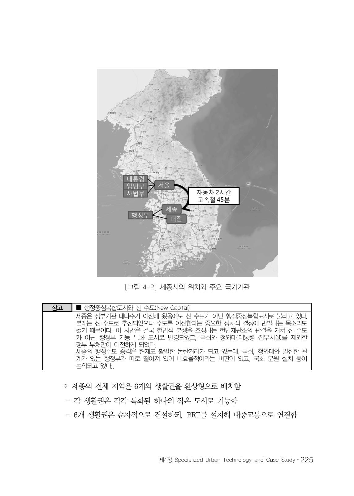

*자료: 「한국형 신도시 가이드라인 연구」 원문 도판 페이지. 세종을 수도권 주택공급형 신도시가 아니라 중앙행정기능의 공간 재배치로 읽기 위한 위치도다.[^40]*

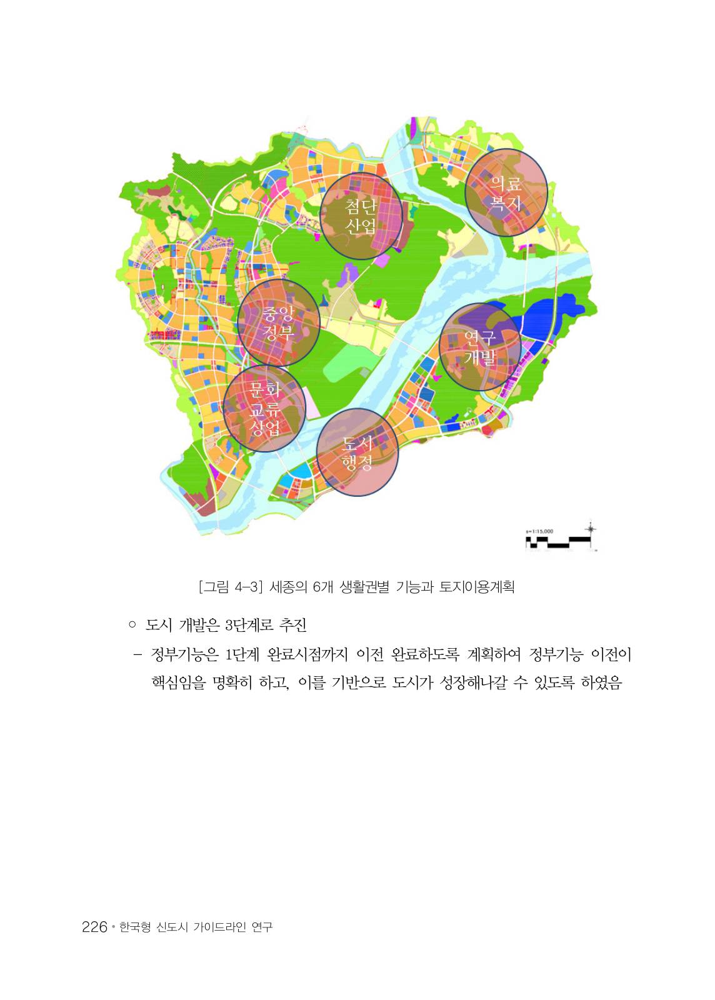

*자료: 「한국형 신도시 가이드라인 연구」 원문 도판 페이지. 행복도시의 6개 생활권과 기능 배분을 확인하기 위한 계획도다.[^40]*

세종을 평가할 때는 세 가지를 나누어야 한다. 첫째, 중앙행정기관 이전이 실제 행정효율성과 국가균형발전에 어떤 영향을 주었는가. 둘째, 생활권 단위의 복합커뮤니티센터와 공공시설 배치가 주민 정주성을 얼마나 높였는가. 셋째, 대전·청주·공주·조치원 등 주변 도시와의 관계가 상호보완으로 작동했는가, 아니면 기능 흡수와 통근권 확대에 그쳤는가. 세종은 성공과 실패를 한 문장으로 판정하기보다, 행정기능, 생활권, 광역권 관계를 분리해 평가해야 한다.

### 9.2 혁신도시: 공공기관 이전과 지역 혁신의 간극

혁신도시는 수도권 공공기관을 지방으로 이전하고, 그 기관을 지역 성장거점과 연결하려는 정책이다. 법령상 혁신도시는 공공기관 이전과 산학연 클러스터, 정주환경 조성을 함께 다룬다.[^25] 그러나 실제 평가는 이전기관이 몇 개 왔는가만으로 끝나지 않는다. 기관 종사자가 해당 지역에 정착했는지, 가족 동반 이주가 이루어졌는지, 지역 대학·기업·연구기관과 협력망이 생겼는지, 원도심과 혁신도시가 경쟁하지 않고 연결되었는지를 봐야 한다.

국토교통부 혁신도시발전추진단의 총괄 현황은 산학연 클러스터를 공공기관과 연계된 기업·대학·연구소가 네트워크를 형성하고 지역혁신을 일으키도록 조성된 용지로 설명하고, 혁신도시 전체의 6.6%에 해당하는 클러스터 용지 현황을 제시한다.[^52] 이 설명은 혁신도시의 목표가 단순한 기관 이전이 아니라 공공기관, 기업, 대학, 연구소의 관계망 형성이라는 점을 보여준다.

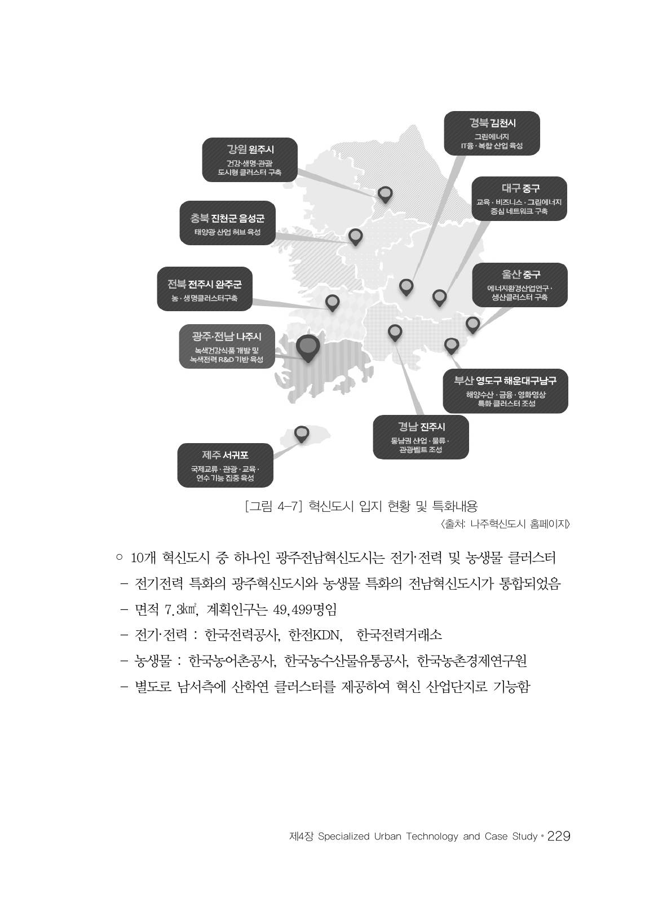

*자료: 「한국형 신도시 가이드라인 연구」 원문 도판 페이지. 혁신도시를 개별 지방 신도시가 아니라 공공기관 이전과 지역별 특화전략의 전국망으로 보기 위한 위치도다.[^40]*

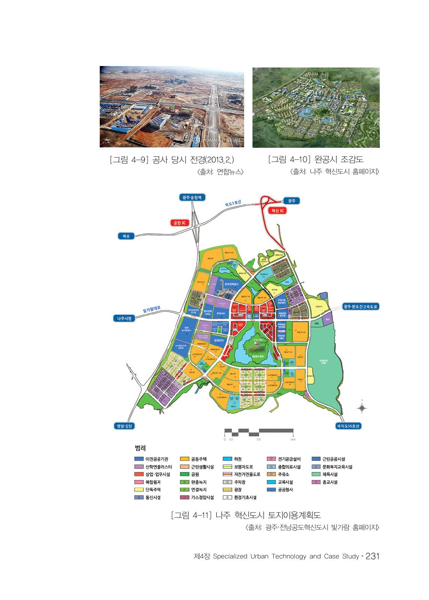

*자료: 「한국형 신도시 가이드라인 연구」 원문 도판 페이지. 혁신도시가 청사 이전지만이 아니라 주거·상업·클러스터·공공용지가 결합된 계획도시임을 보여주는 사례 도판이다.[^40]*

하지만 바로 그 지점이 혁신도시의 난점이다. 공공기관이 이전해도 지역 산업과 연구 생태계가 자동으로 생기지는 않는다. 청사가 들어오고 아파트가 지어진 뒤에도 가족은 수도권에 남고, 지역 대학과의 협력은 프로젝트 단위에 머물며, 혁신도시 상권과 원도심 상권이 분리될 수 있다. 따라서 혁신도시 평가는 "이전 완료"가 아니라 "지역 혁신 체계로의 편입"을 기준으로 해야 한다.

혁신도시를 신도시사에 넣는 이유는 분명하다. 혁신도시는 수도권 주택난을 해결하기 위한 신도시는 아니지만, 국가가 새 도시공간을 만들어 기능을 이전하고 인구와 고용을 재배치하려 한 계획도시다. 이 점에서 세종과 함께 국가균형발전형 신도시사의 한 축을 이룬다.

### 9.3 기업도시: 민간투자형 목적도시의 가능성과 위험

기업도시는 공공이 택지를 조성해 주택을 공급하는 방식과 다르다. 민간기업의 투자와 지역개발을 결합하고, 산업·관광·레저·지식기반 기능을 도시개발과 함께 추진한다. 국토교통부의 2005년 보도자료는 기업도시 시범사업지로 무안, 충주, 원주, 무주를 1차 선정하고, 태안과 영암·해남을 재심의 대상으로 두었다고 설명한다.[^54] 같은 해 후속 자료는 해남·영암과 태안을 관광레저형 기업도시로 추가 선정했다고 밝혔다.[^55]

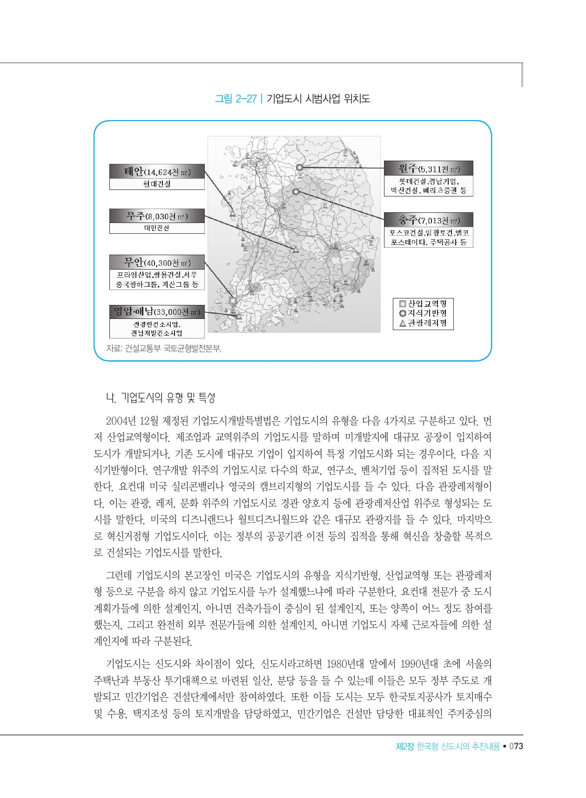

*자료: KSP 「2011 경제발전경험모듈화사업: 한국형 신도시 개발」 원문 도판 페이지. 기업도시 시범사업이 주택공급형 신도시와 달리 민간투자·산업·관광·지역개발 목적을 결합한 전국형 정책이었다는 점을 확인하기 위한 위치도다.[^62]*

기업도시는 목적이 분명한 만큼 위험도 분명하다. 민간투자가 지연되거나 사업성이 흔들리면 도시 전체의 성숙이 늦어진다. 관광레저형 기업도시는 경기 변동과 수요 예측에 취약하고, 산업교역형·지식기반형 기업도시는 실제 기업 유치와 고용창출이 계획대로 이루어져야 한다. 또한 기업도시는 민간기업에게 제한적 토지수용권이 부여되는 구조를 포함하므로, 원주민 이주대책과 생활대책이 매우 중요하다. 국토교통부는 기업도시 이주대책 기준 제정 자료에서 생활 근거를 상실하는 주민을 위한 이주대책과 상가용지 공급, 고용계획, 직업훈련 같은 생활대책을 제시했다.[^60]

계획기준으로 보아도 기업도시는 일반 신도시보다 강한 자족성 요구를 받는다. 3기 신도시 계획기준 연구는 기업도시 계획기준을 산업도시 개념을 넘어 기술개발과 혁신이 지속되는 도시 조성, 산·학·연·관 시설이 집적된 혁신시설지구 계획으로 정리하고, 자족시설용지 비율을 30% 이상, 거점확장형은 40% 이상으로 제시한다.[^56] 이는 기업도시가 주택공급보다 기능 유치와 고용 창출을 더 강하게 요구받는 도시라는 뜻이다.

따라서 기업도시는 "민간이 만든 신도시"라는 단순한 표현으로는 부족하다. 그것은 공공의 지역개발 목표와 민간의 투자논리, 원주민 이주대책, 장기 수요예측, 산업·관광 기능의 지속성이 충돌하는 목적도시다. 기업도시를 신도시사에 넣으면, 신도시의 성공 기준이 분양률과 입주율만이 아니라 사업구조와 지역경제 파급효과까지 넓어진다.

### 9.4 목적도시의 종합 평가

행복도시·혁신도시·기업도시를 넣으면 신도시사의 지도가 수도권 밖으로 넓어진다. 수도권 1·2·3기 신도시는 서울 문제를 중심으로 움직이지만, 목적도시는 수도권 집중을 완화하고 국가 기능을 지방으로 배치하려는 논리에서 나온다. 따라서 대한민국 신도시사는 "수도권 주택정책"과 "국가균형발전 정책"이라는 두 축을 함께 다루어야 한다.

다만 목적도시도 평가가 쉽지 않다. 행정기관이나 공공기관이 이전했다고 해서 지역 혁신 생태계가 자동으로 만들어지는 것은 아니다. 기업도시도 민간투자가 들어왔다고 해서 장기 정주성과 지역경제 파급효과가 보장되는 것은 아니다. 그러므로 목적도시의 평가는 이전 기관 수, 종사자 수, 지역 대학·기업과의 연계, 통근권, 정주 만족도, 원도심과의 관계까지 포함해야 한다.

| 평가항목 | 행정중심복합도시 | 혁신도시 | 기업도시 |
|---|---|---|---|
| 이전 기능 | 중앙행정기관과 국가행정 기능 | 공공기관과 관련 산업 기능 | 민간기업 투자와 산업·관광·지식기반 기능 |
| 도시구조 | 생활권별 행정·상업·연구·의료·첨단 기능 배치 | 공공기관 이전지와 산학연 클러스터 | 사업유형별 산업·관광·주거 복합개발 |
| 핵심 위험 | 행정효율, 광역권 의존, 상가·정주 문제 | 가족동반 이주, 지역연계 부족, 원도심과 분리 | 투자 지연, 사업성 변동, 원주민 이주대책 |
| 평가 기준 | 행정기능 이전 효과와 정주성 | 클러스터 작동과 지역혁신 | 고용창출, 민간투자 지속성, 지역경제 파급 |

목적도시는 신도시사의 보조 장이 아니라, 주택공급형 신도시와 나란히 놓아야 할 별도 축이다. 이 축을 넣어야 대한민국 신도시사가 "서울 집값을 잡기 위해 외곽에 아파트를 지은 역사"로 축소되지 않는다. 대한민국 신도시사는 산업화, 행정기능 분산, 수도권 주택공급, 균형발전, 자족도시 실험, 노후계획도시 정비가 서로 겹친 역사다.

---

## 10. 3기 신도시: 서울 인접, 광역교통, 자족용지

3기 신도시는 2018년 이후 수도권 주택시장 및 서민 주거 안정을 위해 추진된 신도시다.[^20] LH 3기 신도시 공식 자료는 왕숙·왕숙2, 하남 교산, 인천 계양, 고양 창릉, 부천 대장 등 6개 지구를 34.46㎢, 19.3만 호 규모로 제시한다.[^20]

3기의 가장 큰 차이는 입지와 교통이다. 공식 비교표는 1기 신도시를 모도시 20-25km 이내의 위성형, 2기를 30-40km 이내의 독립형, 3기를 10km 이내의 연접형으로 설명한다.[^20] 또한 3기는 자족기능과 인프라 확대, GTX·S-BRT 등 광역교통 인프라, 철도망 중심 대중교통체계를 공식 원칙으로 내세운다.[^20]

| 3기 지구 | 부지면적 | 주택건설 | 해석 |
|---|---:|---:|---|
| 남양주 왕숙 | 10.29㎢ | 64천 호 | 동북권 대형 거점, GTX-B 등 광역축과 결합 |
| 남양주 왕숙2 | 2.39㎢ | 16천 호 | 왕숙과 연계되는 보완 지구 |
| 하남 교산 | 6.86㎢ | 37천 호 | 서울 동남권 연접, 미사·위례·강동축과 연결 |
| 인천 계양 | 3.35㎢ | 18천 호 | 서울 서남권·김포공항·마곡권과 가까운 서부 거점 |
| 고양 창릉 | 8.12㎢ | 38천 호 | 은평·마포 인접, GTX-A·고양선 축과 결합 |
| 부천 대장 | 3.45㎢ | 20천 호 | 마곡·김포공항·인천계양과 묶이는 서남부 거점 |

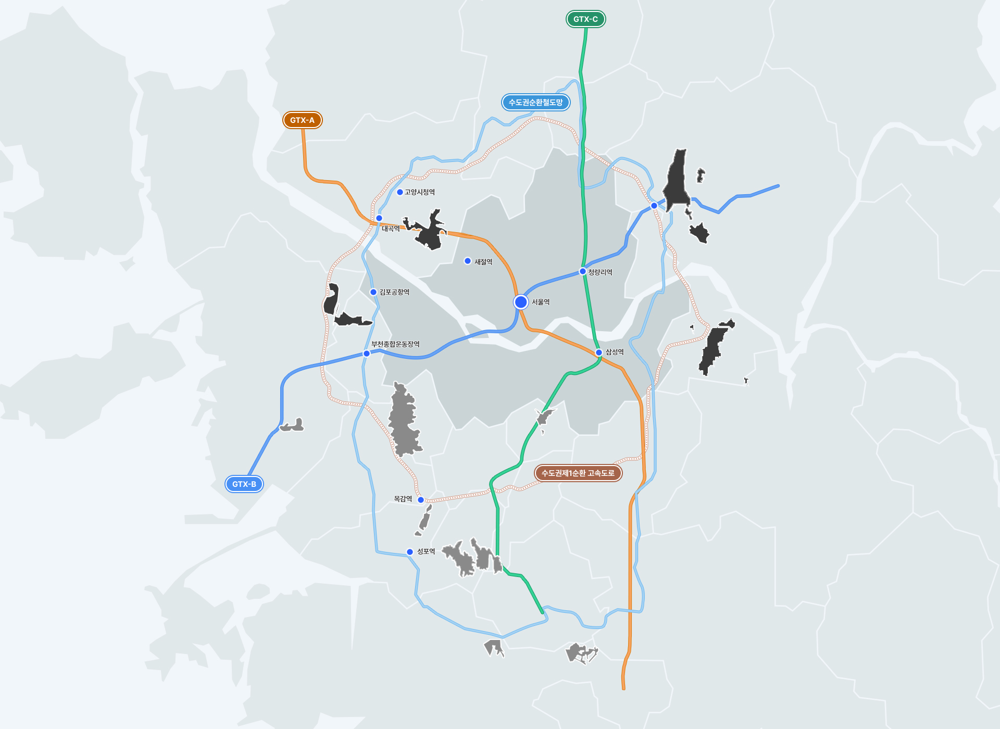

*자료: LH 3기 신도시 공식 사이트의 3기 신도시 위치도. 3기가 1·2기보다 서울에 가까운 연접형 입지를 택했다는 본문 주장을 확인하기 위한 도판이다.[^20]*

3기는 1·2기의 문제를 공식적으로 학습한 세대다. 기존 신도시의 업무시설 부족, 기반시설 지연, 서울도심 접근 불편을 보완하기 위해 대규모 자족용지, 광역교통개선대책 조기 수립, 도심 접근성 개선을 내세운다.[^20] 3기 계획기준 정리본도 3기를 "공간혁신과 공생발전의 미래도시"로 설명하며 자족, 교통, 교육·환경, 협력, 스마트, 포용을 계획목표로 정리한다.[^38]

그러나 3기는 아직 성과가 완전히 검증된 세대가 아니다. 공식 자료가 확인해 주는 것은 계획의 원리와 목표다. 실제 평가는 입주 이후의 통근 구조, 기업 유치, 학교·상업·의료·문화시설의 성숙 속도, 광역교통 개통 시점, 주변 1·2기 도시와의 갈등 완화 여부를 통해 별도로 이루어져야 한다.

3기 신도시의 계획기준은 이전 세대보다 훨씬 구체적인 숫자와 원칙을 제시한다. 3기 계획기준 정리본은 목표연도 세대당 인구 2.35명, 공공주택특별법상 330만㎡ 이상 공공주택지구 적용, 소·중·대 생활권 기준, 자족용지 10% 이상, 공원녹지 최소 20% 이상, 대중교통 분담률 40% 이상 같은 기준을 정리한다.[^39] 이는 3기가 단순히 "더 가까운 신도시"가 아니라 계획지표와 운영기준을 더 체계화하려 한 세대임을 보여준다.

3기의 차이는 세 가지다. 첫째, 서울과의 거리가 짧다. LH 공식 비교표는 1기 신도시를 모도시 20-25km 이내, 2기를 30-40km 이내, 3기를 10km 이내의 연접형으로 설명한다.[^20] 둘째, 교통이 사후 보완이 아니라 초기 원칙으로 제시된다. 셋째, 자족용지를 도시 외곽의 산업용지로만 두지 않고, 대중교통 결절지와 중심부 복합개발, 기업지원허브와 연결하려는 방향이 강하다.

| 3기 계획 원칙 | 의미 | 이전 세대와의 차이 |
|---|---|---|
| 서울 30분대 접근 | 출퇴근 체감시간을 정책 목표로 전면화 | 1·2기의 교통 지연 비판을 반영 |
| 자족용지 10% 이상 | 일자리·산업 기능을 계획 초기부터 배치 | 2기의 자족성 한계를 제도화된 기준으로 보완 |
| 생활권 기준 | 도보·버스·승용차·광역교통 이동 범위를 반영 | 행정구역보다 실제 이동을 중시 |
| 복합화·입체화 | 주거·상업·업무·공공·문화 기능 결합 | 기능별 분리형 토지이용의 한계를 보완 |
| 공원녹지·환경 기준 | 공원 접근성, LID, 미세먼지·열섬 대응 | 친환경을 홍보문구에서 계획기준으로 이동 |
| 협력적 거버넌스 | 시민참여와 지자체 협력 강조 | 기존 도시 주민과 신규 개발지 갈등을 의식 |

그렇지만 3기의 쟁점도 분명하다. 계획기준이 정교해도 실제 광역교통 개통이 늦어지면 입주민 체감은 낮아진다. 자족용지를 확보해도 기업이 들어오지 않으면 땅만 남는다. 서울과 가까운 입지는 장점이지만, 기존 1·2기 신도시 주민에게는 교통 혼잡과 공급 경쟁으로 느껴질 수 있다. 따라서 3기는 "계획 원리는 가장 진화했지만, 검증은 아직 남은 세대"로 정리할 수 있다.

3기 신도시의 갈등도 유사 사례로 분석할 필요가 있다. 2019년 3기 신도시 발표 이후 일산, 파주, 검단 등 기존 1·2기 신도시 주민들은 "3기 철회"를 요구했지만, 그 속에는 기존 신도시의 교통·자족·노후화 문제를 먼저 해결하라는 요구가 담겨 있었다는 분석이 나왔다.[^17] 이는 신도시 갈등의 주체가 원주민과 사업시행자만이 아니라, 주변의 기존 신도시 주민까지 확장되었음을 뜻한다. 새 신도시가 생기면 기존 신도시 주민은 주택공급 경쟁, 교통 혼잡, 공공투자 분산, 도시 위상 하락을 걱정한다.

또 하나는 원주민·토지주 보상 갈등이다. 2021년 LH 투기 의혹 이후 하남교산, 광명시흥, 남양주왕숙 등 3기 신도시 토지주들의 보상 불신과 사업 취소 요구가 커졌다는 보도가 있었다.[^18] 신도시는 아무리 공공주택이라는 명분을 가져도, 토지를 수용당하는 사람에게는 재산권, 생계, 이주자택지, 대토보상, 사업시행자 신뢰의 문제다. 이 점에서 3기는 광주대단지나 목동·상계와 시대는 다르지만, "누가 도시계획의 비용을 부담하는가"라는 질문을 반복한다.

| 갈등 유형 | 1960-80년대 사례 | 3기 신도시의 반복 형태 |
|---|---|---|
| 이주·보상 갈등 | 광주대단지, 목동 철거민, 상계동 철거반대투쟁 | 왕숙·교산 등 원주민 보상, 대토, 이주자택지 문제 |
| 주변 도시 반발 | 영동 개발과 강북·강남 기능 이동, 서울 내부 불균형 | 일산·검단·파주 등 기존 신도시의 3기 반발 |
| 교통 약속 불신 | 1·2기 입주 후 교통 지연 | 3기 광역교통대책 실행 여부 의심 |
| 도시 이미지 경쟁 | 화성·동탄, 송파·위례 명칭 전략 | 3기와 기존 도시 사이의 위상·수요 경쟁 |

---

## 11. 노후계획도시 정비: 신도시의 두 번째 생애

2024년 4월 27일 처음 시행되었고, 2026년 4월 29일 현재 국가법령정보센터에서 2026년 2월 3일 일부개정 시행본으로 확인되는 「노후계획도시 정비 및 지원에 관한 특별법」은 신도시사를 새로 쓰게 만드는 법이다.[^23] 이 법은 1기 신도시 같은 노후 계획도시를 더 이상 "과거의 성공한 공급지"로만 보지 않고, 광역적·체계적으로 정비해야 할 도시 생애주기의 대상으로 본다.

이 전환은 중요하다. 신도시 정책은 오랫동안 새 택지를 조성하고 새 아파트를 공급하는 데 초점을 맞췄다. 하지만 1기 신도시가 30년을 넘어서면서 문제는 바뀌었다. 이제 질문은 "어디에 새 신도시를 만들 것인가"만이 아니라 "이미 만든 신도시를 어떻게 다시 도시답게 고칠 것인가"가 되었다.

노후계획도시 정비는 단순 재건축 문제가 아니다. 분당·일산·평촌·산본·중동은 대규모 아파트 단지만이 아니라 도로, 공원, 학교, 상하수도, 상업지, 주차, 광역교통, 주민 고령화가 동시에 노후화되는 도시다. 아파트 한 단지를 새로 짓는 문제와 달리, 신도시 전체를 정비하려면 이주 순서, 기반시설 용량, 공공기여, 교통 수요, 생활권 유지, 임대주택, 상가 생태계까지 함께 계산할 필요가 있다.

이 점에서 노후계획도시 특별법은 대한민국 신도시사의 세 번째 국면을 연다. 첫 번째 국면이 "새 도시를 만든다"였다면, 두 번째는 "새 도시가 생활권으로 성숙한다"이고, 세 번째는 "성숙한 계획도시를 다시 계획한다"다. 이 세 번째 국면에서는 계획 당시의 성공 요소가 오히려 정비의 난점이 된다. 같은 시기에 지어진 아파트가 많고, 비슷한 시기에 기반시설이 낡으며, 주민 이주 수요가 한꺼번에 발생하기 때문이다.

노후계획도시 정비의 핵심 과제는 다음과 같다.

| 과제 | 내용 |
|---|---|
| 주거 재정비 | 재건축, 리모델링, 용적률, 이주대책, 임대·분양 균형 |
| 기반시설 보강 | 상하수도, 도로, 학교, 공원, 주차, 생활SOC 재배치 |
| 광역교통 재조정 | 오래된 통근 패턴과 새 철도·버스망의 재조합 |
| 도시기능 보강 | 베드타운 구조 완화, 일자리·상업·문화 기능 확충 |
| 주민 거버넌스 | 선도지구, 특별정비계획, 주민 동의와 갈등 관리 |

따라서 신도시사는 세 단계로 다시 쓸 수 있다. 첫째, "새 도시를 계획하는 단계". 둘째, "도시가 실제 생활권으로 성숙하는 단계". 셋째, "노후화된 계획도시를 다시 계획하는 단계"다. 대한민국은 이제 세 번째 단계에 본격적으로 들어섰다.

노후계획도시를 평가할 때는 다음 질문을 별도로 두어야 한다.

| 질문 | 의미 |
|---|---|
| 어떤 기반시설이 가장 먼저 한계에 도달했는가 | 상하수도, 도로, 주차, 학교, 공원, 의료시설 등 정비 우선순위 판단 |
| 이주 수요를 어디에서 흡수할 수 있는가 | 순차 정비와 전세시장 충격을 평가 |
| 재건축이 자족기능을 강화하는가 | 주거 용적률 증가만으로 끝나는지, 업무·상업·생활SOC가 보강되는지 확인 |
| 기존 상권과 공동체는 어떻게 유지되는가 | 도시 정비가 생활권 해체로 이어지는 것을 방지 |
| 1기 정비가 2기·3기와 어떤 관계를 맺는가 | 새 공급과 기존 도시 정비를 수도권 전체에서 조정 |

이 질문을 넣어야 신도시사가 과거사가 아니라 현재 정책사가 된다. 1기 신도시는 이제 "성공한 과거"가 아니라, 대한민국이 처음으로 대규모 계획도시의 노후화를 어떻게 다룰지 시험하는 현재진행형 사례다.

---

## 12. 공간·행정 대응표

아래 표는 "신도시"라는 말이 어떤 사례에 얼마나 정확하게 적용되는지 정리한 것이다. `정확`은 공식 세대 또는 정책용어와 거의 일치하는 경우, `대체로 일치`는 계획도시·신시가지로서 신도시사에 포함할 수 있는 경우, `부분 일치`는 신도시사의 선례나 주변층위로만 다루는 편이 안전한 경우다.

| 사례 | 당시 성격 | 현재 행정·공간 인식 | 신도시사 포함 등급 | 비고 |
|---|---|---|---|---|
| 정조 수원 화성 | 전근대 읍치 이전·성곽·행궁·가로망 | 수원시 팔달구 일대 역사도심 | 부분 일치 | 대한민국 정책사는 아니며, 계획도시 선례로만 사용 |
| 울산신시가지 | 산업화·공업도시 조성 | 울산광역시 핵심 도시권 | 대체로 일치 | 현대적 신도시 출발 사례로 언급 가능 |
| 여의도·영동 | 서울 내부 대규모 신시가지 | 서울 핵심 업무·상업지 | 대체로 일치 | 외곽 신도시는 아니나 서울 확장사의 핵심 |
| 성남 | 이주정착지·도시개발 | 성남시 원도심과 분당·판교 등 복합도시 | 부분 일치 | 초기 성남과 후대 분당·판교를 구분해야 함 |
| 구미·창원·여천·포항 | 산업기지도시 | 지역 산업도시 | 대체로 일치 | 주택공급형보다 산업정책형 계획도시 |
| 과천 | 행정기능 분산 도시 | 과천시 | 대체로 일치 | 행정기능 분산형 계획도시 |
| 목동 | 서울 내부 공영개발형 신시가지 | 서울 양천구 목동 일대 | 부분 일치 | 도시내 신도시, 1기 외곽 신도시와 구분 필요 |
| 상계 | 서울 내부 대규모 주거단지·신시가지 | 서울 노원구 상계동 일대 | 부분 일치 | 대규모 아파트 개발과 이주·재개발 층위가 겹침 |
| 1기 신도시 | 수도권 외곽 대규모 주택공급 | 분당·일산·평촌·산본·중동 | 정확 | 주택난 해소와 서울 과밀 완화 |
| 2기 신도시 | 거점·자족·난개발 방지형 신도시 | 판교·동탄·김포한강·운정·광교 등 | 정확 | 성과는 도시별 편차가 큼 |
| 행복도시·혁신도시·기업도시 | 목적도시 | 세종·혁신도시·기업도시 | 대체로 일치 | 수도권 신도시 세대와 별도 축 |
| 3기 신도시 | 서울 인접·광역교통·자족용지형 신도시 | 왕숙·교산·계양·창릉·대장 등 | 정확 | 계획 원리는 명확하나 성과 검증은 진행 중 |
| 노후계획도시 | 기존 신도시 재정비 대상 | 1기 등 20년 이상 경과 계획도시 | 부분 일치 | 새 신도시가 아니라 신도시의 두 번째 생애 |

이 표의 목적은 포함과 배제를 명확히 하기 위한 것이다. 신도시사를 쓰다 보면 "정조 수원도 신도시인가", "목동도 신도시인가", "성남 전체가 신도시인가", "행복도시와 혁신도시는 신도시인가" 같은 질문이 계속 나온다. 이때 답은 예/아니오로 끝나지 않는다. 어떤 사례는 공식 세대와 정확히 일치하고, 어떤 사례는 계획도시사의 일부로 들어오며, 어떤 사례는 선례나 주변층위로만 들어온다.

특히 성남과 목동·상계는 등급 구분이 필요하다. 성남은 오늘날 분당·판교·위례를 포함하므로 신도시 이미지가 강하지만, 성남 원도심의 출발은 광주대단지 이주정착지와 1971년 사건이다. 목동과 상계는 서울 내부 신시가지로 매우 중요하지만, 수도권 외곽 1기 신도시와 같은 공식 세대는 아니다. 이 차이가 지켜질 때 보고서의 범위가 넓어지면서도 개념은 느슨해지지 않는다.

또한 이 표는 후속 연구에서 자료를 나누는 기준이 된다. `정확` 등급 사례는 고시문, 개발계획, 실시계획, 입주·준공자료가 우선 수집 대상이다. `대체로 일치` 사례는 도시계획사, 산업정책, 행정기능 이전 자료를 함께 포함한다. `부분 일치` 사례는 왜 부분적으로만 포함되는지, 어떤 논점에서 신도시사와 연결되는지를 명시하는 방식이 적절하다.

---

## 13. 성과, 한계, 개선 방향

### 13.1 성과

대한민국 신도시 정책의 가장 큰 성과는 국가가 도시문제를 공간적으로 해결하려는 역량을 축적했다는 점이다. 주택난이 심할 때 대규모 공급을 실행했고, 산업화가 필요할 때 산업도시를 만들었으며, 행정기능 분산과 균형발전이 필요할 때 목적도시를 만들었다. 1기 신도시는 주택공급과 서울 과밀 완화에 실제 효과를 남겼고, 2기와 3기는 자족기능과 광역교통을 더 분명한 계획 조건으로 끌어올렸다.

또 하나의 강점은 연구 재료가 풍부하다는 점이다. 국토교통부와 LH의 공식 정책자료, 서울기록원의 목동 기록, 성남시사의 광주대단지 기록, 서울역사박물관의 영동·강남 개발 자료, 당시 신문 기사, 법령정보, 선행 연구와 평가 보고서가 서로 대조 가능하다. 이 자료 묶음은 곧바로 완결된 학술 논문을 대신하지는 않지만, 연구 질문을 세우고 1차 자료로 진입하기 위한 색인으로 충분한 가치가 있다.

세 번째 강점은 비교 가능성이다. 한국 신도시사는 사례가 많고, 사례별로 정책 목적이 다르기 때문에 비교틀을 만들기 좋다. 예를 들어 1기는 공급속도와 노후화, 2기는 자족성과 광역교통, 3기는 서울 접근성과 계획기준, 목적도시는 국가 기능 이전이라는 기준으로 비교할 수 있다. 같은 "신도시" 안에서도 주택형, 산업형, 행정형, 균형발전형, 재정비형이 나뉘기 때문에, 다른 나라의 계획도시 연구와도 비교가 가능하다.

네 번째 강점은 실패와 갈등의 기록도 연구 자산이 된다는 점이다. 광주대단지 사건, 영동 개발의 투기, 검단의 강남 수요 대체 논쟁, 위례의 명칭과 행정경계 문제, 1기 신도시의 노후화는 부끄러운 부록이 아니라 핵심 자료다. 도시정책은 성공한 결과만으로 평가할 수 없고, 어떤 문제를 만들었는지도 함께 검토된다.

다섯 번째 강점은 유사 사례를 묶어 유형화할 수 있다는 점이다. 화성·동탄만 보면 특이한 작명 사례처럼 보이지만, 김포양촌→김포한강, 이의→광교, 운정·교하 논쟁, 행정중심복합도시→세종을 같이 놓으면 도시명은 정책목표, 시장 이미지, 행정구역, 주민 정체성이 만나는 지점이라는 일반 원리가 나온다. 광주대단지 하나만 보면 비극적 예외처럼 보이지만, 목동·상계·3기 보상 갈등까지 함께 보면 신도시 개발에서 이주와 보상은 반복되는 구조적 문제라는 점이 보인다.

### 13.2 한계

첫째, 신도시가 반복해서 서울 의존 통근 구조를 만들었다. 1기는 주택공급 속도에 비해 일자리와 교통이 늦었고, 2기는 자족기능을 강조했지만 도시별 성과 편차가 컸다. 3기는 이 문제를 알고 출발했지만, 아직 실현 여부가 검증되지 않았다.

둘째, 기반시설과 입주 시점의 불일치가 반복되었다. 새 아파트 입주는 빠른데 철도, 학교, 병원, 상업시설, 공공시설이 늦게 따라오는 문제가 여러 세대에서 나타났다. 이는 주민 체감상 신도시의 첫 기억을 불편으로 만든다.

셋째, 원주민 보상과 주변지역 갈등이 충분히 해결되지 않았다. 신도시는 새 입주민에게는 기회지만 기존 주민에게는 수용, 보상, 이주, 생활권 상실의 사건일 수 있다. 3기 신도시에서도 기존 1·2기 주민과의 교통·공급 갈등이 제기될 수 있다.

넷째, 초기 개발사를 발전서사로만 읽기 쉽다. 영동 개발은 기반시설과 새 중심지 형성의 성공담이지만 동시에 땅값 상승, 투기, 교육·계층 이미지 형성의 역사였다. 성남은 신도시적 개발의 선행 사례이지만 동시에 이주, 빈곤, 기반시설 부재, 광주대단지 사건의 역사였다.

다섯째, "자족성"이라는 말이 자주 쓰였지만 측정 방식이 약했다. 자족용지를 확보하는 것과 실제 일자리가 생기는 것은 다르다. 기업이 들어오는 것과 주민의 직주근접이 실현되는 것도 다르다.

여섯째, 계획 언어가 주민 경험을 충분히 설명하지 못한다. 공식 자료는 교통체계, 자족기능, 쾌적한 주거환경을 말하지만 주민은 출근 시간, 학교 배정, 병원 접근성, 버스 배차, 상가 공실, 아이를 데리고 걸을 수 있는 거리, 동네 이름의 자부심 같은 방식으로 도시를 경험한다. `1·2기 신도시 주민의 삶` 정리본도 공급자 성과가 아니라 주민 거주 경험으로 신도시를 평가할 필요가 있다는 관점을 제시한다.[^37]

일곱째, 신도시가 주변 원도시와 맺는 관계가 충분히 평가되지 않았다. 신도시는 빈 땅 위에 독립적으로 생기는 것처럼 보이지만 실제로는 기존 시가지, 농촌, 산업단지, 군부대, 골프장, 하천, 고속도로, 철도, 원주민 생활권 위에 올라선다. 주변지역을 흡수하거나 밀어내거나, 때로는 주변 원도시의 기능을 빨아들이는 방식으로 작동한다. 이 관계를 빼면 신도시의 성과도 과장되고 피해도 축소된다.

여덟째, 유사 사례를 충분히 찾지 않으면 특정 사례가 과잉해석된다. 화성·동탄의 이름 변경만 보면 "안 좋은 이미지 회피"라는 흥미로운 일화로 끝나지만, 김포한강과 광교, 운정·교하, 세종까지 보면 명칭은 도시개발의 반복적 장치가 된다. 성남 광주대단지만 보면 1970년대의 예외적 폭발처럼 보이지만, 목동과 상계, 3기 보상 갈등을 함께 보면 이주와 보상 문제는 시대를 바꿔 반복되는 구조다.

### 13.3 개선 방향

개선 방향은 여섯 가지로 정리된다.

1. 광역교통은 사후 보완이 아니라 입주 전 필수 조건으로 관리해야 한다.
2. 자족성은 용지 면적이 아니라 실제 고용, 통근, 소비, 여가 충족도로 평가해야 한다.
3. 원주민·기존 주민·신규 입주민의 이해관계를 사업 초기부터 별도 표로 관리해야 한다.
4. 신도시의 성공 지표를 공급 호수에서 생활권 성숙도, 학교·의료·상업 접근성, 탄소·에너지 성능으로 넓혀야 한다.
5. 사건사와 명칭사를 본문 분석 항목으로 독립시켜야 한다. 광주대단지 사건, 영동 개발 투기, 화성·동탄 명칭, 송파·위례 명칭처럼 도시의 이름과 갈등이 정책의 성격을 드러낸다.
6. 새 신도시 계획과 노후 신도시 정비를 따로 보지 말고, 수도권 전체의 주택·교통·일자리 재배치 문제로 함께 다루어야 한다.

여기에 하나를 더 붙이면, 신도시 평가는 "계획 당시 목표"와 "입주 후 주민 경험"과 "30년 뒤 정비 가능성"을 분리할 필요가 있다. 같은 도시도 세 시점에서 평가는 다를 수 있다. 분당은 초기 공급성과와 현재 노후화 문제가 동시에 있고, 판교는 자족성 성과가 크지만 그 특수성을 2기 전체로 일반화하기 어렵다. 위례는 입지 장점과 행정경계·교통 지연 문제를 별도로 검토할 필요가 있다.

---

## 14. 추가로 필요한 자료

이 보고서를 연구자료로 더 단단하게 만들려면 다음 자료가 필요하다.

| 자료 | 필요한 이유 | 우선순위 |
|---|---|---:|
| 지구지정 고시문과 관보 | 공식 지정일, 면적, 시행자, 사업기간 확정 | 높음 |
| 개발계획·실시계획 원문 | 계획 의도와 실제 토지이용, 인구, 주택, 기반시설 비교 | 높음 |
| 첫 입주일·준공일·철도 개통일 표 | 공식 절차와 주민 체감 시점을 분리 | 높음 |
| 통근 OD 데이터 | 베드타운·자족성 논쟁을 실증 | 높음 |
| 사업별 보상·이주 자료 | 원주민과 기존 생활권의 변화를 분석 | 중간 |
| 광주대단지 관련 행정문서·구술·재판자료 | 성남 원도심의 형성과 1971년 사건을 단순 배경이 아니라 도시정책의 결과로 분석 | 높음 |
| 영동지구 토지구획정리·환지·지가 자료 | 강남 개발의 토지 재편, 땅값 상승, 투기 논리를 실증 | 높음 |
| 신도시 명칭 변경 공문·보도자료 | 화성·동탄, 송파·위례, 이의·광교, 김포양촌·김포한강, 운정·교하, 세종처럼 도시 브랜드가 정책과 시장에 미친 영향 분석 | 높음 |
| 목동·상계 철거민 자료 | 서울 내부 신시가지가 기존 주민의 이주·보상 문제를 어떻게 처리했는지 분석 | 높음 |
| 3기 신도시 원주민·기존 신도시 주민 반발 자료 | 원주민 보상 갈등과 1·2기 주민의 교통·자족성 요구를 함께 분석 | 높음 |
| 학교·병원·상가·공원 개설 시점 | 생활 기반시설의 지연 여부 확인 | 중간 |
| 실거래가·전세가·분양가 장기자료 | 주택시장 안정 효과 검증 | 중간 |
| 항공사진·지적도·도시계획도 | 당시 지명과 현재 지명의 공간 대응 | 중간 |
| 주민 구술·당시 신문 기사 | 행정 문서에 남지 않는 생활 경험과 당시 여론 확인 | 중간 |
| 노후계획도시 선도지구 자료 | 신도시 재정비의 두 번째 생애 분석 | 높음 |

특히 목동과 상계는 추가 자료 가치가 크다. 목동은 서울기록원에 행정문서가 두껍게 남아 있으므로 공영개발의 실제 운영을 파고들 수 있다. 상계는 이주정착, 대규모 아파트 개발, 잔존 저층주거지, 재개발이 겹치므로 "신도시와 주변부"라는 관점에서 좋은 사례가 된다.

자료 수집 순서는 다음처럼 잡는 것이 좋다.

| 단계 | 할 일 | 산출물 |
|---|---|---|
| 1단계 | 공식 고시·개발계획·실시계획 수집 | 지구별 기본연표와 면적·인구·주택 표 |
| 2단계 | 당시 신문 기사와 보도자료 수집 | 명칭 변화, 투기 논쟁, 교통 논쟁, 원주민 갈등 연표 |
| 3단계 | 입주 후 생활자료 수집 | 학교·교통·상가·병원·공원 개설 시점표 |
| 4단계 | 통계자료 결합 | 인구, 사업체, 종사자, 통근 OD, 가격지수 |
| 5단계 | 주민 경험 자료 결합 | 구술, 설문, 민원, 지역 커뮤니티 텍스트 |
| 6단계 | 재정비 자료 수집 | 노후계획도시 선도지구, 특별정비계획, 이주대책 |

이 순서를 따르면 보고서가 단순 역사 서술에서 데이터 기반 연구로 넘어갈 수 있다. 특히 2기 신도시는 도시별 편차가 너무 크기 때문에, 각 도시의 지구지정일, 첫 입주일, 철도 개통일, 주요 업무시설 입주시점, 학교 개교시점이 표로 정리되어야 한다.

---

## 15. 재생산 가능한 연구 요소

이 보고서의 분석틀은 다른 도시 연구에도 재사용할 수 있다.

| 재생산 요소 | 사용법 |
|---|---|
| 시간층 분리표 | 발표일, 법령일, 지정일, 착공일, 입주일, 준공일, 체감일을 분리 |
| 공간·행정 대응표 | 당시 지명과 현재 행정동·법정동·생활권의 대응을 등급화 |
| 세대별 비교표 | 1기·2기·3기 또는 산업·행정·주택형 도시를 같은 기준으로 비교 |
| 자족성 검증표 | 자족용지, 실제 사업체, 고용자 수, 주민 통근지를 분리 |
| 생활 기반시설 성숙표 | 학교, 병원, 상가, 공원, 도서관, 교통 개통 시점을 입주와 비교 |
| 갈등 지도 | 원주민, 기존 도시 주민, 신규 입주민, 사업시행자, 지자체의 이해관계 표시 |
| 사건사 층위표 | 광주대단지, 영동 투기, 판교 철거, 검단 투기논쟁처럼 계획과 갈등을 같은 연표에 배치 |
| 명칭 변경 추적표 | 화성신도시에서 동탄신도시, 송파신도시에서 위례신도시처럼 이름 변화와 정책 의도를 연결 |
| 노후화 진단표 | 준공 연도, 주택 유형, 기반시설 용량, 재건축 가능성, 이주 위험 정리 |

이 틀을 쓰면 "신도시가 성공했는가"라는 큰 질문을 더 작은 질문으로 나눌 수 있다. 예를 들어 분당은 주택공급, 교통, 일자리, 재정비라는 네 층위에서 다른 평가가 나올 수 있고, 목동은 공영개발과 교육·주거지 성숙에서는 강점이 있지만 서울 내부 불균형과 재건축 문제에서는 다른 평가가 나올 수 있다.

재생산 가능한 요소 중 가장 중요한 것은 "시간층 분리표"다. 신도시는 발표, 지정, 보상, 착공, 분양, 입주, 준공, 철도 개통, 일자리 형성, 노후화가 한 시점에 일어나지 않는다. 이 시간층을 분리하면 거의 모든 도시개발 사례를 같은 방식으로 비교할 수 있다. 예를 들어 위례는 송파신도시 보도, 명칭 변경, 위례 택지개발지구 고시, 입주, 위례선 트램, 위례신사선 논의가 모두 다른 층위다.

두 번째로 중요한 것은 "갈등 지도"다. 신도시에는 항상 신규 입주민, 원주민, 사업시행자, 중앙정부, 지자체, 주변 기존 도시 주민이 있다. 각 집단의 이익이 다르기 때문에 같은 개발도 누군가에게는 기회이고 누군가에게는 손실이다. 광주대단지 사건은 이 갈등 지도가 빠졌을 때 어떤 일이 벌어지는지 보여주는 초기 사례이고, 3기 신도시의 기존 주민 반발은 같은 문제가 현재에도 반복됨을 보여준다.

세 번째는 "자족성 검증표"다. 자족성은 매우 자주 쓰이지만 매우 느슨한 단어다. 자족용지 비율, 사업체 수, 종사자 수, 주민 통근지, 점심·쇼핑·여가 소비지, 기업 업종, 임금 수준을 분리할 필요가 있다. 판교처럼 실제 고용 집적이 강한 사례와, 자족용지는 있지만 실제 고용 성과가 약한 사례를 구분할 수 있기 때문이다.

네 번째는 "비슷한 사례 확장표"다. 한 사례를 발견하면 같은 유형의 다른 사례를 함께 배치하는 절차가 필요하다. 명칭 변경의 경우 동탄, 위례, 광교, 김포한강, 운정, 세종을 함께 비교한다. 철거와 이주 갈등의 경우 광주대단지, 목동, 상계, 3기 원주민 보상 갈등을 함께 비교한다. 이렇게 하면 보고서가 흥미로운 일화 모음에 그치지 않고 재생산 가능한 연구틀이 된다.

---

## 16. 결론

1. 대한민국 신도시사는 1989년 1기 신도시에서 갑자기 시작된 것이 아니다. 전근대 계획도시의 선례로 정조의 수원이 있고, 현대적 본사는 1960년대 산업화와 서울 신시가지 개발부터 시작해 영동 개발, 성남 광주대단지, 1970년대 산업·행정 계획도시, 1980년대 목동·상계 같은 도시내 신도시를 거쳐 1기 신도시로 이어진다.

2. 목동과 상계는 1기 신도시가 아니지만, 서울 내부 대규모 택지개발과 도시내 신도시의 경험을 보여주는 중요한 중간 단계다. 특히 목동은 기록이 두껍고, 상계는 이주·아파트 개발·잔존 저층주거지·재개발이 겹친다는 점에서 연구 가치가 크다.

3. 성남과 영동은 서로 다른 사건층이 중첩된 사례다. 성남은 이주정착지, 광주대단지 사건, 분당, 판교, 위례가 한 도시에 겹친 압축판이고, 영동은 강남이라는 새 중심지가 기반시설, 토지구획정리, 투기, 학교·공공기관 이전 속에서 만들어진 사례다.

4. 1기·2기·3기의 차이는 연도 차이가 아니라 문제의식의 차이다. 1기는 서울 주택난과 과밀 완화, 2기는 난개발 방지와 권역별 거점·자족기능, 3기는 서울 인접 입지와 광역교통·자족용지의 동시 설계가 핵심이다.

5. 신도시의 성공은 공급 호수만으로 판단할 수 없다. 실제 평가는 교통, 일자리, 생활SOC, 주민 이주와 갈등, 주변 도시와의 관계, 이름과 이미지의 정치, 30년 뒤 정비 가능성까지 포함한다.

6. 이 보고서의 핵심 명제는 다음과 같다. 대한민국 신도시사는 "서울 밖에 집을 지은 역사"가 아니라, 국가가 산업화·서울 집중·주택난·이주 갈등·토지 문제·균형발전·광역교통·노후화를 도시공간으로 해결하려 한 반복된 실험의 역사다.

---

## 참고문헌 및 자료

### 1차 신문·보도 자료

[^1]: 서울신문, 2017.03.13, 「[그때의 사회면] 영동지구(강남) 개발」.  
    URL: https://m.nownews.seoul.co.kr/news/editOpinion/opinion/2017/03/13/20170313026008?cp=go

[^2]: 서울경제, 2016.08.11, 「1971년의 개·돼지…광주대단지 사건」.  
    URL: https://m.sedaily.com/NewsView/1L035WZ7FC

[^3]: 가톨릭신문, 1984, 「신시가지 개발로 밀려나는 목동본당 신자들, 목동지역 철거민대책 호소」.  
    URL: https://www.catholictimes.org/article/201106300158965

[^4]: 파이낸셜뉴스, 2000.12.01, 「판교 신도시 논의 관련 보도」.  
    URL: https://www.fnnews.com/news/200012010527539040

[^5]: 동아일보, 2004.12.13, 「[수도권]판교신도시 조성-분양계획 세부안 확정」.  
    URL: https://www.donga.com/news/Economy/article/all/20041213/8138545/1

[^6]: 연합뉴스, 2005.08.30, 「<8.31대책> 송파신도시 어떻게 개발되나」.  
    URL: https://www.yna.co.kr/view/AKR20050830006400003

[^7]: 한국경제, 2005.12.27, 「[송파신도시 개발 윤곽] 분양가 판교보다 낮을듯」.  
    URL: https://www.hankyung.com/article/2005122783041

[^8]: 한국경제, 2003.01.15, 「토공 '화성=연쇄살인' 이미지 벗기 .. 신도시 명칭 화성·동탄으로」.  
    URL: https://www.hankyung.com/article/2003011552351

[^9]: 동아일보, 2006.10.26, 「[검단 신도시 확정] 도심까지 1시간…강남수요 분산 어려워」.  
    URL: https://www.donga.com/news/Economy/article/all/20061026/8366028/1

[^10]: 뉴스핌, 2007.06.01, 「정부, 東동탄 10만호 '자족형' 신도시 개발, '투기 강력 억제'」.  
    URL: https://www.newspim.com/news/view/20070601000211

[^11]: 한국경제, 2007.08.14, 「송파신도시 명칭 '위례신도시'로 확정」.  
    URL: https://www.hankyung.com/article/2007081427341

[^12]: 매일경제, 2008.05.28, 「평택 고덕신도시 글로벌교육단지로 조성」.  
    URL: https://www.mk.co.kr/news/realestate/4443437

[^13]: 경기일보, 2004.09.17, 「이의신도시 명칭 ‘광교테크노밸리’로」.  
    URL: https://www.kyeonggi.com/article/200409170028682

[^14]: 이투데이, 2008.06.04, 「김포신도시 '김포 한강신도시'라 불러주오」.  
    URL: https://www.etoday.co.kr/news/view/169196

[^15]: 아주경제, 2011.10.04, 「파주 운정신도시 명칭 확정」.  
    URL: https://www.ajunews.com/view/20111003000288

[^16]: 파이낸셜뉴스, 2006.12.21, 「행정중심복합도시 명칭, 세종으로 확정」.  
    URL: https://www.fnnews.com/news/200612211403599520

[^17]: 비즈워치, 2019.05.29, 「[신도시 후폭풍] '3기 철회' 속뜻은 '1·2기 살릴 대책부터'」.  
    URL: https://news.bizwatch.co.kr/article/real_estate/2019/05/29/0018

[^18]: 파이낸셜뉴스, 2021.03.08, 「'LH 어떻게 믿나… 아예 취소하라' 3기신도시 '보이콧' 확산」.  
    URL: https://www.fnnews.com/news/202103081834085164

[^19]: 비전성남, 2020.09.22, 「이돈순 ‘분리된 도시의 삶 - 광주대단지 사건으로부터’ 展」.  
    URL: https://m.snvision.seongnam.go.kr/12532

[^58]: 뉴데일리경제, 2023.06.13, 「'김포골드라인' 혼잡도 227→203% 소폭 감소…'개선대책 지속 추진'」.
    URL: https://biz.newdaily.co.kr/site/data/html/2023/06/13/2023061300065.html

### 법령 및 공식 자료

[^20]: 한국토지주택공사(LH), 「신도시스토리」, 3기 신도시 공식 누리집.  
    URL: https://xn--3-3u6ey6lv7rsa.kr/kor/CMS/Contents/Contents.do?mCode=MN181
    3기 신도시 위치도: https://xn--3-3u6ey6lv7rsa.kr/kor/CMS/Contents/Contents.do?mCode=MN037

[^21]: 국토교통부, 「제1기 신도시건설안내」, 국토교통부 정책자료.  
    URL: https://www.molit.go.kr/USR/policyData/m_34681/dtl.jsp?id=523

[^22]: 국토교통부, 「제2기 수도권신도시 건설안내」, 국토교통부 정책자료.  
    URL: https://www.molit.go.kr/USR/policyData/m_34681/dtl.jsp?id=524

[^23]: 국가법령정보센터, 「노후계획도시 정비 및 지원에 관한 특별법」, 2026.02.03. 일부개정 시행본.  
    URL: https://www.law.go.kr/LSW/lsInfoP.do?ancYnChk=0&chrClsCd=010202&efYd=20260203&lsiSeq=283189&urlMode=lsInfoP

[^24]: 국가법령정보센터, 「신행정수도 후속대책을 위한 연기·공주지역 행정중심복합도시 건설을 위한 특별법」.  
    URL: https://www.law.go.kr/lsInfoP.do?chrClsCd=010204&lsiSeq=79081

[^25]: 국가법령정보센터, 「혁신도시 조성 및 발전에 관한 특별법」.  
    URL: https://www.law.go.kr/LSW/lsLawLinkInfo.do?chrClsCd=010202&lsId=010372&lsJoLnkSeq=1000340956&print=print

[^26]: 국가법령정보센터, 「기업도시개발 특별법」.  
    URL: https://www.law.go.kr/LSW/lsInfoP.do?lsiSeq=166509

[^27]: 서울특별시, 「목동·상계 등 대규모 택지개발지구 도시관리방안 마련」, 서울특별시 도시계획국 자료.  
    URL: https://news.seoul.go.kr/citybuild/archives/67623

[^28]: 서울특별시, 「노원구 상계동 154-3 일대 재개발」, 서울특별시 도시계획국 자료.  
    URL: https://news.seoul.go.kr/citybuild/archives/531212

[^29]: 국가유산청, 「수원 화성」, 나만의 국가유산 해설사.  
    URL: https://my.heritage.go.kr/public/commentary/HtmlPage.do?menuId=04_01&pg=%2Funesco%2FHeritage%2FHeritage_05.jsp

[^49]: 국토교통부, 2024.12.11, 「GTX-A ‘운정중앙~서울역’ 구간, 12월 28일 개통」.
    URL: https://www.molit.go.kr/USR/NEWS/dtl.jsp?id=95090469&lcmspage=42

[^50]: 국토교통부 대도시권광역교통위원회, 2022.10.17, 「대광위, 「옥정~포천」 광역철도 기본계획 승인」.
    URL: https://www.molit.go.kr/mta/USR/N0201/m_36770/dtl.jsp?id=95087308&lcmspage=4

[^51]: 국토교통부, 2009.12.15, 「인천 검단신도시, 경기 송산그린시티 광역교통개선대책 확정」.
    URL: https://www.molit.go.kr/USR/NEWS/m_71/dtl.jsp?id=155413502&lcmspage=274

[^52]: 국토교통부 혁신도시발전추진단, 「혁신도시 주요 총괄 현황」.
    URL: https://innocity.molit.go.kr/content.do?key=2208172096359

[^53]: 행정중심복합도시건설청, 「행복도시 소개: 지구단위계획」.
    URL: https://naacc.go.kr/WEB/contents/N1010400000.do

[^54]: 국토교통부, 2005.07.08, 「기업도시 무안, 무주, 원주, 충주 1차 확정」.
    URL: https://www.molit.go.kr/USR/NEWS/m_71/dtl.jsp?id=80055375&lcmspage=2146

[^55]: 국토교통부, 2005.08.26, 「해남·영암, 태안 기업도시 추가선정」.
    URL: https://www.molit.go.kr/USR/NEWS/m_71/dtl.jsp?id=80067027&lcmspage=251

[^59]: 국토교통부, 2024.12.27, 「[참고] 파주-서울 출퇴근 20분대, GTX-A 운정중앙~서울역 28일 개통」.
    URL: https://www.molit.go.kr/USR/NEWS/m_72/dtl.jsp/dtl.jsp?id=95090542&lcmspage=21

[^60]: 국토교통부, 2005.12.29, 「기업도시 이주대책 기준 제정」.
    URL: https://www.molit.go.kr/USR/NEWS/m_71/dtl.jsp?id=135067891&lcmspage=2089

### 기관 편찬·아카이브 자료

[^30]: 서울기록원, 1983.12.09, 「목동 신시가지 개발 기공」.  
    URL: https://archives.seoul.go.kr/item/427

[^31]: 서울기록원, 「일반문서철을 통해 보는 80년대 일상의 행정」.  
    URL: https://archives.seoul.go.kr/contents/nordocument

[^63]: 서울기록원, 「목동 신시가지 개발기록」 전시, 「목동지구 도시설계(안) 보고」 이미지.  
    URL: https://archives.seoul.go.kr/exhibitions-programs/exhibitions/289

[^32]: 서울역사박물관, 「서울반세기종합전Ⅱ 강남 40년: 영동에서 강남으로」.  
    URL: https://museum.seoul.go.kr/www/board/NR_boardView.do?bbsCd=1002&seq=00000000000000093&sso=ok

[^33]: 성남시사편찬위원회, 「성남시 40년사 제6권 도시개발사」.  
    URL: https://www.seongnam.go.kr/contents/down/History/HistoryOfSeongnamCity_6.pdf

[^44]: KDI 경제정책 시계열서비스, 1973, 「창원기계공업기지 건설계획」.
    URL: https://epts.kdi.re.kr/archive/frwdHist/view2?EPIC_NUM=253912

[^45]: 서울기록원, 「서울의 도시성장과 환경기초시설」.
    URL: https://archives.seoul.go.kr/contents/environment

[^46]: 국가기록원, 「정부제2종합청사와 과천의 변화」.
    URL: https://theme.archives.go.kr/next/koreaOfRecord/govermentComplex.do

[^57]: 한국민족문화대백과사전, 「울산미포국가산업단지」.
    URL: https://encykorea.aks.ac.kr/Article/E0040470

[^61]: Jpbarrass, 「Hwaseong Fortress Map - Korean.PNG」, Wikimedia Commons, 2008.12.01, public domain.  
    URL: https://commons.wikimedia.org/wiki/File:Hwaseong_Fortress_Map_-_Korean.PNG

### 연구보고서 및 논문 자료

[^34]: 한국토지주택공사 토지주택연구원, 2021, 「1·2기 신도시 종합평가 연구 (Ⅰ): 신도시 건설의 영향」.  
    정리자료: ./books/newtown-construction-impact-evaluation/docs/newtown-construction-impact-evaluation/01-summary.md

[^35]: 한국토지주택공사 토지주택연구원, 2021, 「1·2기 신도시 종합평가 연구 (Ⅰ): 신도시 건설의 영향」, 제2장 「신도시 개발 및 거버넌스 평가」.  
    정리자료: ./books/newtown-construction-impact-evaluation/docs/newtown-construction-impact-evaluation/text-layer/03-chapter-2-development-governance-evaluation.md

[^36]: 한국토지주택공사 토지주택연구원, 2021, 「1·2기 신도시 종합평가 연구 (Ⅰ): 신도시 건설의 영향」, 주요 수치 정리.  
    정리자료: ./books/newtown-construction-impact-evaluation/docs/newtown-construction-impact-evaluation/stats.md

[^37]: 윤정중·최상희·최대식·윤정란·진규남·권오준·송태호, 2021, 「1·2기 신도시 종합평가 연구 (Ⅱ): 신도시 주민의 삶」, 한국토지주택공사 토지주택연구원, 연구기획 2021-93호.  
    정리자료: ./books/newtown-resident-life-evaluation/docs/newtown-resident-life-evaluation/index.md

[^38]: 윤정중·김두환·최상희·윤은주·윤정란·권오준·송태호·박성용·김동근, 2020, 「3기 신도시 개발전략 및 계획기준 수립 연구」, 한국토지주택공사 토지주택연구원, 연구지원 2020-16호.  
    정리자료: ./books/third-newtown-development-strategy/docs/third-newtown-development-strategy/01-summary.md

[^39]: 윤정중 외, 2020, 「3기 신도시 개발전략 및 계획기준 수립 연구」, 제5장 「계획기준」, 한국토지주택공사 토지주택연구원, 연구지원 2020-16호.  
    정리자료: ./books/third-newtown-development-strategy/docs/third-newtown-development-strategy/06-chapter-5-planning-standards.md

[^43]: 윤정중 외, 2020, 「3기 신도시 개발전략 및 계획기준 수립 연구」, 제2장 「기존 신도시의 종합적 고찰」, 한국토지주택공사 토지주택연구원, 연구지원 2020-16호.
    정리자료: ./books/third-newtown-development-strategy/docs/third-newtown-development-strategy/text-layer/03-chapter-2-existing-newtowns-review.md

[^47]: 김백영, 2017, 「강남 개발과 올림픽 효과: 1970~80년대 잠실 올림픽타운 조성사업을 중심으로」, 『도시연구: 역사·사회·문화』 17, 67-101.
    URL: https://www.kci.go.kr/kciportal/ci/sereArticleSearch/ciSereArtiView.kci?sereArticleSearchBean.artiId=ART002223184

[^48]: 윤정중 외, 2020, 「3기 신도시 개발전략 및 계획기준 수립 연구」, 제3장 「3기 신도시 개발여건 및 계획과제」, 한국토지주택공사 토지주택연구원, 연구지원 2020-16호.
    정리자료: ./books/third-newtown-development-strategy/docs/third-newtown-development-strategy/text-layer/04-chapter-3-third-newtown-context.md

[^56]: 윤정중 외, 2020, 「3기 신도시 개발전략 및 계획기준 수립 연구」, 제5장 「계획기준」 중 기업도시·혁신도시 계획기준 및 자족시설용지 비교.
    정리자료: ./books/third-newtown-development-strategy/docs/third-newtown-development-strategy/text-layer/06-chapter-5-planning-standards.md

[^40]: 한국토지주택공사, 「한국형 신도시 가이드라인 연구」, 주요 수치 정리 및 원문 도판 변환본.  
    정리자료: ./books/korean-newtown-guideline/docs/korean-newtown-guideline/stats.md
    원문 PDF: ./books/korean-newtown-guideline/sources/OTKCRK170383.pdf
    도판 이미지: ./books/korean-newtown-guideline/docs/korean-newtown-guideline/assets/pages/

[^62]: KSP, 2011, 「경제발전경험모듈화사업: 한국형 신도시 개발」.  
    URL: https://www.ksp.go.kr/api/file/download/7073?downloadFilename=Korean+Version+of+New+Town+Development+%28Korean%29.pdf

[^41]: Park, Jaeyool, 2026, 「1기 신도시 연구보고서」.  
    파일: ./1기-신도시-연구보고서.md

[^42]: 송은영, 2025, 「난민정착지에서 중산층 아파트단지까지 도시개발과 재현: 서울 상계동과 중계동의 사례를 중심으로」.  
    URL: https://k-knowledge.kr/srch/read.jsp?id=276956447
