# 서울 동남부 도시 연담화 보고서

## 초록

이 보고서는 서울 동남부와 인접 도시 사이에서 진행되는 도시 연담화를 하나의 단선적 확장 현상이 아니라, 접속 방향·개발 단계·교통계획·중심지 기능이 서로 다른 복수 축의 중첩으로 분석한다. 분석 대상은 ①강동-미사-하남도심 축, ②송파-감일 축, ③송파-교산-하남도심 축, ④송파 거여·마천-위례-복정·남위례 축, ⑤강동-하남-구리·남양주 동부 확장 축, ⑥강남 삼성·영동대로 환승핵이다. 같은 하남권이라도 미사는 이미 하남선으로 서울 철도망에 편입된 동측 확장지이고, 감일은 송파 접경의 주거 확장지이며, 교산은 국가 주도 대규모 계획도시다. 위례는 서울·성남·하남에 걸친 행정분리-생활권통합형 신도시이고, 강동-하남-남양주 동부축은 하남을 넘어 남양주 왕숙·별내·진접 방향으로 이어지는 장거리 외연 확장이다. 영동대로 환승핵은 이 외연들을 강남의 고차 업무·환승 기능으로 수렴시키는 결절점이다.

결론은 세 가지다. 첫째, 서울 동남부 연담화는 행정구역 경계가 사라진다는 뜻이 아니라, 공공주택지구·신도시·광역철도·생활권 계획이 행정경계를 넘어 맞물리는 구조를 뜻한다. 둘째, 하남을 하나의 균질한 배후지로 보면 미사·감일·교산·위례의 차이가 사라지므로, 접속 방향과 교통 단계에 따라 분리해 읽어야 한다. 셋째, 이 연담화는 서울 외곽으로만 퍼지는 현상이 아니라, 강남·삼성·영동대로 같은 중심지 기능으로 다시 수렴하는 외연 확장-중심 수렴 구조다.

**주제어:** 서울 동남부, 도시 연담화, 하남, 미사, 감일, 교산, 위례, 남양주, 영동대로, 광역교통

---

## 관련 문서

- [1기·2기·3기 신도시의 근본적 차이](./1기-2기-3기-신도시의-근본적-차이.md) - 하남교산이 속한 3기 신도시 세대의 정책 성격
- [위례선 트램 보고서](./위례선-트램-보고서.md) - 위례선 트램의 환승 구조와 이용자 체감
- [1963년 서울 대확장 연구보고서](./서울-1963-확장-연구보고서.md) - 오늘날 강남·송파·강동 일대 행정 기반의 형성
- [국가철도망 구축계획과 도시철도망 구축계획 비교](./국가철도망-구축계획과-도시철도망-구축계획-비교.md) - 송파하남선·강동하남남양주선 등 법정 철도계획 해석 기준

---

## 1. 문제 제기

서울 동남부의 도시 확장은 “서울-하남이 붙었다” 또는 “강남 생활권이 넓어졌다” 같은 말로 자주 설명된다. 그러나 이런 표현은 실제 구조를 지나치게 단순화한다. 서울 동남권은 서울 내부에서 강남·서초·송파·강동을 묶는 권역으로 다뤄지고, 서울 생활권계획은 주민의 일상 생활공간을 통근·통학·쇼핑·여가·공공서비스 같은 활동 단위로 설명한다.[^1][^2] 동시에 대도시권 광역교통시행계획은 강동하남남양주선, 송파하남선, 위례삼동선, 하남선 등을 수도권 광역교통시설로 제시한다.[^5][^6] 즉 이 현상은 단순한 주거지 확장이 아니라 생활권, 광역교통, 공공택지 개발, 중심지 기능이 결합된 광역 도시구조의 변화다.

이 보고서가 답하려는 질문은 다섯 가지다.

1. 서울 동남부 연담화를 어떤 기준으로 판정할 수 있는가.
2. 미사·감일·교산·위례는 왜 같은 하남권이라도 서로 다른 사례인가.
3. 성남 복정·남위례와 남양주 동부축은 서울 동남부 연담화에서 어떤 역할을 하는가.
4. 영동대로 환승핵은 왜 외곽 개발지가 아닌데도 이 분석에 포함되어야 하는가.
5. 계획 노선, 개통 노선, 생활권 해석을 구분하지 않으면 어떤 오해가 생기는가.

이 문서의 핵심 판단은 다음과 같다.

- 서울 동남부 연담화는 단순한 행정 경계 인접성이 아니라 **주택지 개발 + 광역철도·버스 + 광역계획 체계**가 중첩되며 형성된다.
- 하남 내부에서도 **미사, 감일, 교산, 위례**는 위치와 서울 접속 방향, 적용되는 철도계획, 생활권 성격이 서로 다르다.
- 따라서 서울 동남부 연담화는 최소한 **기개통 철도 기반 확장, 접경형 주거 확장, 대규모 계획도시형 확장, 행정분리-생활권통합형 신도시, 장거리 동부 외연 확장, 중심 수렴형 환승핵**으로 나누어 읽어야 한다.

---

## 2. 자료와 방법

이 보고서는 네 종류의 공식 자료를 사용한다.

첫째, 서울시 생활권·도시공간 자료다. 서울 생활권계획 설명, 서울 동남권 계획 아카이브, 2040 서울도시기본계획, 2040 수도권 광역도시계획 관련 서울시 설명을 통해 서울 내부 권역과 중심지 체계를 확인한다.[^1][^2][^3][^4]

둘째, 광역교통 법정계획과 사업 자료다. 제4차 대도시권 광역교통시행계획, 하남선 운영 현황, 송파하남선 기본계획 승인, 강동하남남양주선 기본계획 승인, 위례선·위례신사선·영동대로 자료를 통해 각 축의 교통 단계와 사업 상태를 확인한다.[^5][^6][^7][^8][^13][^16][^17][^20]

셋째, 공공주택지구와 신도시 자료다. 토지이음(EUM)의 하남미사·하남감일·하남교산 고시, 3기 신도시 공식 누리집의 하남교산·남양주왕숙·왕숙2 자료, 한국토지주택공사(LH)의 하남교산 토지이용계획표·계획도·광역교통계획도를 사용한다.[^10][^12][^14][^15][^22][^23][^28]

넷째, 지자체 보도자료와 공식 설명이다. 하남시, 성남시, 남양주시, 경기도 자료는 특정 노선과 생활권 요구가 실제 정책 의제로 등장했는지를 확인하는 보조 근거로 사용한다.[^18][^20][^21][^25][^26][^27]

자료 해석 원칙은 다음과 같다. 고시와 법정계획은 확인 사실의 근거로 쓰고, 보도자료는 승인 상태·후속 절차·지자체 정책 요구를 확인하는 데 사용한다. “연담화”라는 판정은 법정 용어가 아니라 이 보고서의 분석 개념이므로, 물리적 연속성·교통 연결·거버넌스·중심지 수렴이라는 기준을 모두 검토한 뒤 해석으로 제시한다. 계획 노선은 개통 노선과 구분하고, 예상 효과는 실제 운영성과와 구분한다.

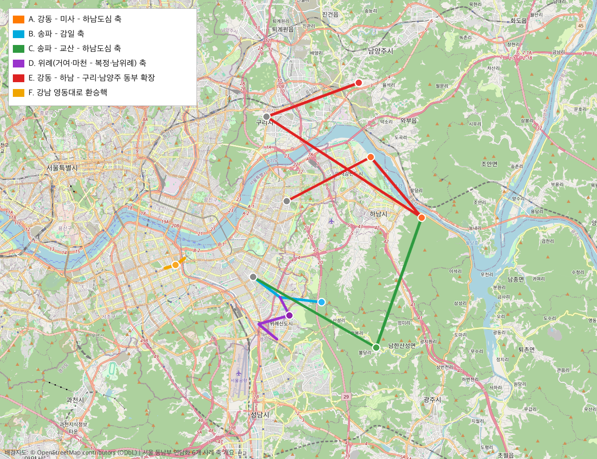
> 그림 1. OpenStreetMap 타일 기반 지도 위에 6개 사례 축을 오버레이한 지리 개요도. 주황(A·강동-미사-하남도심), 하늘색(B·송파-감일), 초록(C·송파-교산-하남도심), 보라(D·위례), 빨강(E·강동-하남-구리·남양주 동부 확장), 금색(F·영동대로 환승핵)으로 각 축을 표시했다. 행정구역 경계를 가로질러 시가지가 이어지는 공간적 연속성을 실제 지도 위에서 확인할 수 있다. 배경지도: © OpenStreetMap contributors (ODbL).

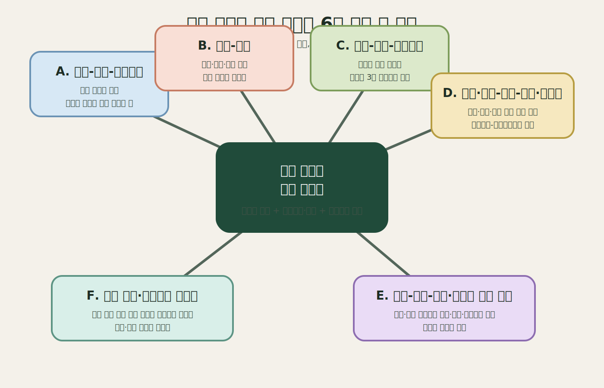
> 그림 2. 6개 사례 축의 접속 방향과 공간적 역할을 요약한 개념도. 출처: 본문 [^1][^2][^3][^5][^7][^8][^20] 종합, 도식화.

---

## 3. 분석 기준: 왜 이걸 ‘연담화’로 볼 수 있는가

이 보고서에서 연담화는 법정 행정구역 개념이 아니라 분석 개념이다. 행정구역은 서울시, 하남시, 성남시, 구리시, 남양주시로 나뉘지만, 공공주택지구·도시철도·광역철도·생활권 계획이 서로 맞물리면 실제 도시 이용은 행정경계 밖으로 이어진다. 따라서 이 보고서는 단순한 접경 여부가 아니라, 시가지 또는 계획시가지의 연속성, 일상 생활권의 연결, 광역 기반시설, 광역 거버넌스, 중심지 수렴이 동시에 나타나는지를 기준으로 삼는다.[^1][^2][^3][^5]

판정 기준은 다섯 가지다.

1. **시가지·개발지 연속성**: 기존 시가지, 공공주택지구, 신도시, 역세권이 서울 경계 또는 인접 도시 경계를 따라 이어지는가.
2. **계획·사업 연동성**: 공공주택지구, 택지지구, 역세권, 광역교통계획이 서로 연동되며 공간적으로 이어지는가.
3. **교통 연결의 단계**: 개통 노선, 승인된 기본계획, 법정 시행계획 반영, 지자체 건의 중 어디에 있는가.
4. **광역 거버넌스의 존재**: 서울시 단독이 아니라 국토부, 대광위, 경기도, 하남시, 성남시, 구리시, 남양주시, LH, GH 등이 함께 계획·시행하는가.
5. **중심지 수렴성**: 외곽 주거지 확장에 그치지 않고 잠실·강남·삼성·영동대로 같은 서울 중심 기능과 연결되는가.

서울시는 생활권계획을 통근·통학·쇼핑·여가·공공서비스 등 주민의 일상 생활공간을 기준으로 설명하고 있으며, 서울 동남권을 강남·서초·송파·강동으로 묶는다. 동시에 2040 서울도시기본계획과 2040 수도권 광역도시계획은 광역철도망과 중심지 체계의 연계를 통해 수도권 구조를 다룬다.[^2][^3][^4] 따라서 서울 동남부와 인접 도시의 관계는 단순한 외곽 통근 문제가 아니라, 서울의 중심 기능이 주변 계획도시·신도시와 결합하며 재구조화되는 **광역도시 구조 재편 문제**로 읽는 것이 타당하다.

---

## 4. 상위 계획 차원의 핵심 근거

### 4-1. 서울 동남권은 서울 내부에서도 하나의 권역으로 다뤄진다

- 서울시 동남권 계획 아카이브는 강남·서초·송파·강동을 하나의 동남권으로 묶어 관리한다.[^4]
- 서울 생활권계획은 생활권을 행정구역이 아니라 일상 활동 공간 단위로 설명한다.[^2]

### 4-2. 서울 동남부 외연은 광역교통 시행계획 안에서 제도화되어 있다

- **제4차 대도시권 광역교통시행계획(2021~2025)**은 수도권 차원 법정 시행계획으로서 서울권에서 다수의 철도·BRT·환승시설 사업을 포함한다.[^5]
- 이 계획은 강동하남남양주선, 송파하남선, 위례삼동선, 하남선 등을 서울권 광역철도 사업으로 제시한다. 이는 서울 동남부 외연 확장이 개별 지자체의 임기응변이 아니라 **법정 광역계획** 안에서 제도화되어 있음을 보여준다.[^5][^6]

### 4-3. 강남은 서울 동남부 연담화의 핵심 수렴점이다

- 영동대로 지하공간 복합개발은 GTX-A/C, 위례신사선, 2호선, 9호선, 버스환승체계를 통합하는 수도권급 환승거점으로 계획·추진되고 있다.[^7][^8]
- 이는 하남·성남·남양주 쪽에서 유입되는 통근·업무 흐름이 단순히 잠실이나 강동에만 머무는 것이 아니라, 강남 핵심 업무지구와 직결된다는 점을 강화한다. 다시 말해 서울 동남부 연담화의 종착점은 서울 경계선이 아니라, 강남의 고차 중심지 기능이다.[^8][^9]

---

## 5. 사례별 판정 요약

| 사례 | 공간 연속성 | 개발 근거 | 교통 단계 | 거버넌스 | 연담화 유형 |
|---|---|---|---|---|---|
| 강동-미사-하남도심 | 강동 상일동 동측으로 미사·하남도심이 이어짐 | 하남미사 공공주택지구 지구계획 변경 고시 | 하남선 개통·운영 | 국토부·하남시·LH·대광위 | 기개통 철도 기반 확장 |
| 송파-감일 | 송파 동남부와 하남 서남측 접경 주거지 연결 | 하남감일 공공주택지구 지구계획 변경 고시 | 송파하남선 기본계획 승인 | 국토부·경기도·서울시·하남시·LH | 접경형 주거 확장 |
| 송파-교산-하남도심 | 감일보다 동측의 대규모 내륙형 신도시 | 하남교산 공공주택지구 고시 및 LH 토지이용 자료 | 송파하남선 기본계획 승인 | 국토부·경기도·하남시·LH·GH | 대규모 계획도시형 확장 |
| 송파-위례-복정·남위례 | 서울·성남·하남에 걸친 단일 계획시가지 | 위례신도시 및 위례선·위례신사선 자료 | 위례선 본선 시운전·종합시험운행, 위례신사선 재정사업 전환 | 서울시·성남시·하남시·LH·SH·GH | 행정분리-생활권통합형 연담화 |
| 강동-하남-구리·남양주 | 하남 동측에서 남양주 왕숙·별내·진접 방향 확장 | 남양주 왕숙·왕숙2 3기 신도시 및 남양주 철도 자료 | 강동하남남양주선 기본계획 승인 | 대광위·경기도·하남시·남양주시·LH | 장거리 동부 외연 확장 |
| 삼성·영동대로 환승핵 | 외곽 주거지가 아니라 중심 기능 수렴점 | 국제교류복합지구·영동대로 복합개발 | GTX·위례신사선·2·9호선·버스 환승체계 계획 | 서울시·국토부·철도사업기관 | 중심 수렴형 환승핵 |

이 표의 핵심은 모든 사례를 “서울 바깥으로 주거지가 늘어났다”로 읽지 않는 데 있다. 미사는 이미 개통된 철도 기반 사례이고, 감일과 교산은 송파하남선이라는 계획·승인 단계의 광역철도에 기대는 사례다. 위례는 하나의 신도시가 세 행정구역으로 나뉜 사례이고, 남양주 동부축은 하남을 통과해 더 먼 수도권 동부로 뻗는 장거리 축이다. 영동대로는 외곽 개발지가 아니지만, 이 모든 흐름을 강남의 중심 기능으로 수렴시키는 결절점이므로 별도 사례로 둔다.

---

## 6. 세부 사례 분석

### 6-1. 사례 A: 강동-미사-하남도심 축

#### 성격

이 축은 서울 동남부 중에서도 **강동구와 가장 직접적으로 맞물리는 하남 연담화 축**이다. 다른 하남 사례와 달리, 미사는 송파보다는 강동과의 접속성이 더 직접적이며, 이미 개통된 하남선을 통해 서울 철도망 안에 실질적으로 편입되어 있다.

#### 왜 별도 사례인가

- 미사는 **하남미사 공공주택지구**라는 독립된 공공주택지구로 계획·관리된다.
- 하남시는 미사지구 1·2단계 지구단위계획 시행지침을 별도로 운영한다.
- 대광위 운영현황상 하남선은 **상일동~검단산 7.7km, 2021-03-27 개통** 광역철도로 제시된다.
- 따라서 미사는 감일·교산처럼 “향후 철도계획 중심의 외연 확장지”이기보다, **이미 서울 광역철도권에 편입된 동부 생활권 확장 사례**에 가깝다.

#### 공간 배치와 지도 판독

지도상으로 보면 미사는 서울 동남부 가운데서도 강동구 상일동과 가장 직접적으로 이어지는 동측 접속지대에 놓인다. 이 축의 공간 구조는 한강 동측의 대규모 주거지와 상일동-검단산을 잇는 광역철도축이 결합한 형태이며, 그 결과 미사는 송파 접경보다는 **강동 생활권의 동측 확장부**로 읽는 것이 더 정확하다.[^6][^10][^11]

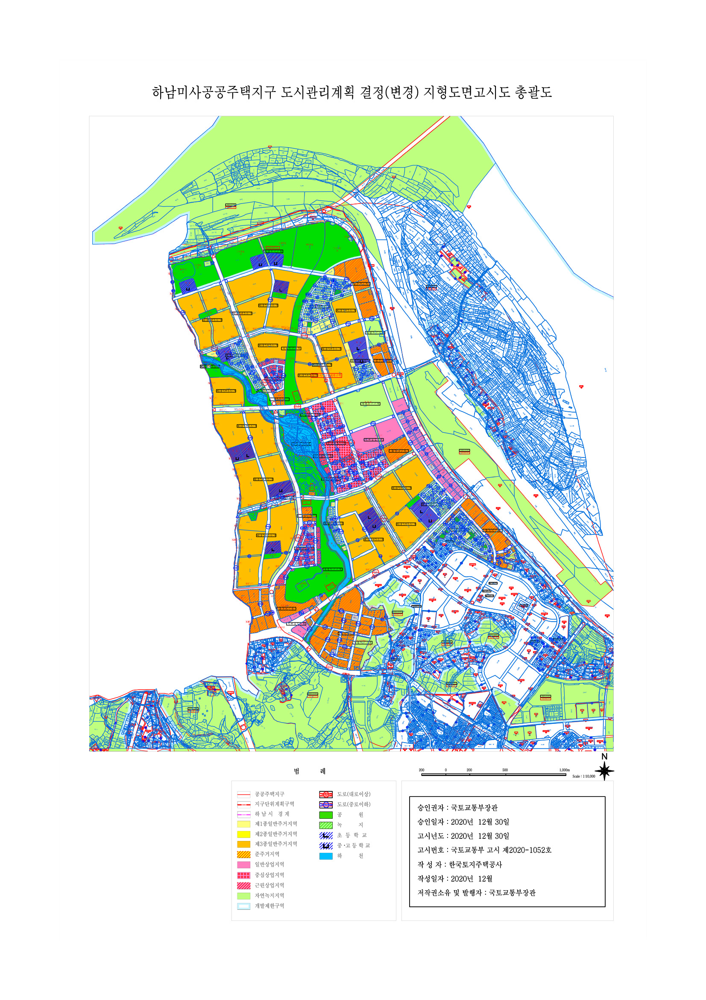
> 그림 3. 토지이음(EUM) 고시 상세 페이지에 첨부된 `하남미사 지형도면고시도` 총괄 이미지. 미사가 독립된 공공주택지구로 계획된 동측 확장 사례임을 공식 도면 수준에서 확인하게 해 주며, 이 절의 공간 판독을 보조하는 시각자료로 기능한다. 출처: https://www.eum.go.kr/web/gs/gv/gvGosiDet.jsp?seq=502978

- 서울 접속 핵심: **강동구(상일동) 방향**
- 철도 축: **하남선(5호선 연장)**
- 기능: 강동 생활권과 결합된 대규모 주거지 + 하남도심 연계

#### 연담화 해석 포인트

- 미사는 하남 내부에서도 가장 먼저 **서울 철도 접근이 현실화된 사례**다.[^6]
- 따라서 “서울 동남부 외연이 어디까지 실질적으로 연결되었는가”를 보여주는 기준점 역할을 한다.
- 동시에 미사는 후속 사례인 교산·강동하남남양주선과 연결되며, 하남 동측이 남양주까지 이어지는 동부 확장 벨트의 교량 구실을 한다.

#### 확인 사실과 해석의 구분

- 확인 사실: 하남미사는 국토교통부 고시로 지구계획 변경이 승인된 공공주택지구이고, 하남선은 대광위 운영현황에서 상일동~검단산 7.7km, 2021년 3월 27일 개통 노선으로 확인된다.[^6][^10]
- 해석: 이 두 사실을 결합하면 미사는 “향후 연결될 가능성”이 아니라 이미 서울 도시철도망과 결합해 생활권을 확장한 사례로 볼 수 있다.
- 주의: 하남선 개통이 곧 미사의 모든 생활권이 강동권으로만 귀속된다는 뜻은 아니다. 이 보고서는 미사의 서울 접속 방향이 송파보다 강동에 더 직접적이라는 범위에서만 해석한다.

#### 주요 근거 출처

| 구분 | 내용 | 출처 |
|---|---|---|
| 지구계획 | 하남미사 공공주택지구 관련 지구지정변경 및 지구계획변경 첨부 문서 | LH 분양·공고 페이지: https://apply.lh.or.kr/lhapply/apply/wt/wrtanc/selectWrtancInfo.do?aisTpCd=01&ccrCnntSysDsCd=01&mi=1062&panId=BN-0006046&uppAisTpCd=01 |
| 지구계획 변경 | 하남미사 공공주택지구 지구계획 변경(18차) | 토지이음(EUM): https://www.eum.go.kr/web/gs/gv/gvGosiDet.jsp?seq=502978 |
| 지자체 계획관리 | 미사지구 1·2단계 지구단위계획 시행지침 | 하남시: https://www.hanam.go.kr/www/selectBbsNttView.do?bbsNo=79&integrDeptCode=&key=3211&nttNo=74214&pageIndex=1&searchCnd=all&searchCtgry=&searchKrwd= |
| 광역철도 운영 | 하남선 상일동~검단산, 7.7km, 2021-03-27 개통 | 대광위: https://www.molit.go.kr/mtc/USR/WPGE0201/m_37122/DTL.jsp |
| 교통 실사용 | 하남-미사-공항 노선 표기 | 하남시: https://www.hanam.go.kr/www/contents.do?key=3262 |

---

### 6-2. 사례 B: 송파-감일 축

#### 성격

감일은 하남 내부에서도 **송파구와 가장 직접적으로 맞물리는 서남측 접속지대**다. 미사처럼 강동축이 아니고, 교산처럼 하남 중심부 대규모 3기 신도시도 아니며, 위례처럼 다중 행정구역 신도시도 아니다. 즉 감일은 **송파-하남 접경의 독립 신도시형 주거 확장 사례**로 보는 것이 적절하다.

#### 왜 별도 사례인가

- 감일은 **하남감일 공공주택지구**로 별도 지정·변경 고시가 존재한다.
- 하남시는 별도로 **신도시(감일지구) 자료실**을 운영한다.
- 대광위 송파하남선 기본계획 승인 자료는 오금역~하남시청역 11.7km, 정거장 6곳, 2032년 개통 목표를 제시한다. 기능적으로 감일은 이 노선축 안에서도 **송파 접경 전초부**라는 점에서 교산과 구분된다.[^13]

#### 공간 배치와 지도 판독

감일은 하남 서남측에서 송파구 동남부와 가장 직접적으로 맞닿는 접경부에 위치한다. 미사가 강동축의 이미 개통된 철도망을 기반으로 안정화된 사례라면, 감일은 오금·거여·장지 생활권과의 인접성을 바탕으로 장래의 송파하남선 축에 편입되는 **경계 압력형 확장지**라는 점에서 구분된다.[^12][^13]

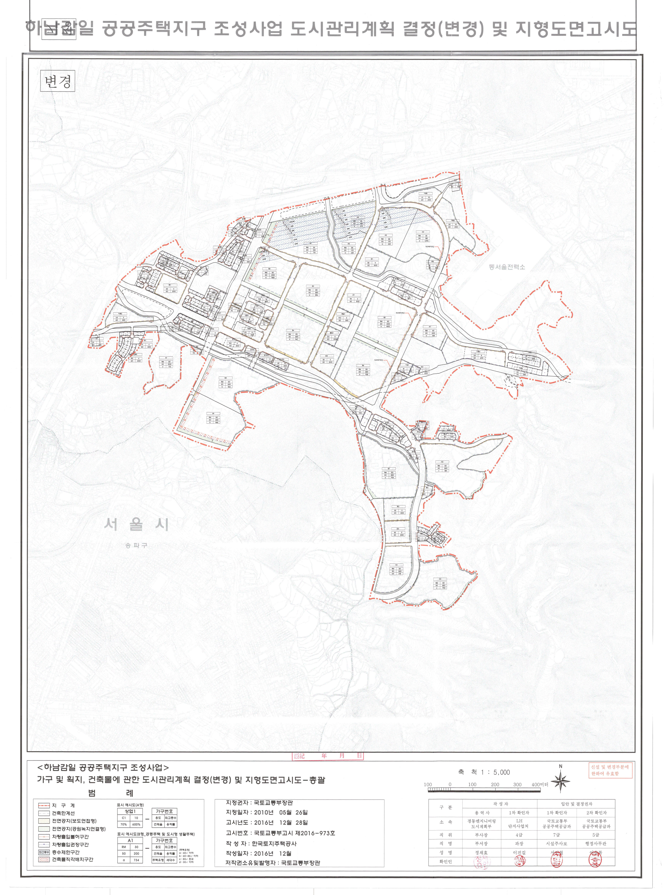
> 그림 4. 토지이음(EUM) 고시 상세 페이지에 첨부된 `하남감일 공공주택지구 도시관리계획결정총괄도` 변경 도면. 감일이 별도의 공공주택지구로 계획된 서남측 접경 확장 사례임을 행정계획 도면 수준에서 보여 주며, 감일을 미사나 교산과 구분하는 공식 시각자료로 기능한다. 출처: https://www.eum.go.kr/web/gs/gv/gvGosiDet.jsp?seq=365502

- 서울 접속 핵심: **송파구 동남부(오금·거여·장지 생활권에 가까운 축)**
- 향후 철도 축: **송파하남선**
- 현재 기능: 접경형 주거지, 철도는 송파하남선 기본계획 단계[^13]

#### 연담화 해석 포인트

- 감일은 서울과 하남 사이의 완충지대라기보다, 서울 인접부의 주거 개발과 장래 광역철도 계획이 맞물린 **접경형 확장지**로 볼 수 있다.[^12][^13]
- 미사가 강동과의 기존 광역철도 연결을 바탕으로 성장했다면, 감일은 **송파 인접성 + 향후 송파하남선 축**이라는 기대 위에서 재편되는 공간이다.
- 따라서 감일은 서울 동남부 연담화를 “이미 완성된 연결”보다 **진행 중인 접경 연담화**로 보여주는 사례다.

#### 확인 사실과 해석의 구분

- 확인 사실: 하남감일은 토지이음 고시에서 별도 공공주택지구로 확인되고, 송파하남선은 2025년 7월 대광위 기본계획 승인을 받은 광역철도 사업으로 확인된다.[^12][^13]
- 해석: 감일은 현재의 접경형 주거 확장과 장래 송파하남선 연결이 겹치는 사례다. 따라서 미사처럼 기개통 철도 기반 확장으로 보면 안 되고, 교산처럼 대규모 독립 신도시형 확장으로 보아도 부정확하다.
- 주의: 감일의 “송파 생활권” 성격은 공간 인접성과 송파하남선 계획으로 해석한 것이며, 실제 통근·소비 흐름을 정량화하려면 별도의 O/D 또는 생활인구 자료가 필요하다.

#### 주요 근거 출처

| 구분 | 내용 | 출처 |
|---|---|---|
| 지구계획 | 하남감일 공공주택지구 지구계획 변경(2차) 승인 | 토지이음(EUM): https://www.eum.go.kr/web/gs/gv/gvGosiDet.jsp?seq=365502 |
| 계획 이력 | 하남감일 공공주택지구 지구계획 변경 | 토지이음(EUM): https://www.eum.go.kr/web/gs/gv/gvGosiDet.jsp?seq=10784 |
| 지자체 구분 | 신도시(감일지구) 자료실 운영 | 하남시: https://www.hanam.go.kr/www/selectBbsNttList.do?bbsNo=1205&key=4600 |
| 교통 | 감일문화공원-인천공항 노선 표기 | 하남시: https://www.hanam.go.kr/www/contents.do?key=12497 |
| 광역철도 계획 | 오금역~하남시청역 11.7km, 정거장 6곳, 2032년 개통 목표 | 대광위: https://molit.go.kr/mtc/USR/N0201/m_36770/dtl.jsp?id=95091084&lcmspage=1 |

---

### 6-3. 사례 C: 송파-교산-하남도심 축

#### 성격

교산은 하남 내부에서 가장 규모가 큰 **3기 신도시형 대규모 확장 사례**다. 감일이 접경 주거지 성격이 강하다면, 교산은 훨씬 큰 면적과 인구·주택 계획을 가진 독립적 도시구조 형성 사례이며, 송파하남선과 광역교통계획이 집중적으로 결합되는 지점이다.

#### 왜 별도 사례인가

- 교산은 **하남교산 공공주택지구**로 반복적인 지정변경·지구계획변경 고시가 존재한다.
- 3기 신도시 공식 자료는 사업시행자를 경기도, 한국토지주택공사, 경기주택도시공사, 하남도시공사로 제시해 **광역·공기업 협업 구조**를 확인시킨다.[^22]
- 3기 신도시 공식 자료와 LH 데이터는 교산의 주택 수, 토지이용, 광역교통계획도, 위치 자료를 별도로 제공한다.[^15][^22]
- 즉 교산은 하남 내부에서도 가장 전형적인 **국가 주도 광역 신도시형 연담화 사례**다.

#### 공간 배치와 지도 판독

교산은 감일보다 동측이면서도 하남 중심부와 결합된 대규모 계획도시 입지에 가깝다. 공간적으로는 서울 경계에 단순 접촉하는 소규모 접경지가 아니라, 오금역 방면 광역철도와 대규모 택지계획이 결합되는 **내륙형 신도시 축**에 속한다. 따라서 교산은 송파 접경의 전초부인 감일과 달리, 독립적인 도시 골격을 갖춘 광역 신도시형 연담화 사례로 해석된다.[^13][^14][^15]

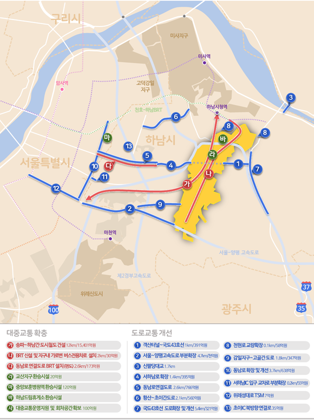
> 그림 5. 공공데이터포털에 공개된 한국토지주택공사의 `하남교산 광역교통계획도` 원문 이미지. 교산이 송파하남선, 도로망, 광역버스망과 함께 읽혀야 하는 내륙형 신도시 축임을 보여 주는 교통 도면이다. 출처: https://www.data.go.kr/data/15088255/fileData.do

- 서울 접속 핵심: **송파구 오금역 방향**
- 향후 철도 축: **송파하남선(3호선 연장 성격)**
- 내부 구조: 공동주택, 도시지원시설, 공원녹지, 도로 등 독자적 신도시 구조

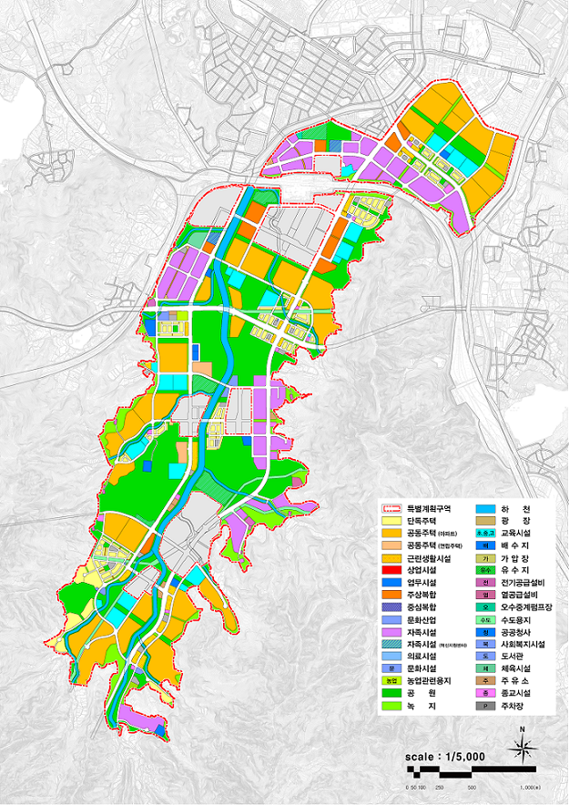
> 그림 6. 공공데이터포털에 공개된 한국토지주택공사의 `하남교산 토지이용계획도` 원문 이미지. 공동주택, 도시지원시설, 공원녹지, 도로 등 블록별 용도 배치를 제시함으로써, 교산이 독립적 도시 골격을 가진 계획도시형 확장이라는 본문의 해석을 시각적으로 보조한다. 출처: https://www.data.go.kr/data/15089727/fileData.do

#### 연담화 해석 포인트

- 교산은 단순한 서울 베드타운이 아니라, 도시지원시설까지 포함된 **자족성 일부를 의도한 계획 신도시**다.[^14][^15]
- 그럼에도 광역교통계획상 송파하남선 의존도가 높아, 서울 동남부와의 기능 연결이 핵심 축으로 남는다.
- 따라서 교산은 “서울 외곽의 빈 땅 개발”이 아니라 **서울 동남권과 광역교통으로 연결되며 새 도시를 구성하는 광역 연담화의 확장판**으로 읽을 수 있다.[^13][^22]

#### 확인 사실과 해석의 구분

- 확인 사실: 하남교산은 공공주택지구 지구계획 변경 고시가 존재한다. 3기 신도시 공식 토지이용계획 페이지는 전체면적 6,862,463㎡, 주택 33천 호, 인구 78천 인, 사업시행자 경기도·LH·GH·하남도시공사를 제시하고, 광역교통계획 페이지는 송파~하남간 도시철도, BRT, 환승시설, 도로 확장·개선 사업을 제시한다.[^14][^22]
- 해석: 교산은 단순 접경 주거지가 아니라 도시지원시설과 공공시설을 포함한 계획도시형 확장이다. 이 점에서 감일과 구분된다.
- 주의: 지구개요, 토지이용계획, 변경고시는 갱신 시점과 첨부 문서에 따라 면적·주택 수치가 달라질 수 있다. 도시지원시설이 계획되어 있다는 사실만으로 실제 자족성이 달성되었다고 말할 수도 없다. 이 보고서는 “자족성 일부를 의도한 토지이용 구조”까지만 확인한다.

#### 주요 근거 출처

| 구분 | 내용 | 출처 |
|---|---|---|
| 최신 고시 | 하남교산 공공주택지구 지구계획 변경(4차) 승인, 국토교통부 고시 제2025-746호 | 토지이음(EUM): https://www.eum.go.kr/web/gs/gv/gvGosiDet.jsp?seq=625595 |
| 지구개요 | 전체면적 6,862,463㎡, 주택 33천 호, 인구 78천 인, 시행자 경기도·LH·GH·하남도시공사 | 3기 신도시: https://www.xn--3-3u6ey6lv7rsa.kr/kor/CMS/Contents/Contents.do?mCode=MN053 |
| 토지이용계획도 | 블록별 용도와 지구 구조를 보여 주는 공식 도면 | LH 데이터: https://www.data.go.kr/data/15089727/fileData.do |
| 토지이용계획표 | 공원녹지 23%, 공동주택 18.1%, 도로 16%, 도시지원시설 10.8% | LH 데이터: https://www.data.go.kr/data/15087755/fileData.do |
| 광역교통계획 | 송파~하남간 도시철도, BRT, 환승시설, 도로 확장·개선 등 | 3기 신도시: https://www.xn--3-3u6ey6lv7rsa.kr/kor/CMS/Contents/Contents.do?mCode=MN097 |
| 광역교통계획도 | 도로·철도·버스 네트워크 계획 자료 | LH 데이터: https://www.data.go.kr/data/15088255/fileData.do |
| 위치·도로 연결 | 주요 도로축 및 연계성 자료 | LH 데이터: https://www.data.go.kr/data/15118434/fileData.do |
| 광역철도 계획 | 오금역~하남시청역 11.7km, 정거장 6곳, 2032년 개통 목표 | 대광위: https://molit.go.kr/mtc/USR/N0201/m_36770/dtl.jsp?id=95091084&lcmspage=1 |

---

### 6-4. 사례 D: 송파 거여·마천-위례-복정·남위례 축

#### 성격

위례는 하남의 한 동네가 아니라, 서울·성남·하남에 걸친 **다중 행정구역 신도시**다. 따라서 위례는 미사·감일·교산과 달리 “하남 내부 신도시”라기보다 **서울 동남부와 성남, 하남이 직접 맞물리는 초광역 연담화 핵심 사례**다.

#### 왜 별도 사례인가

- 위례는 처음부터 하나의 생활권이지만 행정은 서울 송파구, 성남시, 하남시로 분할되어 있어, 서울 동남부 연담화를 설명할 때 가장 전형적인 **행정분리-생활권통합** 사례다.[^24]
- 서울시는 **위례선 트램**을 마천역~복정역·남위례역 축으로 추진하고 있으며, 2026년 2월부터 본선 시운전과 철도종합시험운행 단계에 들어갔다.[^16]
- 서울시는 **위례신사선**을 도시철도망 구축계획에 반영하고 2026년 2월 국토부 승인 고시를 통해 재정사업 전환을 확정했다고 밝혔다.[^17]
- 하남시는 별도로 **위례신사선 하남연장**을 상위 계획에 반영하려고 움직이고 있고, 위례선 개통 대응으로 마천역·장지역 연계 버스개편을 추진한다.[^25][^26][^27]

#### 공간 배치와 지도 판독

위례는 서울 송파구 거여·장지동, 성남시 창곡·복정동, 하남시 학암·감이동 일원에 걸친 신도시다.[^24] 공간적으로는 하나의 연속된 계획시가지처럼 읽히지만, 실제 교통 공급은 마천역-복정역-남위례역으로 이어지는 환승축과 하남측 피더 교통이 비대칭적으로 배치되어 있다. 바로 이 비대칭성이 위례를 단순한 신도시가 아니라, **행정적으로 분절되었으나 기능적으로 통합된 연담화 사례**로 이해하게 만든다.[^5][^16][^17][^27]

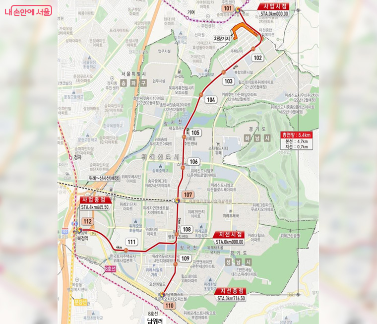
> 그림 7. 서울시가 위례선 본선 시운전 개시 기사에서 공개한 공식 노선도. 위례 절에서 핵심적인 `마천-복정-남위례` 환승축과 분기 구조를 제시함으로써, 행정 경계와 실제 교통 결절이 어떻게 교차하는지를 시각적으로 확인하게 한다. 서울시 기사 페이지는 공공누리 제4유형(출처표시+상업적 이용금지+변경금지) 조건을 명시한다. 출처: https://mediahub.seoul.go.kr/archives/2016896

- 서울 접속 핵심: **송파구 거여·마천, 장지, 강남(신사) 방향**
- 성남 접속 핵심: **복정역, 남위례역 방향**
- 하남 측 이슈: **같은 위례 생활권인데도 서울·성남 쪽 철도 접근성 차이 존재**

#### 연담화 해석 포인트

- 위례는 서울 동남부 연담화 중에서도 가장 복합적이다.[^16][^17]
- 서울-성남-하남 경계가 공간적으로 거의 끊기지 않는 신도시 구조를 이루지만, 교통 공급은 균등하지 않아 **같은 신도시 내부에서도 서울측·성남측·하남측의 접근성과 정책 요구가 다르게 나타난다.**
- 즉 위례는 하나의 사례이지만, 내부적으로도 다시 **서울측 위례 / 성남측 위례 / 하남측 위례**로 나누어 읽을 필요가 있다.

#### 하남측 위례를 따로 봐야 하는 이유

- 하남시는 위례신사선 하남연장을 제5차 국가철도망·광역교통시행계획에 반영하려고 한다.[^25][^26]
- 하남시는 위례 주민의 버스 접근성 한계를 직접 언급하며, 마천역·장지역과 연결되는 피더 버스 체계를 조정한다.[^27]
- 이는 같은 위례라도 하남측이 여전히 **서울 철도망의 말단 수혜지**라는 문제를 안고 있음을 뜻한다.

#### 성남측 세부 판독: 복정·남위례

성남측을 더 세분하면, 위례와 서울 동남부의 연결은 다시 세 개의 상이한 기능 지점으로 나뉜다. 첫째, **복정**은 서울과 성남의 경계에서 위례 생활권이 수도권 철도망과 접속하는 관문형 결절점이다. 위례선 트램이 복정역을 주요 환승지점으로 설정하고 있다는 사실은 복정이 단순한 경계 역이 아니라, 위례 생활권을 서울 및 성남 철도망에 편입시키는 관문이라는 점을 보여준다.[^16]

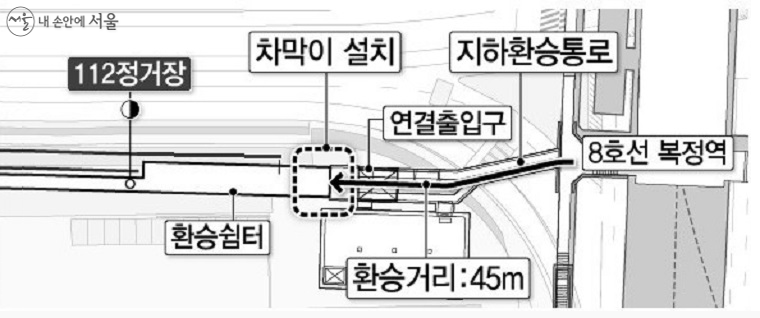
> 그림 8. 서울시가 제시한 위례선 복정역 환승 구조도. 복정이 위례 전체를 서울·성남 철도망에 접속시키는 관문형 결절점임을 구체적 환승 구조와 함께 보여 주며, 본문의 공간적 해석을 보조한다. 서울시 기사 페이지는 공공누리 제4유형(출처표시+상업적 이용금지+변경금지) 조건을 명시한다. 출처: https://mediahub.seoul.go.kr/archives/2005040

둘째, **남위례와 성남측 위례**는 연속된 계획시가지가 성남 수정구 쪽으로 가장 직접적으로 펼쳐지는 구간이다. 성남시는 위례신사선이 위례신도시와 서울 강남권을 연결하는 핵심 사업이라고 설명하고 있고, 동시에 위례삼동선이 위례중앙역에서 수정·중원구를 거쳐 광주시 삼동역까지 이어지는 노선이라고 제시한다. 이는 성남측 위례가 서울-성남 경계의 주거 연속성에 머무르지 않고, 성남 원도심과 광주 방향으로 기능을 확장하는 매개지대라는 뜻이다.[^5][^18]

#### 확인 사실과 해석의 구분

- 확인 사실: 국토교통부 정책정보는 위례신도시 위치를 서울 송파구 거여·장지동, 성남시 창곡·복정동, 하남시 학암·감이동 일원으로 제시한다.[^24] 서울시는 위례선을 마천역~복정역·남위례역 5.4km, 정거장 12개, 차량 10편성 규모로 설명하고, 2026년 2월부터 본선 시운전 및 철도종합시험운행을 진행한다고 밝혔다.[^16] 위례신사선은 2026년 2월 도시철도망 변경 승인으로 재정사업 전환이 확정되었지만, 기재부 신속예타와 기본계획·설계 등 후속 절차가 남아 있다.[^17]
- 해석: 이 세 사실을 결합하면 위례는 하나의 계획시가지가 세 행정구역으로 나뉘면서, 도시철도·광역철도·피더 버스 조정이 생활권 통합을 떠받치는 사례로 볼 수 있다.
- 주의: 위례의 “생활권 통합”은 행정구역 통합을 뜻하지 않는다. 또한 위례신사선 재정사업 전환은 착공·개통 확정이 아니라 후속 절차에 진입했다는 의미로 한정해야 한다.[^17]

#### 주요 근거 출처

| 구분 | 내용 | 출처 |
|---|---|---|
| 신도시 위치 | 서울 송파구 거여·장지동, 성남시 창곡·복정동, 하남시 학암·감이동 일원 | 국토교통부: https://www.molit.go.kr/USR/policyData/m_34681/dtl.jsp?id=524&lcmspage=1&p_category=&psize=10&s_category=&search=%EC%8B%A0%EB%8F%84%EC%8B%9C&search_regdate_e=&search_regdate_s=&srch_dept_id=&srch_dept_nm=&srch_usr_ctnt=&srch_usr_nm=&srch_usr_titl=Y |
| 트램 | 위례선 본선 시운전·철도종합시험운행, 마천역~복정역·남위례역 5.4km, 정거장 12개 | 서울시: https://news.seoul.go.kr/citybuild/archives/530849 |
| 도시철도망 | 위례신사선 재정사업 전환, 제2차 서울시 도시철도망 구축계획 변경 승인 | 서울시: https://news.seoul.go.kr/traffic/archives/516245?listPage=1 |
| 상위계획 반영 요구 | 위례신사선 하남역 신설/하남연장 검토 | 하남시: https://www.hanam.go.kr/sosik/selectBbsNttView.do?bbsNo=1164&key=10048&nttNo=481327 |
| 광역교통계획 반영 요구 | 하남연장을 제5차 광역교통시행계획에 반영 요구 | 하남시: https://www.hanam.go.kr/sosik/selectBbsNttView.do?bbsNo=1164&key=10048&nttNo=496487 |
| 버스 피더 조정 | 마천역·장지역 연계 버스개편 및 위례트램 대응 | 하남시: https://www.hanam.go.kr/sosik/selectBbsNttView.do?bbsNo=1164&key=10048&nttNo=496768 |
| 위례-삼동선 | 위례~삼동 10.4km가 제4차 대도시권 광역교통시행계획에 포함 | 대광위: https://www.molit.go.kr/mtc/USR/WPGE0201/m_37121/DTL.jsp |
| 주택개발 데이터 | 위례 관련 공공주택 사업 데이터 | GH / 공공데이터포털: https://www.data.go.kr/data/15016337/fileData.do |

---

### 6-5. 사례 E: 강동-하남-구리·남양주 동부 확장 축

#### 성격

이 축은 서울 동남부 연담화가 하남에서 끝나지 않고 **구리·남양주로 계속 이어지는 동부 광역 확장 축**임을 보여준다. 여기서 핵심은 미사·하남 동측이 남양주 왕숙, 별내, 진접 축과 결합하면서, 서울 동남부 외연이 하나의 동부 주거·통근 벨트로 재구성된다는 점이다.

#### 왜 별도 사례인가

- 강동하남남양주선은 감일·교산을 지나는 송파하남선과 다른 노선축이다.[^20]
- 경기도 자료는 이를 **강동-하남-남양주 진접2**를 잇는 서울 9호선 연장 축으로 제시한다.[^20]
- 남양주시는 중앙선, 경춘선, 진접선, 별내선 등 다중 철도망을 보유·계획 중이다.[^21]
- 3기 신도시 공식 자료는 남양주왕숙을 주택 64천 호·인구 155천 인, 왕숙2를 주택 13천 호·인구 36천 인 규모로 제시한다.[^23][^28]

#### 공간 배치와 지도 판독

이 축은 서울 동남부의 외연이 하남 동측에서 멈추지 않고 구리·남양주 방향으로 길게 연장된다는 점을 보여준다. 공간 배치상 강동-하남-남양주 축은 송파하남선이 통과하는 남측 축과 달리, 미사 및 하남 동부권을 경유해 별내·왕숙·진접으로 이어지는 **동부 장거리 생활권 벨트**를 형성한다.[^5][^20][^21][^23]

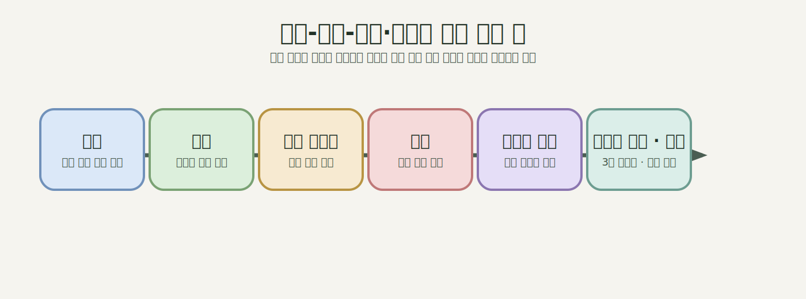
> 그림 9. 강동에서 미사와 하남 동부권을 거쳐 구리·남양주로 이어지는 동부 확장 벨트 개념도. 하남이 종점이 아니라 동부 광역 생활권의 중간 매개 공간이라는 점을 개념적으로 압축해 제시함으로써, 이 절의 장거리 생활권 해석을 보조한다. 출처: 본문 [^5][^20][^21][^23][^28] 종합, 도식화.

- 서울 접속 핵심: **강동구 방향**
- 중간 결절: **하남 동측(미사 포함 동부권)**
- 외연 확장: **구리-별내-왕숙-진접**

#### 연담화 해석 포인트

- 이 축은 서울 동남부 연담화를 “송파-하남”만으로 한정하면 놓치게 되는 부분이다.[^20][^21]
- 계획·철도축상 서울 동남부 외연은 하남 동측을 경유해 남양주 대규모 주거지와 이어진다.[^20][^23][^28]
- 따라서 하남은 서울 동남부 연담화의 종점이 아니라, **동북·동부 수도권으로 연결되는 중간 매개 공간**이기도 하다.

#### 확인 사실과 해석의 구분

- 확인 사실: 경기도 자료는 강동하남남양주선을 서울 강동구에서 하남시를 거쳐 남양주시 진접2지구까지 잇는 17.59km, 정거장 8개소, 차량기지 1개소, 2031년 개통 목표의 광역철도 사업으로 설명한다.[^20] 3기 신도시 공식 자료는 남양주왕숙이 서울 경계 3.5km에 위치하고 별내·다산 등 기개발지와 인접하며, 경춘선·GTX-B 예정 노선·별내선·진접선·경의중앙선과 연결되는 입지라고 설명한다.[^23]
- 해석: 이 사실들은 서울 동남부 외연이 하남 동측에서 끝나는 것이 아니라, 남양주 왕숙·왕숙2·별내·진접 방향의 동부 도시화 축과 결합한다는 해석을 뒷받침한다.
- 주의: 철도 기본계획과 3기 신도시 입지 설명만으로 실제 통근권이 이미 하나로 통합되었다고 단정할 수는 없다. 실제 생활권 통합 정도를 보려면 교통카드 O/D, 통근통학 통계, 생활인구 자료가 추가로 필요하다.

#### 주요 근거 출처

| 구분 | 내용 | 출처 |
|---|---|---|
| 광역철도 계획 | 강동하남남양주선 기본계획 승인, 17.59km, 8개 정거장 | 경기도: https://gnews.gg.go.kr/briefing/brief_gongbo_view.do?BS_CODE=s017&number=64209 |
| 법정 상위계획 | 강동하남남양주선 등 포함 제4차 대도시권 광역교통시행계획 | 대광위: https://www.molit.go.kr/mtc/USR/WPGE0201/m_37121/DTL.jsp |
| 남양주 철도망 | 중앙선, 경춘선, 진접선, 별내선 등 철도 데이터 | 남양주시: https://www.data.go.kr/data/3033990/fileData.do |
| 왕숙 지구개요 | 전체면적 10,293,785㎡, 주택 64천 호, 인구 155천 인, 서울 경계 3.5km 및 별내·다산 인접 | 3기 신도시: https://www.xn--3-3u6ey6lv7rsa.kr/kor/CMS/Contents/Contents.do?mCode=MN030 |
| 왕숙2 지구개요 | 전체면적 2,393,385㎡, 주택 13천 호, 인구 36천 인 | 3기 신도시: https://www.xn--3-3u6ey6lv7rsa.kr/kor/CMS/Contents/Contents.do?mCode=MN040 |
| 왕숙2 광역교통계획 | 별내선 연장, 경춘선·경의중앙선 역사 신설, 서울 강동~하남~남양주간 도시철도 등 | 3기 신도시: https://www.xn--3-3u6ey6lv7rsa.kr/kor/CMS/Contents/Contents.do?mCode=MN096 |
| 개발지구 경계도 | 국가 지정 사업지구 경계도 API | 국토부: https://www.data.go.kr/data/15058609/openapi.do |

---

### 6-6. 사례 F: 강남 삼성·영동대로 환승핵

#### 성격

강남 삼성·영동대로는 주거지가 아니라 **광역 연담화를 흡수하는 수도권 환승·업무 결절점**이다. 그러나 서울 동남부 연담화를 분석할 때 이 사례를 따로 둬야 하는 이유는, 하남·성남·남양주에서 유입되는 흐름이 최종적으로 강남 업무지구와 연결되기 때문이다.

#### 왜 별도 사례인가

- 영동대로 지하 복합개발은 GTX-A/C, 위례신사선, 2호선, 9호선, 버스환승을 결합한다.[^7][^8]
- 국제교류복합지구 계획은 COEX-잠실 일대를 수도권 차원의 업무·MICE 중심지로 설정했다.[^9]
- 즉 서울 동남부 연담화의 교통 흐름은 단순히 서울 경계에서 끝나지 않고, 강남 핵심 기능지로 수렴한다.

#### 공간 배치와 지도 판독

삼성역·봉은사역 일대 영동대로는 강남구의 중심 업무축에서도 가장 고밀도 환승 기능이 집중된 구간이다. 공간적으로 보면 이 일대는 동측의 잠실·송파와 서측의 서초·반포 사이에서 수도권 남부 철도망의 수렴점 역할을 한다. 북측의 GTX-A/C 지하 환승구조와 남측의 버스환승 체계가 지하-지상 양 방향으로 쌓이는 구조이며, 이를 국제교류복합지구(MICE) 개발 계획이 감싸고 있다. 따라서 영동대로 환승핵은 단순한 역세권이 아니라, 수도권 동남부에서 유입되는 통근·업무 흐름이 최종적으로 수렴하는 고차 도시 기능 거점으로 읽어야 한다.[^7][^8][^9]

#### 연담화 해석 포인트

- 서울 외곽 인접 신도시가 강남과 구조적으로 연결될수록 연담화의 질이 달라진다.[^7][^8]
- 이 점에서 영동대로 환승핵은 “서울 동남부 외연”을 “강남 중심 핵”과 접속시키는 수도권급 관문이다.
- 따라서 강남은 배후지의 반대편에 있는 종점이 아니라, **연담화를 끌어당기는 중심 기능핵**으로 보아야 한다.[^8][^9]

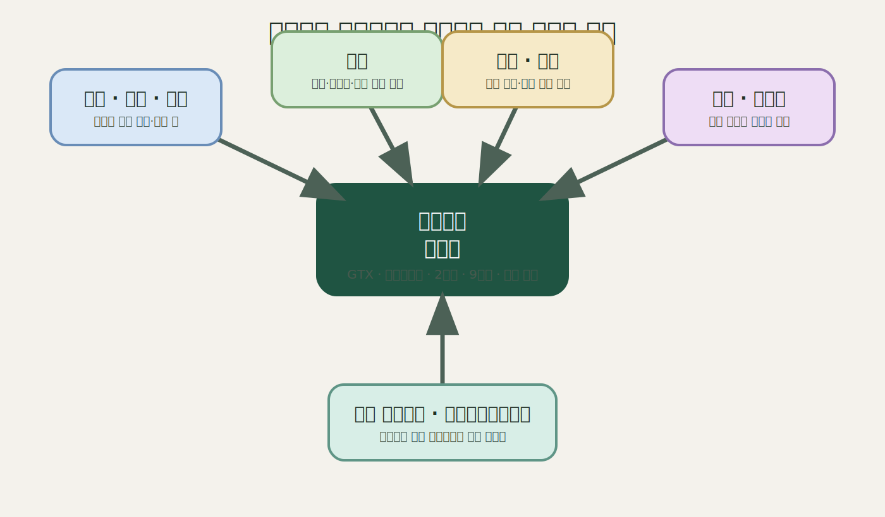
> 그림 10. 하남·위례·성남·남양주 축이 영동대로 환승핵과 강남 업무지구로 수렴하는 구조를 요약한 개념도. 서울 동남부 연담화가 경계 확장에 머무르지 않고 강남의 고차 중심지 기능과 결합한다는 이 절의 논점을 구조적으로 제시한다. 출처: 본문 [^7][^8][^9] 종합, 도식화.

#### 확인 사실과 해석의 구분

- 확인 사실: 서울시는 영동대로 지하공간 복합개발을 GTX-A/C, 위례신사선, 2호선, 9호선, 버스환승체계를 결합하는 환승거점 사업으로 설명하고, 2025년 공사 착수 자료에서도 GTX-A/C, 위례신사선, 2·9호선, 버스 연계 고도 환승체계를 제시한다.[^7][^8]
- 해석: 영동대로는 외곽 주거지가 아니지만, 하남·위례·성남·남양주 방향의 광역 교통축이 강남 업무지구와 만나는 중심 수렴 지점이다. 따라서 이 보고서에서는 외연 확장 사례가 아니라 **중심 수렴형 환승핵**으로 분리한다.
- 주의: 영동대로 사례는 물리적 시가지 연속성을 보여주는 사례가 아니다. 이 절은 연담화의 주거 확장 근거가 아니라, 외곽 확장이 서울 중심 기능과 어떻게 접속되는지를 설명하는 기능적 근거로 한정한다.

#### 주요 근거 출처

| 구분 | 내용 | 출처 |
|---|---|---|
| 환승센터 정의 | GTX·위례신사선·버스환승 포함 통합역사 계획 | 서울시: https://news.seoul.go.kr/citybuild/archives/44459 |
| 2025 공사 착수 | GTX-A/C, 위례신사선, 2·9호선, 버스 연계 고도 환승체계 | 서울시: https://news.seoul.go.kr/citybuild/archives/526689 |
| 광역 중심지 계획 | 국제교류복합지구와 영동대로 환승센터 계획 연계 | 서울시: https://news.seoul.go.kr/citybuild/archives/61212 |
| 수도권 구조 계획 | 2040 서울도시기본계획 도시공간 구조 | 서울도시공간포털: https://urban.seoul.go.kr/view/html/PMNU2020000000 |

---

## 7. 사례 간 비교: 왜 하남을 하나로 보면 안 되는가

앞선 사례들을 종합하면, 서울 동남부 연담화는 “서울에 붙어 있는 하남의 확장”이라는 한 문장으로 설명되지 않는다. 같은 하남 내부 사례라도 **서울 접속축, 철도 단계, 도시 성격, 정책적 의미, 연담화 유형**이 서로 다르기 때문이다. 미사는 이미 개통된 철도망을 통해 서울 동측 생활권으로 편입된 사례이고, 감일은 송파 접경에서 진행 중인 주거 확장지에 가깝다. 교산은 이 둘과 달리 국가 주도의 대규모 계획도시가 광역교통계획과 결합하는 사례이며, 위례는 행정구역이 분절되어 있으면서도 생활권이 통합되는 복합형 사례다. 여기에 강동-하남-남양주 동부축과 영동대로 환승핵까지 포함하면, 서울 동남부 연담화는 접경 확장만이 아니라 **외연 확장과 중심 수렴이 동시에 작동하는 구조**로 읽혀야 한다.

즉 이 문서에서 중요한 것은 사례를 많이 나누는 일이 아니라, **무엇이 서로 다른 유형인가를 드러내는 일**이다. 미사와 감일은 모두 하남 사례지만 하나는 “이미 연결된 축”, 다른 하나는 “연결을 기다리는 접경 확장지”라는 점에서 다르다. 교산은 감일의 확대판이 아니라, 도시지원시설과 대규모 주택계획을 포함한 독립적 계획도시로서 다른 단계의 사례다. 위례는 다시 단일 행정구역 신도시가 아니라, 행정 분절과 생활권 통합이 겹치는 초광역 연담화 사례다. 따라서 하남을 하나로 묶으면 오히려 서울 동남부 외연이 어떤 방식으로 확장되는지의 핵심 구조가 사라진다.

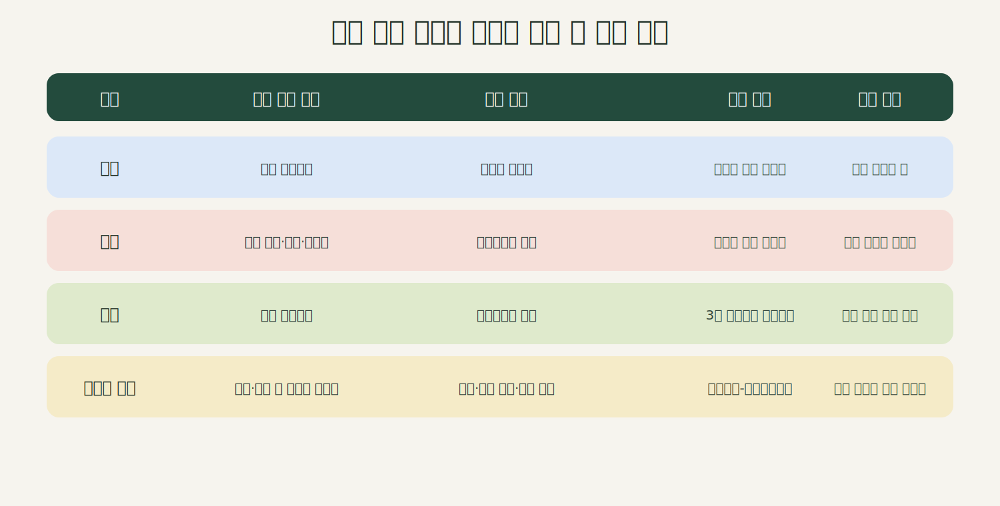
> 그림 11. 미사, 감일, 교산, 하남측 위례를 하나의 하남 사례로 묶기 어려운 이유를 비교한 개념도. 같은 하남권이라도 서울 접속 방향, 교통 체계, 도시 성격, 해석 포인트가 상이하다는 점을 집약적으로 정리한다. 출처: 본문 [^6][^13][^14][^16][^17][^20] 종합, 도식화.

### 7-1. 서울 접속 방향이 다르다

- **미사**는 강동구 상일동축과 직접 연결되며, 이미 개통된 하남선을 통해 서울 철도망과 결합한 사례다.[^6][^10]
- **감일**은 송파구 오금·거여·장지 생활권 쪽 접경성이 강화된 지역으로, 접경형 주거 확장의 성격이 강하다.[^12][^13]
- **교산**은 송파하남선을 중심으로 대규모 신도시형 외연 확장이 진행되는 사례다.[^13][^14]
- **하남측 위례**는 같은 위례 생활권에 속하지만 서울·성남 측 철도 접근성에서 상대적으로 취약하며, 별도의 연장 요구와 피더 교통 조정이 나타난다.[^16][^17][^25][^27]

이 차이는 단순한 위치 차이가 아니라 연담화의 방향 자체를 바꾼다. 미사는 강동 생활권의 동측 연장이고, 감일과 교산은 송파 생활권의 남동측 외연이다. 반면 하남측 위례는 송파 및 성남 수정권과 연결되면서도 동일 생활권 내부의 비대칭을 드러낸다. 따라서 “하남-서울 연결”이라는 단일 표현은 실제로는 **강동축, 송파축, 복정·남위례축**이라는 서로 다른 접속 방향을 덮어버리는 셈이 된다.

### 7-2. 적용되는 철도·교통 체계가 다르다

- 미사는 이미 개통된 **하남선** 중심으로 기능한다.[^6]
- 감일·교산은 **송파하남선** 중심의 미래 연결체계에 놓여 있다.[^13]
- 하남 동측/미사 외연은 **강동하남남양주선**과 결합하는 동부 확장축을 이룬다.[^20]
- 위례는 **위례선 트램, 위례신사선, 위례삼동선** 등 복합 노선 체계 속에서 읽혀야 한다.[^5][^16][^17]

같은 하남 내부 사례라도 철도 단계는 서로 다르다. 미사는 **기개통 노선 기반의 안정화된 연담화**, 감일과 교산은 **계획 노선 의존형 연담화**, 위례는 **복수 노선과 환승체계에 의해 작동하는 복합형 연담화**에 가깝다. 여기에 동부축은 하남을 넘어서 남양주까지 이어지는 장거리 외연 확장이라는 점에서, 단일 신도시 교통계획이 아니라 광역 생활권의 구조 변화를 보여주는 축으로 봐야 한다.

### 7-3. 개발 단계와 도시 성격이 다르다

- 미사: 상대적으로 성숙한 주거지 + 기존 개통 노선 보유.[^6][^10]
- 감일: 접경형 주거 확장지.[^12][^13]
- 교산: 대규모 3기 신도시형 계획도시.[^14][^22]
- 위례: 다중 행정구역 통합 생활권형 신도시.[^16][^17][^24]

이 네 유형은 규모만 다른 것이 아니다. 미사는 하남선 개통을 바탕으로 이미 철도 기반을 확보한 확장지이고, 감일은 경계 압력이 먼저 작동하는 접경형 주거지다. 교산은 국가 주도 계획도시가 광역교통계획과 함께 들어오는 단계이며, 위례는 행정구역이 나뉘어도 하나의 계획시가지로 읽히는 통합형 신도시다. 즉 교산을 감일의 확대판으로 읽으면 안 되는 이유는, 감일이 접경 확장지라면 교산은 **독립 도시 골격을 갖춘 계획도시형 확장**이기 때문이다.[^6][^13][^22][^24]

### 7-4. 거버넌스 문제가 다르게 나타난다

- 미사·감일·교산은 하남시 + LH/GH + 국토부 중심의 공공주택지구 문제로 읽히는 경향이 강하다.[^10][^12][^14][^22]
- 위례는 서울시, 성남시, 하남시, LH, SH, GH, 대광위 등 복수 기관의 조정 문제가 더 강하게 드러난다.[^16][^17][^24][^25][^27]

정책적 의미도 여기서 갈린다. 미사·감일·교산은 공공주택지구와 광역교통 연계라는 공공개발 논리로 해석하기 쉬운 반면, 위례는 같은 생활권 안에서 행정 분절과 교통 불균형이 동시에 나타나는 사례다. 동부축과 영동대로 환승핵은 더 나아가 하나의 지구 문제가 아니라, 외연 확장과 중심 수렴을 닫아주는 **시스템 축**으로 이해해야 한다. 따라서 하남을 하나로 보는 방식이 놓치는 것은 단지 사례의 세부성만이 아니라, 서울 동남부 연담화가 **주거 확장, 계획도시 형성, 복합 생활권 통합, 광역 수렴 구조**의 중첩이라는 사실이다.

### 7-5. 보론: 성남 판교는 왜 별도 비교점으로 다루어야 하는가

성남은 위례(복정·남위례)를 통해 서울 동남부 연담화의 경계 결절에 직접 참여하지만, 판교는 그와 다른 위상을 가진다. 판교테크노밸리 일대는 서울 경계에 직접 맞닿은 연속 시가지가 아니라, 성남 내부에서 고차 업무·상업 기능을 담당하는 독립적 중심지다. 성남시 공식 자료는 8호선 판교연장이 판교테크노밸리와 주요 업무·상업시설 접근성을 높이고, 모란역-판교역 환승을 통해 수도권 동남부 철도 네트워크를 강화한다고 설명한다.[^18][^19] 따라서 판교는 이 문서의 6개 사례 축에는 포함되지 않지만, 성남이 서울 동남부 연담화 체계 속에서 단순 주거 배후지가 아니라 **고차 기능극**으로 작동한다는 점을 보여주는 비교 지점이다.

---

## 8. 한계와 갱신 필요 사항

이 보고서는 공식 계획·고시·보도자료로 확인되는 범위 안에서 서울 동남부 연담화를 분석했다. 따라서 다음 한계는 결론을 읽을 때 함께 적용해야 한다.

1. **법정계획 기간의 한계**: 제4차 대도시권 광역교통시행계획은 2021~2025년 계획이다.[^5] 2026년 5월 6일 기준으로 이 문서가 확인한 내용은 제4차 계획과 각 사업의 별도 보도자료·고시이며, 제5차 계획 확정 내용은 별도 갱신 대상이다.
2. **계획 단계와 운영 단계의 구분**: 하남선은 개통·운영 중인 노선이지만, 송파하남선과 강동하남남양주선은 기본계획 승인 및 목표연도 단계이고, 위례선은 2026년 본선 시운전·철도종합시험운행 단계이며, 위례신사선은 재정사업 전환 이후 신속예타·기본계획 등 후속 절차가 남아 있다.[^6][^13][^16][^17][^20]
3. **신도시 수치의 변동 가능성**: 하남교산, 남양주왕숙, 왕숙2 같은 공공주택지구는 지구계획 변경 고시와 공식 누리집 갱신에 따라 면적·주택·인구 수치가 바뀔 수 있다. 이 보고서는 출처별 최신 확인 수치를 사용하되, 서로 다른 페이지의 수치를 임의로 합산하지 않는다.[^14][^22][^23][^28]
4. **생활권 실증자료의 부재**: 이 보고서는 도시공간·광역교통·공공주택지구의 계획 근거를 다룬다. 실제 통근·통학, 소비, 여가 이동이 어느 정도 통합되었는지는 교통카드 O/D, 통계청 통근통학 자료, 생활인구, 휴대전화 유동인구 같은 별도 실증자료가 필요하다.
5. **도식의 성격**: 지도와 개념도는 공식 자료의 공간관계를 설명하기 위한 보조 자료다. 법정 경계도나 실시설계도 자체가 아니므로, 정확한 사업 경계·선형·정거장 위치는 각 고시·기본계획·실시설계 자료를 우선해야 한다.[^13][^14][^16][^20]

---

## 9. 결론

서울 동남부 도시 연담화는 하나의 현상이 아니라, **서로 다른 접속 방식과 도시 성격을 가진 복수의 유형이 중첩된 구조**다. 이 문서의 사례들은 모두 서울 동남부 외연에 속하지만, 같은 외연 안에서도 역할은 전혀 같지 않다. 미사는 **이미 연결된 철도 기반 확장**이고, 감일은 **접경형 주거 확장**이다. 교산은 **국가 주도 대규모 계획도시형 확장**이며, 위례는 **행정분리-생활권통합형 복합 연담화**다. 강동-하남-남양주 동부축은 **하남을 넘어 남양주로 이어지는 장거리 외연 확장**이고, 영동대로는 이 외연들을 최종적으로 흡수하는 **중심 기능핵**이다.

따라서 서울 동남부 연담화를 설명하는 가장 적절한 방식은 “서울-하남 연계”처럼 단선적으로 부르는 것이 아니라, **기개통 철도 기반 확장 / 접경형 주거 확장 / 대규모 계획도시형 확장 / 행정분절-생활권통합형 연담화 / 장거리 외연 확장 / 중심 수렴형 구조**가 동시에 작동하는 복합 모델로 읽는 것이다. 이때 하남은 하나의 균질한 배후 공간이 아니라, 서로 다른 접속 방식과 발전 단계가 중첩된 결절지대로 이해되어야 한다.

같은 이유로 성남 역시 하나의 배후 도시로 단순화하기 어렵다. 위례-복정-남위례는 서울 동남부 경계에서의 생활권 연속성과 환승 관문 기능을 보여주고, 판교는 성남 내부의 고차 업무 중심지로서 수도권 동남부 철도 네트워크를 수렴하는 기능을 보여준다.[^18][^19] 결국 서울 동남부 연담화의 핵심은 어디까지가 서울의 바깥인가를 묻는 데 있지 않다. 오히려 중요한 것은 서울의 중심 기능이 어떤 외연과 어떤 철도·신도시·거버넌스 구조를 통해 바깥으로 번지고, 다시 어떤 결절점을 통해 중심으로 수렴하는가를 구조적으로 읽는 데 있다.

---

## 10. 참고자료 및 출처

[^1]: 서울시 생활권계획 설명: https://news.seoul.go.kr/citybuild/archives/39423
[^2]: 서울 동남권 계획 아카이브: https://news.seoul.go.kr/citybuild/plan-southeast
[^3]: 2040 서울도시기본계획: https://urban.seoul.go.kr/view/html/PMNU2020000000
[^4]: 2040 수도권 광역도시계획 관련 서울시 설명: https://news.seoul.go.kr/citybuild/archives/506625
[^5]: 제4차 대도시권 광역교통시행계획: https://www.molit.go.kr/mtc/USR/WPGE0201/m_37121/DTL.jsp / 계획 개요: https://www.molit.go.kr/mtc/USR/WPGE0201/m_37118/DTL.jsp
[^6]: 하남선 운영 현황: https://www.molit.go.kr/mtc/USR/WPGE0201/m_37122/DTL.jsp
[^7]: 영동대로 지하공간 복합개발: https://news.seoul.go.kr/citybuild/archives/44459
[^8]: 영동대로 2025 공사 착수: https://news.seoul.go.kr/citybuild/archives/526689
[^9]: 국제교류복합지구 및 영동대로 연계: https://news.seoul.go.kr/citybuild/archives/61212
[^10]: 하남미사 지구계획 변경: https://www.eum.go.kr/web/gs/gv/gvGosiDet.jsp?seq=502978
[^11]: 미사지구 시행지침: https://www.hanam.go.kr/www/selectBbsNttView.do?bbsNo=79&integrDeptCode=&key=3211&nttNo=74214&pageIndex=1&searchCnd=all&searchCtgry=&searchKrwd=
[^12]: 하남감일 지구계획 변경: https://www.eum.go.kr/web/gs/gv/gvGosiDet.jsp?seq=365502
[^13]: 송파하남선 기본계획 승인: https://molit.go.kr/mtc/USR/N0201/m_36770/dtl.jsp?id=95091084&lcmspage=1
[^14]: 하남교산 지구계획 변경(4차) 승인, 국토교통부 고시 제2025-746호: https://www.eum.go.kr/web/gs/gv/gvGosiDet.jsp?seq=625595
[^15]: 하남교산 토지이용 데이터: https://www.data.go.kr/data/15087755/fileData.do
[^16]: 위례선 본선 시운전: https://news.seoul.go.kr/citybuild/archives/530849
[^17]: 위례신사선 재정사업 전환: https://news.seoul.go.kr/traffic/archives/516245?listPage=1
[^18]: 성남시 시정소식지 비전성남(8호선 판교연장, 위례신사선, 위례삼동선): https://m.snvision.seongnam.go.kr/22484
[^19]: 2035 성남 도시기본계획 PDF: https://files-scs.pstatic.net/2025/01/07/kRuicZJLRc/01_2035%EB%85%84%20%EC%84%B1%EB%82%A8%20%EB%8F%84%EC%8B%9C%EA%B8%B0%EB%B3%B8%EA%B3%84%ED%9A%8D(%EC%A0%9C1%ED%8E%B8,2%ED%8E%B8).pdf
[^20]: 강동하남남양주선 기본계획 승인: https://gnews.gg.go.kr/briefing/brief_gongbo_view.do?BS_CODE=s017&number=64209
[^21]: 남양주시 철도 데이터: https://www.data.go.kr/data/3033990/fileData.do
[^22]: 3기 신도시 하남교산 토지이용계획: https://www.xn--3-3u6ey6lv7rsa.kr/kor/CMS/Contents/Contents.do?mCode=MN053 / 광역교통계획: https://www.xn--3-3u6ey6lv7rsa.kr/kor/CMS/Contents/Contents.do?mCode=MN097
[^23]: 3기 신도시 남양주왕숙 지구개요: https://www.xn--3-3u6ey6lv7rsa.kr/kor/CMS/Contents/Contents.do?mCode=MN030
[^24]: 국토교통부 정책정보, 위례신도시: https://www.molit.go.kr/USR/policyData/m_34681/dtl.jsp?id=524&lcmspage=1&p_category=&psize=10&s_category=&search=%EC%8B%A0%EB%8F%84%EC%8B%9C&search_regdate_e=&search_regdate_s=&srch_dept_id=&srch_dept_nm=&srch_usr_ctnt=&srch_usr_nm=&srch_usr_titl=Y
[^25]: 하남시 위례신사선 하남역 신설·하남연장 검토: https://www.hanam.go.kr/sosik/selectBbsNttView.do?bbsNo=1164&key=10048&nttNo=481327
[^26]: 하남시 위례신사선 광역교통시행계획 반영 요구: https://www.hanam.go.kr/sosik/selectBbsNttView.do?bbsNo=1164&key=10048&nttNo=496487
[^27]: 하남시 위례트램 대응 버스개편: https://www.hanam.go.kr/sosik/selectBbsNttView.do?bbsNo=1164&key=10048&nttNo=496768
[^28]: 3기 신도시 남양주왕숙2 지구개요: https://www.xn--3-3u6ey6lv7rsa.kr/kor/CMS/Contents/Contents.do?mCode=MN040
